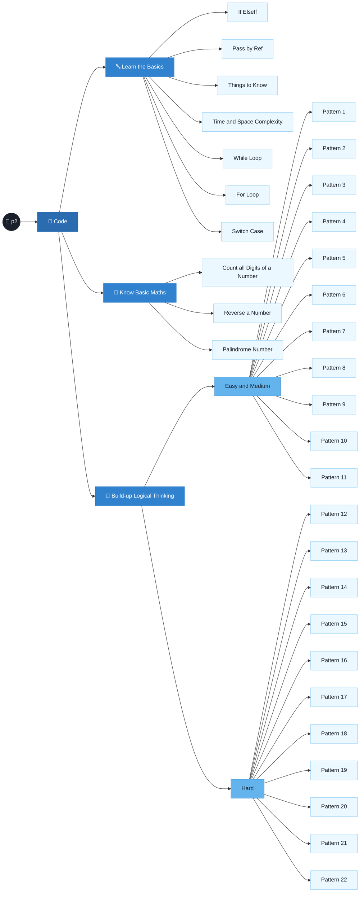
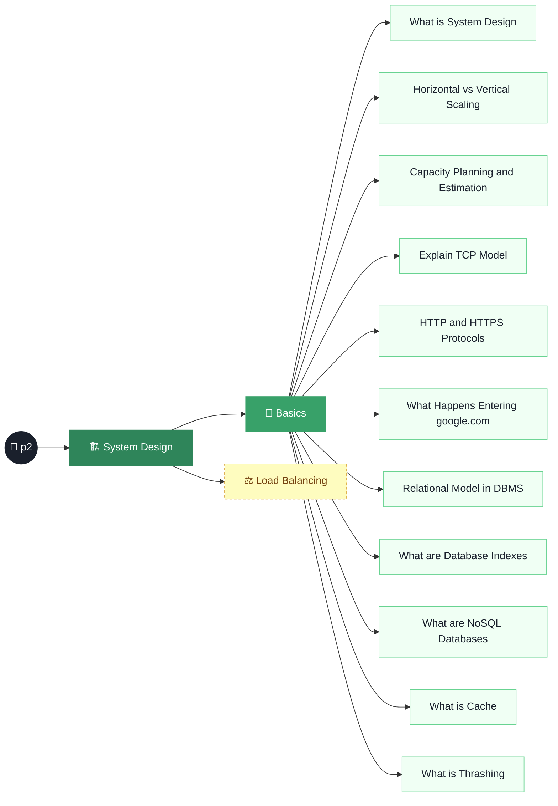

# 🌱 p2 — My Learning Forest

> A living index of every problem, pattern, and system-design note I plant here — one big spreadsheet-style table, updated every time something new grows. Yes, it's going to get long. That's the point.

---

## 📊 Master Index

| # | Module | Sub-Module | Topic | Link | Comments |
| --- | --- | --- | --- | --- | --- |
| 1 | Code | Learn the Basics | If ElseIf | [README](<code/Learn the basics/If ElseIf/README.md>) | [main.py](<code/Learn the basics/If ElseIf/main.py>) |
| 2 | Code | Learn the Basics | Pass by Ref | [README](<code/Learn the basics/Pass by Ref/README.md>) | [main.py](<code/Learn the basics/Pass by Ref/main.py>) |
| 3 | Code | Learn the Basics | Things to Know | [README](<code/Learn the basics/Things to Know/README.md>) | [main.py](<code/Learn the basics/Things to Know/main.py>) |
| 4 | Code | Learn the Basics | Time and Space Complexity | [README](<code/Learn the basics/Time and Space Complexity/README.md>) | Concept notes only — no code |
| 5 | Code | Learn the Basics | While Loop | [README](<code/Learn the basics/While Loop/README.md>) | [main.py](<code/Learn the basics/While Loop/main.py>) |
| 6 | Code | Learn the Basics | For Loop | [README](<code/Learn the basics/for loop/README.md>) | [main.py](<code/Learn the basics/for loop/main.py>) |
| 7 | Code | Learn the Basics | Switch Case | [README](<code/Learn the basics/switch case/README.md>) | [main.py](<code/Learn the basics/switch case/main.py>) |
| 8 | Code | Know Basic Maths | Count all Digits of a Number | [README](<code/Learn the basics/Know Basic Maths/Count all Digits of a Number/README.md>) | [main.py](<code/Learn the basics/Know Basic Maths/Count all Digits of a Number/main.py>) |
| 9 | Code | Know Basic Maths | Reverse a Number | [README](<code/Learn the basics/Know Basic Maths/Reverse a number/README.md>) | [main.py](<code/Learn the basics/Know Basic Maths/Reverse a number/main.py>) |
| 10 | Code | Know Basic Maths | Palindrome Number | [README](<code/Learn the basics/Know Basic Maths/Palindrome Number/README.md>) | [main.py](<code/Learn the basics/Know Basic Maths/Palindrome Number/main.py>) |
| 11 | Code | Build-up Logical Thinking → Easy and Medium | General Approach Notes | [README](<code/Learn the basics/Build-up Logical Thinking/Easy and Medium/README.md>) | Pattern-solving cheatsheet (row formulas, checklist) |
| 12 | Code | Build-up Logical Thinking → Easy and Medium | Pattern 1 | [README](<code/Learn the basics/Build-up Logical Thinking/Easy and Medium/Pattern 1/README.md>) | [main.py](<code/Learn the basics/Build-up Logical Thinking/Easy and Medium/Pattern 1/main.py>) |
| 13 | Code | Build-up Logical Thinking → Easy and Medium | Pattern 2 | [README](<code/Learn the basics/Build-up Logical Thinking/Easy and Medium/Pattern 2/README.md>) | [main.py](<code/Learn the basics/Build-up Logical Thinking/Easy and Medium/Pattern 2/main.py>) |
| 14 | Code | Build-up Logical Thinking → Easy and Medium | Pattern 3 | [README](<code/Learn the basics/Build-up Logical Thinking/Easy and Medium/Pattern 3/README.md>) | [main.py](<code/Learn the basics/Build-up Logical Thinking/Easy and Medium/Pattern 3/main.py>) |
| 15 | Code | Build-up Logical Thinking → Easy and Medium | Pattern 4 | [README](<code/Learn the basics/Build-up Logical Thinking/Easy and Medium/Pattern 4/README.md>) | [main.py](<code/Learn the basics/Build-up Logical Thinking/Easy and Medium/Pattern 4/main.py>) |
| 16 | Code | Build-up Logical Thinking → Easy and Medium | Pattern 5 | [README](<code/Learn the basics/Build-up Logical Thinking/Easy and Medium/Pattern 5/README.md>) | [main.py](<code/Learn the basics/Build-up Logical Thinking/Easy and Medium/Pattern 5/main.py>) |
| 17 | Code | Build-up Logical Thinking → Easy and Medium | Pattern 6 | [README](<code/Learn the basics/Build-up Logical Thinking/Easy and Medium/Pattern 6/README.md>) | [main.py](<code/Learn the basics/Build-up Logical Thinking/Easy and Medium/Pattern 6/main.py>) |
| 18 | Code | Build-up Logical Thinking → Easy and Medium | Pattern 7 | [README](<code/Learn the basics/Build-up Logical Thinking/Easy and Medium/Pattern 7/README.md>) | [main.py](<code/Learn the basics/Build-up Logical Thinking/Easy and Medium/Pattern 7/main.py>) |
| 19 | Code | Build-up Logical Thinking → Easy and Medium | Pattern 8 | [README](<code/Learn the basics/Build-up Logical Thinking/Easy and Medium/Pattern 8/README.md>) | [main.py](<code/Learn the basics/Build-up Logical Thinking/Easy and Medium/Pattern 8/main.py>) |
| 20 | Code | Build-up Logical Thinking → Easy and Medium | Pattern 9 | [README](<code/Learn the basics/Build-up Logical Thinking/Easy and Medium/Pattern 9/README.md>) | [main.py](<code/Learn the basics/Build-up Logical Thinking/Easy and Medium/Pattern 9/main.py>) |
| 21 | Code | Build-up Logical Thinking → Easy and Medium | Pattern 10 | [README](<code/Learn the basics/Build-up Logical Thinking/Easy and Medium/Pattern 10/README.md>) | [main.py](<code/Learn the basics/Build-up Logical Thinking/Easy and Medium/Pattern 10/main.py>) |
| 22 | Code | Build-up Logical Thinking → Easy and Medium | Pattern 11 | [README](<code/Learn the basics/Build-up Logical Thinking/Easy and Medium/Pattern 11/README.md>) | [main.py](<code/Learn the basics/Build-up Logical Thinking/Easy and Medium/Pattern 11/main.py>) |
| 23 | Code | Build-up Logical Thinking → Hard | Pattern 12 | [README](<code/Learn the basics/Build-up Logical Thinking/Hard/Pattern 12/README.md>) | [main.py](<code/Learn the basics/Build-up Logical Thinking/Hard/Pattern 12/main.py>) |
| 24 | Code | Build-up Logical Thinking → Hard | Pattern 13 | [README](<code/Learn the basics/Build-up Logical Thinking/Hard/Pattern 13/README.md>) | [main.py](<code/Learn the basics/Build-up Logical Thinking/Hard/Pattern 13/main.py>) |
| 25 | Code | Build-up Logical Thinking → Hard | Pattern 14 | [README](<code/Learn the basics/Build-up Logical Thinking/Hard/Pattern 14/README.md>) | [main.py](<code/Learn the basics/Build-up Logical Thinking/Hard/Pattern 14/main.py>) |
| 26 | Code | Build-up Logical Thinking → Hard | Pattern 15 | [README](<code/Learn the basics/Build-up Logical Thinking/Hard/Pattern 15/README.md>) | [main.py](<code/Learn the basics/Build-up Logical Thinking/Hard/Pattern 15/main.py>) |
| 27 | Code | Build-up Logical Thinking → Hard | Pattern 16 | [README](<code/Learn the basics/Build-up Logical Thinking/Hard/Pattern 16/README.md>) | [main.py](<code/Learn the basics/Build-up Logical Thinking/Hard/Pattern 16/main.py>) |
| 28 | Code | Build-up Logical Thinking → Hard | Pattern 17 | [README](<code/Learn the basics/Build-up Logical Thinking/Hard/Pattern 17/README.md>) | [main.py](<code/Learn the basics/Build-up Logical Thinking/Hard/Pattern 17/main.py>) |
| 29 | Code | Build-up Logical Thinking → Hard | Pattern 18 | [README](<code/Learn the basics/Build-up Logical Thinking/Hard/Pattern 18/README.md>) | [main.py](<code/Learn the basics/Build-up Logical Thinking/Hard/Pattern 18/main.py>) |
| 30 | Code | Build-up Logical Thinking → Hard | Pattern 19 | [README](<code/Learn the basics/Build-up Logical Thinking/Hard/Pattern 19/README.md>) | [main.py](<code/Learn the basics/Build-up Logical Thinking/Hard/Pattern 19/main.py>) |
| 31 | Code | Build-up Logical Thinking → Hard | Pattern 20 | [README](<code/Learn the basics/Build-up Logical Thinking/Hard/Pattern 20/README.md>) | [main.py](<code/Learn the basics/Build-up Logical Thinking/Hard/Pattern 20/main.py>) |
| 32 | Code | Build-up Logical Thinking → Hard | Pattern 21 | [README](<code/Learn the basics/Build-up Logical Thinking/Hard/Pattern 21/README.md>) | [main.py](<code/Learn the basics/Build-up Logical Thinking/Hard/Pattern 21/main.py>) |
| 33 | Code | Build-up Logical Thinking → Hard | Pattern 22 | [README](<code/Learn the basics/Build-up Logical Thinking/Hard/Pattern 22/README.md>) | [main.py](<code/Learn the basics/Build-up Logical Thinking/Hard/Pattern 22/main.py>) |
| 34 | System Design | Basics | What is System Design | [README](<System Design/Basics/What is System Design/README.md>) | [▶ YouTube](https://www.youtube.com/watch?v=quLrc3PbuIw) |
| 35 | System Design | Basics | Horizontal vs. Vertical Scaling | [README](<System Design/Basics/Horizontal vs. Vertical Scaling/README.md>) | [▶ YouTube](https://www.youtube.com/watch?v=xpDnVSmNFX0) |
| 36 | System Design | Basics | Capacity Planning and Estimation | [README](<System Design/Basics/Capacity Planning and Estimation/README.md>) | [▶ YouTube](https://www.youtube.com/watch?v=0myM0k1mjZw) |
| 37 | System Design | Basics | Explain TCP Model | [README](<System Design/Basics/explain-tcp-model/README.md>) | [▶ YouTube](https://www.youtube.com/watch?v=2QGgEk20RXM) |
| 38 | System Design | Basics | HTTP and HTTPS Protocols | [README](<System Design/Basics/http-and-https-protocols/README.md>) | [▶ YouTube](https://www.youtube.com/watch?v=MkaPJJnh5LM) |
| 39 | System Design | Basics | What Happens When You Enter `google.com`? | [README](<System Design/Basics/what-happens-when-you-enter-google-com/README.md>) | [▶ YouTube](https://www.youtube.com/watch?v=PyzBe6cUgNI) |
| 40 | System Design | Basics | Relational Model in DBMS | [README](<System Design/Basics/relational-model-in-DBMS/README.md>) | [▶ YouTube](https://www.youtube.com/watch?v=Q45sr5p_NmQ) |
| 41 | System Design | Basics | What are Database Indexes? | [README](<System Design/Basics/What are Database Indexes/README.md>) | [▶ YouTube](https://www.youtube.com/watch?v=YC50j-nozZs) |
| 42 | System Design | Basics | What are NoSQL Databases? | [README](<System Design/Basics/What are NoSQL databases/README.md>) | [▶ YouTube](https://www.youtube.com/watch?v=0buKQHokLK8) |
| 43 | System Design | Basics | What is Cache? | [README](<System Design/Basics/What is cache/README.md>) | [▶ YouTube](https://www.youtube.com/watch?v=kRcfCt_F_bc) |
| 44 | System Design | Basics | What is Thrashing? | [README](<System Design/Basics/What is Thrashing/README.md>) | [▶ YouTube](https://www.youtube.com/watch?v=-sjCrT-vDXk) |
| 45 | System Design | Load Balancing | — | — | 🚧 Not started yet |

---

<strong>🌳 Optional visual map (Mermaid tree)</strong> — same data, drawn as branches instead of rows

### Code

### System Design

---

Synced through commit `ef7b5f6` · 2026-09-16
