# System Design Estimation: YouTube Storage & Processing


## 1. What Are Estimation Questions?

Estimation questions are useful in system design interviews. The goal is not perfect arithmetic. The goal is to make sensible assumptions, break a large problem into smaller pieces, calculate, and explain the reasoning.

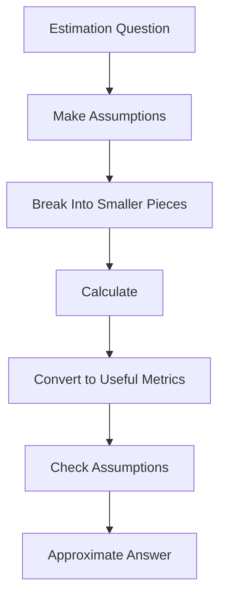

## 2. Example: YouTube Daily Storage

The transcript asks:

> How much storage does YouTube need per day?

Initial assumptions:

| Parameter | Assumption |
|---|---:|
| Users | 1 billion |
| Upload rate | 1 in 1,000 users |
| Video length | 10 minutes |
| Two-hour movie | 4 GB |
| Estimated compressed size | 0.4 GB / 2 hours |

### Uploaders

```text
1,000,000,000 / 1,000 = 1,000,000 uploaders
```

With roughly 10 minutes per video, the transcript works with approximately:

```text
10^7 minutes/day
```


## 3. Video Size

The transcript assumes:

```text
2 hours ≈ 0.4 GB
```

Therefore:

```text
0.4 GB / 2 hours
= 0.2 GB/hour
= 200 MB/hour

200 / 60 ≈ 3 MB/minute
```

So the working estimate is:

```text
~3 MB/minute
```

## 4. Raw Daily Storage

```text
10^7 minutes × 3 MB/minute
≈ 30 TB/day
```

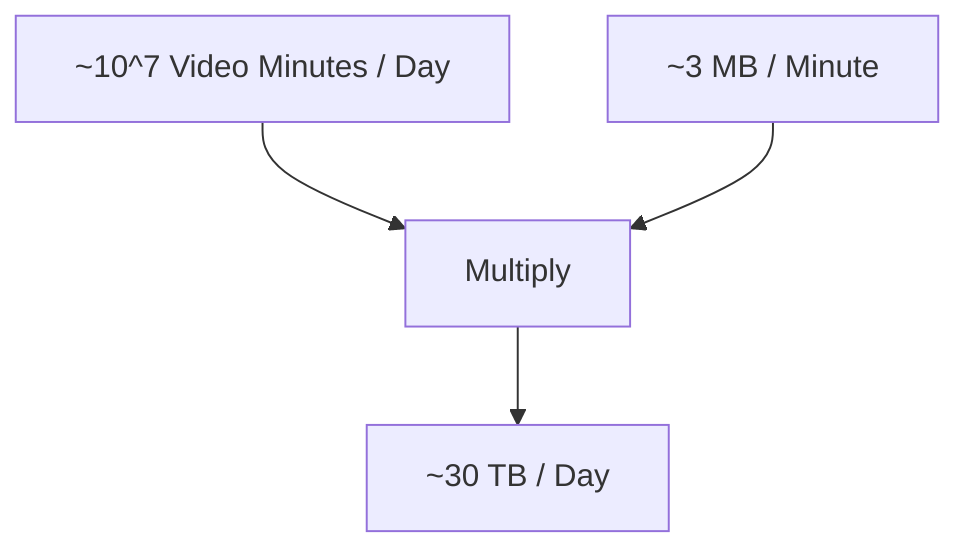

## 5. Replication

One copy is not enough. The transcript introduces three copies for fault tolerance, redundancy, and better geographic performance.

```text
30 TB × 3 = 90 TB
```

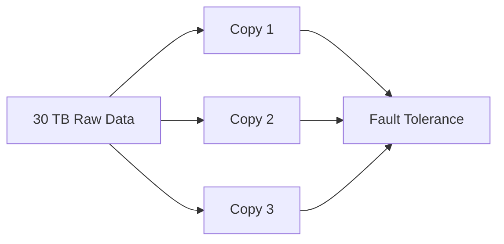

## 6. Multiple Resolutions

A video may need versions such as:

```text
720p
480p
360p
240p
144p
```

The transcript approximates the combined additional storage as roughly another 1× of the original requirement.

```text
90 TB × 2 ≈ 180 TB
≈ 0.18–0.2 PB
```

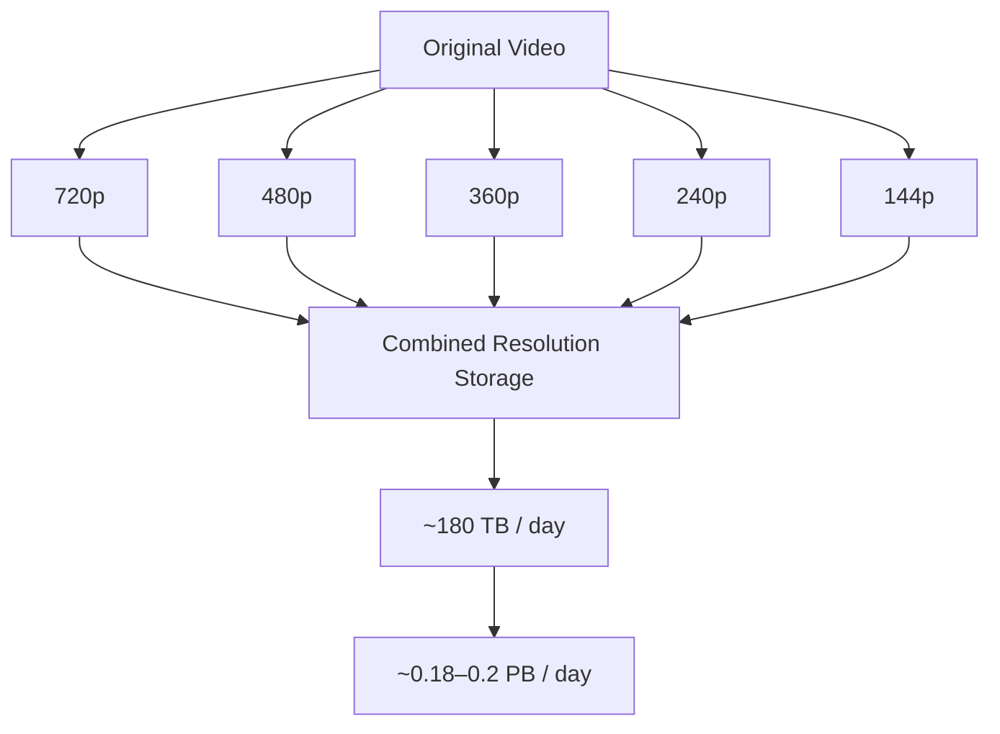

## 7. Assumptions Are the Core of Estimation

The transcript emphasizes that assumptions should be visible:

- Number of uploaders
- Video length
- Video size
- Compression
- Number of copies
- Number of resolutions

The interviewer can challenge an assumption, and you can adjust the calculation.

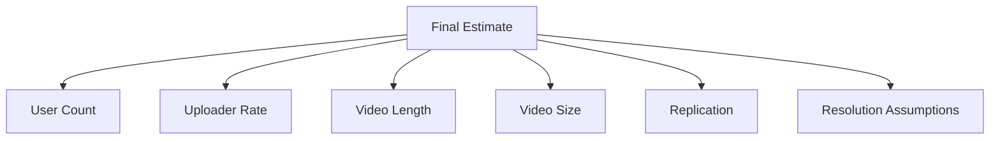

## 8. Order-of-Magnitude Thinking

The transcript says being off by a factor of 10, or sometimes 100, can be understandable in an estimation problem. Being off by 1,000 or 10,000 suggests a serious calculation issue.

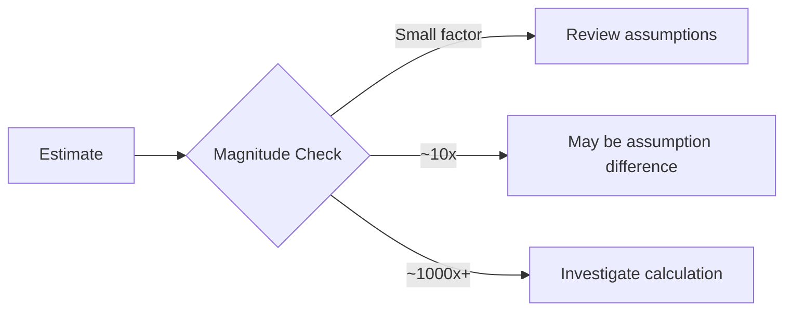

## 9. A More Detailed Video Model

A video can also be imagined as a collection of images.

The transcript considers:

```text
24 frames/second
≈ 25 frames/second

25 × 60 = 1500 frames/minute
```

If one image were assumed to be 1 MB:

```text
1 MB × 25 × 60
= 1500 MB
≈ 1.5 GB/minute
```

This is dramatically different from the earlier ~3 MB/minute estimate.

The lesson is important:

> More detailed modeling does not automatically produce a better estimate.

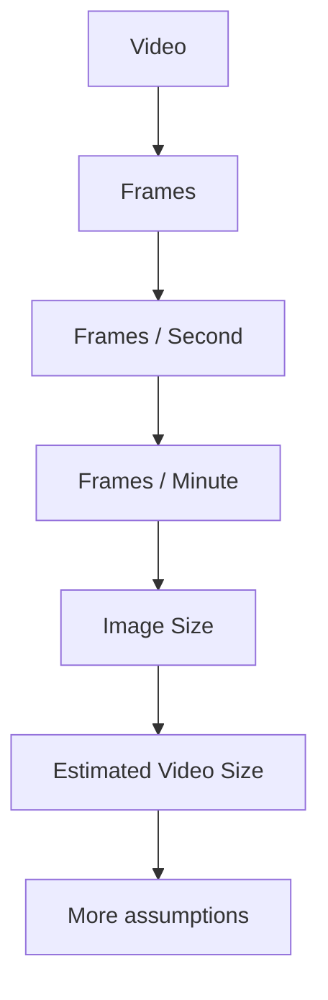

## 10. Metadata Cache

The transcript then considers caching video metadata.

Examples:

- Thumbnail
- Title

The thumbnail is heavier because it is an image.

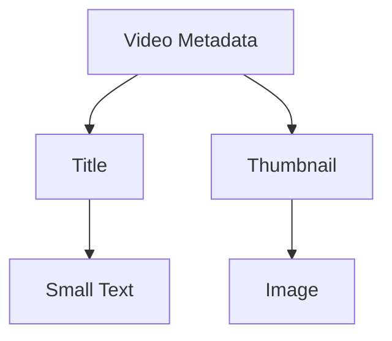

### Thumbnail estimate

Assume:

```text
Original image ≈ 1 MB
Thumbnail ≈ 100× smaller
```

Therefore:

```text
1 MB / 100 ≈ 10 KB
```

So the transcript uses approximately:

```text
10 KB per cached thumbnail
```

## 11. What Should Be Cached?

The transcript focuses on popular videos.

A rough assumption is:

```text
Popular videos ≈ videos from the last 90 days
```

Evergreen videos are ignored for the rough calculation.

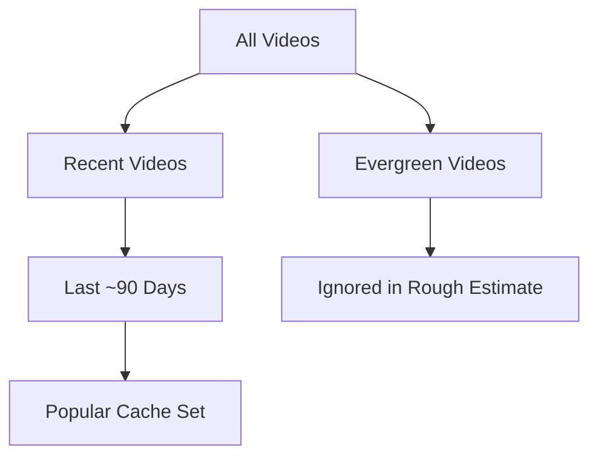

## 12. Distributed Cache

The transcript reaches an approximate cache requirement of:

```text
~1 TB RAM
```

One machine is not assumed to hold all of it.

The transcript uses 16 GB machines:

```text
1000 GB / 16 GB
≈ 62.5
≈ 64 nodes
```

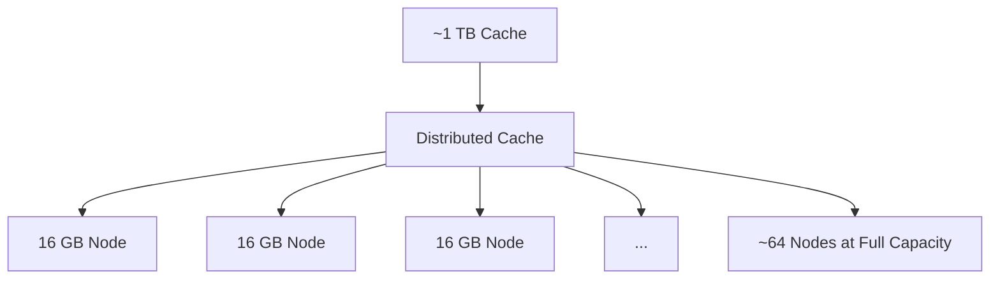

## 13. Why Leave Headroom?

If every cache node operates at peak capacity and one crashes, its work moves to the remaining nodes. Those nodes can then become overloaded, creating a cascading failure.

The transcript therefore considers roughly 50% capacity and arrives at approximately 500 nodes for the rough caching system.

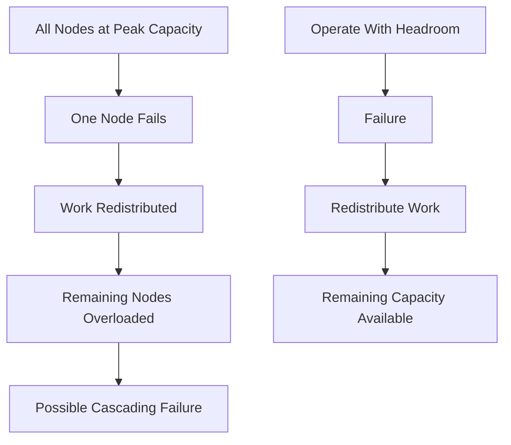

## 14. Convert Daily Work Into Per-Second Throughput

Large-scale estimates become more useful when converted to machine-level units.

The transcript moves from daily video volume to:

```text
~40 MB/s raw footage
```

and then, accounting roughly for multiple formats and locations:

```text
~400 MB/s worldwide
```


## 15. Video Processing Pipeline

The transcript breaks processing into three operations:

```text
READ → PROCESS → WRITE
```

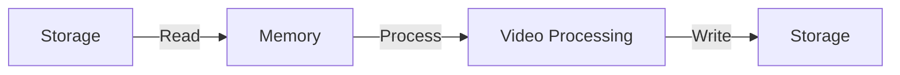

## 16. Read, Process, Write Estimates

The transcript assumes:

```text
Read       ≈ 10 ms / MB
Processing ≈ 20 ms / MB
Write      ≈ 20 ms / MB
```

Therefore:

```text
10 + 20 + 20
= 50 ms / MB
```

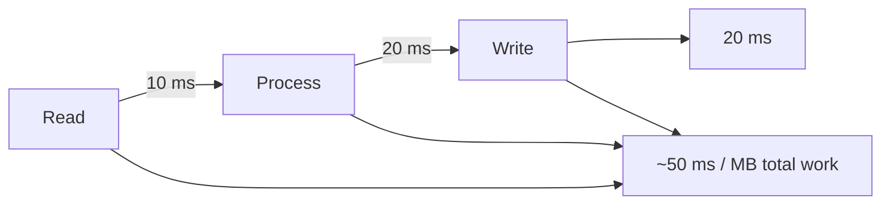

## 17. Seconds of Work Per Second

With:

```text
400 MB/s
50 ms/MB = 0.05 seconds/MB
```

we get:

```text
400 × 0.05
= 20 seconds of work per second
```

One computer cannot perform 20 seconds of work every second.

Therefore, the workload needs parallel processing.

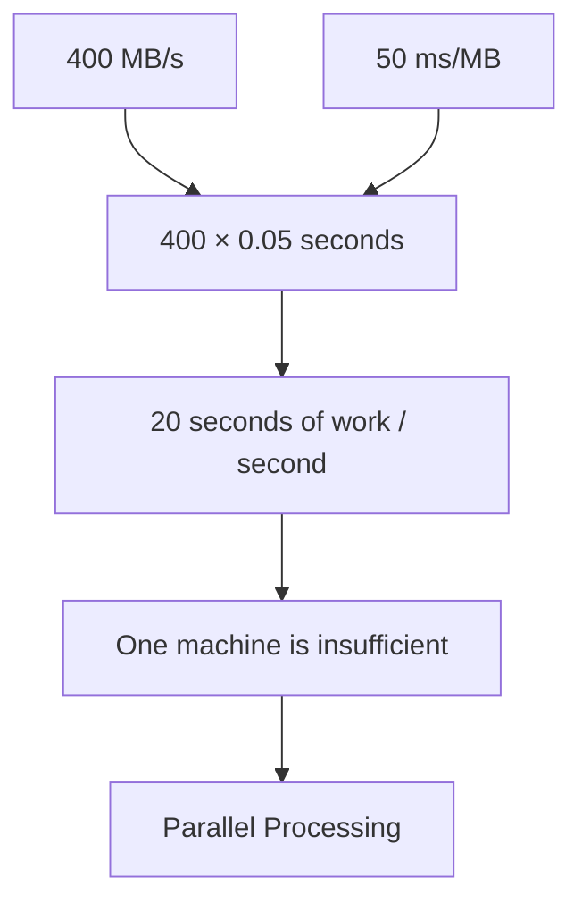

## 18. Parallel Processors

The transcript arrives at approximately:

```text
20 processors
```

The reasoning is that 20 seconds of work must be completed every second, so approximately 20 parallel processing units are needed under these assumptions.

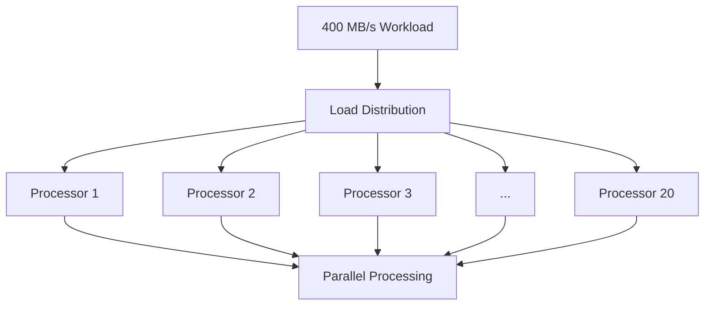

## 19. The Complete Estimation Journey

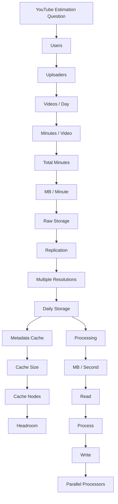

## 20. Capacity vs Throughput

This example demonstrates two different dimensions.

### Capacity

How much data can be stored?

```text
TB / PB
```

### Throughput

How much data must be processed per second?

```text
MB/s / GB/s
```

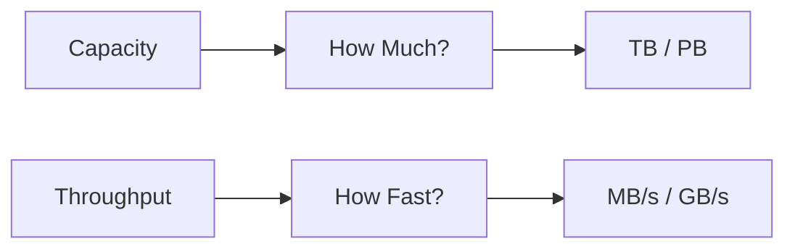

## 21. General Estimation Template

Use this workflow for similar system-design estimation questions:

```text
1. Clarify the question
2. State assumptions
3. Estimate the workload
4. Convert units
5. Calculate the base requirement
6. Add redundancy
7. Add formats / replicas where relevant
8. Estimate cache requirements
9. Convert daily workload to per-second throughput
10. Break processing into READ → PROCESS → WRITE
11. Estimate parallel machines
12. Sanity-check the magnitude
13. Explain uncertainties
```

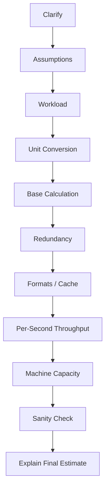

## 22. Key Numbers From the Transcript

| Metric | Approximate Value |
|---|---:|
| Users | 1 billion |
| Upload rate assumption | 1 / 1,000 |
| Video length | 10 minutes |
| Working video size | ~3 MB/min |
| Raw daily storage | ~30 TB |
| Copies | 3 |
| Replicated storage | ~90 TB |
| Multi-resolution factor | ~2× |
| Final daily storage | ~180 TB |
| Approximate PB | ~0.18–0.2 PB |
| Thumbnail | ~10 KB |
| Cache node size | 16 GB |
| Full-capacity nodes | ~64 |
| Rough planned cache cluster | ~500 nodes |
| Raw processing | ~40 MB/s |
| Worldwide processing | ~400 MB/s |
| Read | ~10 ms/MB |
| Processing | ~20 ms/MB |
| Write | ~20 ms/MB |
| Total work | ~50 ms/MB |
| Parallel processors | ~20 |

> These are rough interview estimates from the transcript, not verified production specifications for YouTube.

## 23. Final Mental Model

```text
BIG QUESTION
     ↓
MAKE ASSUMPTIONS
     ↓
BREAK IT DOWN
     ↓
ESTIMATE VOLUME
     ↓
CONVERT UNITS
     ↓
CALCULATE CAPACITY
     ↓
ADD REDUNDANCY
     ↓
CONSIDER CACHE / FORMATS
     ↓
CONVERT TO MB/s OR SIMILAR
     ↓
READ → PROCESS → WRITE
     ↓
PARALLELIZE
     ↓
SANITY CHECK
     ↓
EXPLAIN THE REASONING
```

```mermaid
flowchart TD
    A["BIG ESTIMATION QUESTION"]
    --> B["Assumptions"]
    --> C["Decomposition"]
    --> D["Volume"]
    --> E["Units"]
    --> F["Capacity"]
    --> G["Redundancy"]
    --> H["Throughput"]
    --> I["Machine Capacity"]
    --> J["Parallel Processing"]
    --> K["Sanity Check"]
    --> L["Approximate Answer"]
```

## Final Takeaway

The transcript's central lesson is:

> **Do not memorize the final number. Learn how to build the number.**

A strong estimation answer is a chain of understandable assumptions and calculations. The exact number can move when assumptions change. What matters most is that the reasoning is explicit, sensible, and checked for order-of-magnitude errors.
