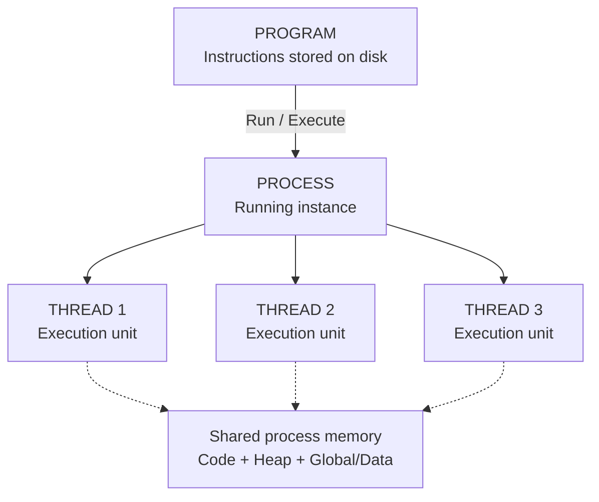
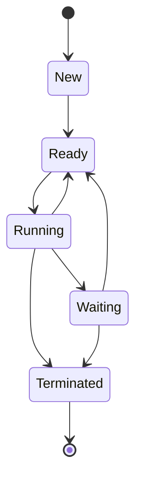
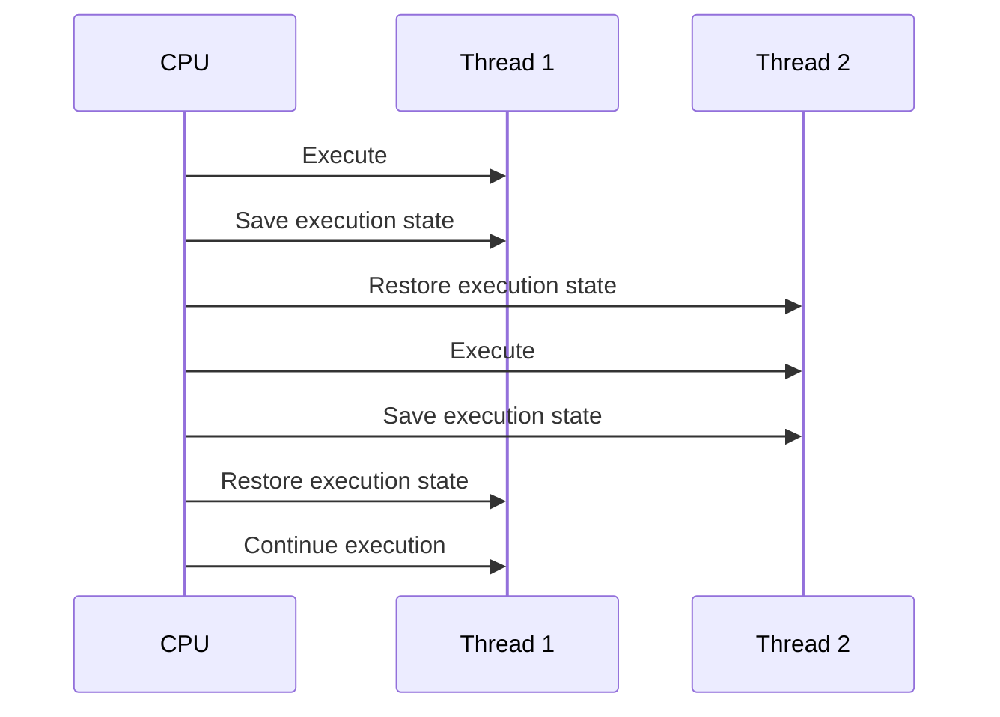

# Difference Between Program, Process, and Thread

## 1. Big Picture

The easiest way to understand these three terms is:

```text
Program
  ↓
A set of instructions stored on disk

Process
  ↓
A program that is currently running

Thread
  ↓
A unit of execution inside a process
```

### Simple Example

Suppose you have a Python file:

```text
app.py
```

The file contains:

```python
print("Hello")
```

- `app.py` on disk → **Program**
- When you run `python app.py` → **Process**
- The execution of instructions happens through a **Thread**

---

# 2. Visual: Program → Process → Thread

This is the core relationship to remember:



### What the diagram means

- **Program** is the instructions sitting on storage.
- **Process** is the running instance created by the operating system.
- **Threads** execute work inside that process.
- Threads in the same process can access shared process memory.
- Each thread still has its own execution state and stack.

---

# 2. What is a Program?

A **program** is a set of instructions written to perform a particular task.

It is normally stored on persistent storage such as:

- SSD
- HDD
- File system

A program is **passive**. It is not executing by itself.

### Example

```text
calculator.exe
python.exe
chrome.exe
myapp.py
```

These are programs/files that contain instructions.

### Program Characteristics

| Property | Program |
|---|---|
| Nature | Passive |
| Stored in | Disk / storage |
| Execution | Not currently executing |
| Memory | Does not require runtime process memory |
| State | No execution state |
| Example | `app.py`, `chrome.exe` |

---

# 3. What is a Process?

A **process** is a program that is currently executing.

When the operating system loads a program into memory and starts executing it, a process is created.

```text
Program on Disk
      │
      │ Execute
      ▼
   Process
      │
      ▼
 Program instructions
      +
 Memory
      +
 CPU state
      +
 Resources
```

A process is therefore much more than just the program code.

It has its own execution environment.

---

# 4. What Does a Process Contain?

A process generally has its own:

- Virtual address space
- Code/text section
- Data section
- Heap
- Stack
- CPU execution state
- Open file handles
- Resources
- One or more threads

A simplified process memory layout:

```text
+-----------------------+
|       Stack           |
|   Local variables     |
|   Function calls      |
+-----------------------+
|         ↓             |
|                       |
|         ↑             |
+-----------------------+
|        Heap           |
| Dynamic allocations   |
+-----------------------+
|   Data / Global vars  |
+-----------------------+
|   Program Code        |
+-----------------------+
```

---

# 5. What is a Thread?

A **thread** is the smallest unit of execution that can be scheduled by the operating system within a process.

A process can contain:

```text
Process
│
├── Thread 1
├── Thread 2
├── Thread 3
└── Thread 4
```

Threads within the same process share many resources, especially the process's memory.

However, each thread has its own execution-related state, such as:

- Program counter
- CPU registers
- Stack

---

# 6. Process vs Thread

The most important difference:

```text
Process
= Resource / isolation container

Thread
= Execution unit inside that process
```

Think of a process as a **house** and threads as **people working inside the house**.

The people share the house's resources, but each person has their own current task and working state.

---

# 7. Memory Sharing

This is one of the most important interview concepts.

### Multiple Processes

Different processes normally have separate virtual address spaces.

```text
Process A
+----------------+
| Code           |
| Heap           |
| Stack          |
+----------------+

Process B
+----------------+
| Code           |
| Heap           |
| Stack          |
+----------------+
```

Process A normally cannot directly access Process B's memory.

The operating system provides this isolation.

### Multiple Threads

Threads inside the same process share the process's memory.

```text
              Process
        +-------------------+
        |      Heap         |
        |      Data         |
        |      Code         |
        +-------------------+
           ↑       ↑      ↑
           │       │      │
        Thread 1 Thread 2 Thread 3
        Stack    Stack    Stack
```

Threads have separate stacks, but share process-level resources such as:

- Code
- Heap
- Global/static data

---

# 8. Why Do Threads Share Memory?

Suppose a process has three threads:

```text
Thread 1 → reads customer data
Thread 2 → processes payment
Thread 3 → writes logs
```

They may need to access common objects or data.

Because they belong to the same process, they can communicate through shared memory.

But this creates another problem:

> Shared memory can cause race conditions.

For example:

```text
Thread 1              Thread 2
   │                     │
   │ Read balance = 100  │
   │                     │ Read balance = 100
   │                     │
   │ Write 50            │
   │                     │ Write 20
   ▼                     ▼
       Final balance = 20
```

The intended result might have been `30`, but concurrent access caused a race condition.

This is why synchronization mechanisms are important.

Examples:

- Lock
- Mutex
- Semaphore
- Monitor
- Atomic operations

---

# 9. Process Isolation

Processes provide stronger isolation.

```text
+-------------------+       +-------------------+
|    Process A      |       |    Process B      |
|                   |       |                   |
| Heap A            |       | Heap B            |
| Stack A           |       | Stack B           |
| Memory A          |       | Memory B          |
+-------------------+       +-------------------+
          │                           │
          └──────── OS isolation ─────┘
```

If Process A crashes, Process B can often continue running.

This isolation is one reason operating systems use separate processes.

---

# 10. Process Creation

When a program is executed, the operating system creates a process.

A simplified flow:


The process receives resources and an address space.

The initial thread begins executing the program.

---

# 11. Process Lifecycle

A process typically moves through several states.



### Common States

| State | Meaning |
|---|---|
| New | Process is being created |
| Ready | Waiting for CPU |
| Running | Currently executing |
| Waiting/Blocked | Waiting for I/O or another event |
| Terminated | Execution has finished |

---

# 12. Thread Lifecycle

Threads also move between execution states.

A simplified model:

```text
       Ready
         │
         ▼
      Running
       /   \
      /     \
 Waiting    Ready
    │
    └──────────►
         │
         ▼
     Terminated
```

A thread can become blocked while waiting for:

- File I/O
- Network I/O
- Lock
- Database response
- Another thread

---

# 13. Context Switching

The CPU can execute only a limited number of threads at a time.

The operating system switches between runnable threads.

This is called a **context switch**.

```text
Thread A
   │
   │ Running
   ▼
CPU
   │
   │ Context switch
   ▼
Thread B
   │
   │ Running
   ▼
CPU
```

The OS saves the current execution state and loads another thread's state.

---

# 14. Visual: Context Switching



A context switch allows the CPU to stop one runnable thread and continue another.

---

# 14. Process Context Switch vs Thread Context Switch

A process switch generally involves more state and isolation boundaries than switching between threads within the same process.

### Process Switch

```text
Process A
   ↓
save process/thread state
   ↓
switch address-space context
   ↓
Process B
```

### Thread Switch Within Same Process

```text
Thread A
   ↓
save thread state
   ↓
Thread B
```

Because threads in the same process share the address space, switching between them can avoid some process-level changes.

The exact cost depends on the operating system, CPU architecture, memory-management features, and workload.

---

# 15. Program vs Process vs Thread

| Feature | Program | Process | Thread |
|---|---|---|---|
| What is it? | Set of instructions | Running instance of a program | Execution unit inside a process |
| Nature | Passive | Active | Active |
| Exists on disk? | Yes | No, as an executing entity | No |
| Own address space | No runtime address space | Yes | Shares process address space |
| Own stack | No execution stack | Process contains thread stacks | Yes |
| Own heap | No runtime heap | Yes | Shares process heap |
| Shares memory | N/A | Normally isolated from other processes | Shares process memory |
| Communication | N/A | IPC usually required | Shared memory is common |
| Isolation | N/A | Strong | Weak compared with processes |
| Failure isolation | N/A | Stronger | Weaker |
| Creation cost | N/A | Generally higher | Generally lower |
| Scheduling | N/A | Contains schedulable threads | Schedulable execution unit |

---

# 16. Simple Real-World Example

Imagine a web browser.

```text
Browser Application
        │
        ├── Process A
        │     ├── Thread 1
        │     ├── Thread 2
        │     └── Thread 3
        │
        ├── Process B
        │     ├── Thread 1
        │     └── Thread 2
        │
        └── Process C
              ├── Thread 1
              └── Thread 2
```

Modern applications commonly use multiple processes and multiple threads.

The exact architecture depends on the application and operating system.

---

# 17. Multitasking

The operating system can run multiple processes.

```text
CPU
 │
 ├── Process A
 │
 ├── Process B
 │
 ├── Process C
 │
 └── Process D
```

This is **process-level multitasking**.

Inside one process:

```text
Process A
 │
 ├── Thread 1
 ├── Thread 2
 └── Thread 3
```

Multiple threads can also make progress concurrently.

---

# 18. Concurrency vs Parallelism

These concepts are closely related to threads.

### Concurrency

Multiple tasks are in progress during overlapping periods.

```text
Time →
Task A: ████    ████
Task B:    ████    ████
```

The CPU may switch between tasks.

### Parallelism

Multiple tasks actually execute at the same time on different CPU cores.

```text
Core 1 → Task A █████████
Core 2 → Task B █████████
```

So:

```text
Concurrency ≠ necessarily parallelism
```

Threads can be used for both.

---

# 19. CPU-Bound vs I/O-Bound Work

This distinction matters when deciding how to use threads.

### CPU-Bound

The task spends most of its time using CPU.

Examples:

- Image processing
- Mathematical calculations
- Compression
- Data transformation

```text
CPU
████████████████████
```

### I/O-Bound

The task spends significant time waiting for external resources.

Examples:

- Database calls
- Network requests
- File operations
- API calls

```text
CPU    ███
Wait      █████████████
CPU                   ███
```

Threads or asynchronous I/O can help keep applications productive while other work is waiting.

---

# 20. Thread Communication

Because threads share memory, they can communicate through shared variables.

```text
Thread 1
   │
   ├──────► Shared Memory ◄──────┤
   │                              │
Thread 2                       Thread 3
```

But shared memory requires synchronization when multiple threads access mutable data.

Common mechanisms:

```text
Lock
Mutex
Semaphore
Condition Variable
Atomic operation
```

---

# 21. Process Communication

Processes normally have isolated address spaces.

Therefore, communication often uses **IPC (Inter-Process Communication)**.

Examples:

- Pipes
- Sockets
- Shared memory
- Message queues
- Signals


A network socket can also be used for communication between separate processes, even when they are on different machines.

---

# 22. Threads in Backend Development

This becomes very important for backend developers.

Suppose you have a web server:

```text
                    Web Server Process
                           │
             ┌─────────────┼─────────────┐
             │             │             │
          Thread 1      Thread 2      Thread 3
             │             │             │
          Request A     Request B     Request C
```

Multiple requests may be handled concurrently.

A backend application may use:

- Worker threads
- Thread pools
- Async tasks
- Event loops
- Multiple processes

The exact model depends on the runtime and framework.

---

# 23. Thread Pool

Creating a new thread for every small task can be expensive.

Instead, applications often use a **thread pool**.

```text
                 Thread Pool
              ┌───────────────┐
Tasks ───────► │ Thread 1      │
              │ Thread 2      │
              │ Thread 3      │
              │ Thread 4      │
              └───────────────┘
```

Tasks are submitted to the pool.

Available threads execute them.

This avoids repeatedly creating and destroying threads.

---

# 24. Python Example

Consider:

```python
def task():
    print("Running task")
```

A process can contain multiple threads.

Conceptually:

```text
Python Process
│
├── Main Thread
│
├── Worker Thread 1
│
└── Worker Thread 2
```

Python applications can use:

```python
import threading

t = threading.Thread(target=task)
t.start()
```

The thread executes the function concurrently with other work.

The behavior and performance characteristics depend on the Python implementation and workload.

---

# 25. Important Python Note: GIL

In CPython, the **Global Interpreter Lock (GIL)** historically limits execution of Python bytecode by multiple threads at the same time within one interpreter.

Therefore, Python threading is commonly useful for I/O-bound workloads, while CPU-bound workloads may require approaches such as:

- Multiprocessing
- Native extensions
- Other concurrency techniques
- Implementations/configurations with different threading behavior

Do not simplify this to:

> "Python cannot use multiple threads."

That statement is incorrect.

Threads are still useful for concurrency, particularly when work spends time waiting on I/O.

---

# 26. Process vs Thread: Communication

### Process

```text
Process A
    │
    │ IPC
    ▼
Process B
```

Communication normally requires an explicit mechanism.

### Thread

```text
Thread A
    │
    ▼
Shared Memory
    ▲
    │
Thread B
```

Threads can communicate through shared process memory.

This makes communication easier, but synchronization becomes important.

---

# 27. Process vs Thread: Failure

Consider:

```text
Process
├── Thread 1
├── Thread 2
└── Thread 3
```

If the entire process terminates, all its threads terminate.

```text
Process crashes
      │
      ├── Thread 1 ❌
      ├── Thread 2 ❌
      └── Thread 3 ❌
```

This is different from separate processes:

```text
Process A ❌

Process B ✅
Process C ✅
```

Process isolation can prevent one application's failure from directly terminating another process.

---

# 28. Program, Process, Thread: Easy Analogy

Think about a restaurant.

### Program

The **recipe book**.

It contains instructions, but nobody is currently cooking from it.

### Process

A **restaurant kitchen currently operating using those recipes**.

It has:

- Ingredients
- Equipment
- Resources
- Workers

### Threads

The **workers performing tasks inside the kitchen**.

They share the kitchen resources but perform different tasks.

```text
Program
Recipe / Instructions
        │
        ▼
Process
Running Kitchen
        │
   ┌────┼────┐
   ▼    ▼    ▼
Thread Thread Thread
Cook   Prep  Clean
```

---

# 29. Common Misconceptions

### Misconception 1

> A process is just a program.

Not exactly.

A program is passive instructions. A process is a running instance with memory, resources, and execution state.

---

### Misconception 2

> A thread has its own memory.

A thread has its own execution state and stack, but threads within a process share the process's address space and resources.

---

### Misconception 3

> Multiple threads always mean parallel execution.

No.

Multiple threads can provide concurrency without actual simultaneous execution.

Actual parallel execution generally requires multiple execution resources, such as CPU cores.

---

### Misconception 4

> More threads always make an application faster.

No.

Too many threads can introduce:

- Context-switch overhead
- Lock contention
- Memory overhead
- Scheduling overhead
- Race conditions

---

### Misconception 5

> Process communication is impossible.

No.

Processes can communicate using IPC mechanisms such as sockets, pipes, queues, and shared memory.

---

# 30. Interview Questions

### Q1. What is a program?

A program is a passive set of instructions stored on persistent storage that describes what a computer should do.

### Q2. What is a process?

A process is a running instance of a program with its own virtual address space and resources.

### Q3. What is a thread?

A thread is an execution unit within a process. Threads in the same process share the process's address space and resources while maintaining their own execution state and stack.

### Q4. Can one process have multiple threads?

Yes.

```text
Process
├── Thread 1
├── Thread 2
└── Thread 3
```

### Q5. Do threads share memory?

Threads within the same process generally share the process's address space, including code, heap, and global data.

### Q6. Do processes share memory?

Normally, separate processes have isolated virtual address spaces. They can communicate using IPC mechanisms.

### Q7. Which is more isolated, process or thread?

A process generally provides stronger isolation than a thread because separate processes normally have separate address spaces.

### Q8. Why use multiple threads?

Common reasons include:

- Concurrent execution
- Handling I/O while other work continues
- Improving responsiveness
- Utilizing available CPU resources for suitable workloads

### Q9. What is a thread pool?

A thread pool is a reusable collection of worker threads that execute submitted tasks.

### Q10. What is context switching?

Context switching is the process of saving the execution state of one running task and restoring another task's state so the CPU can execute it.

---

# 31. Quick Comparison

```text
PROGRAM
│
│  Passive instructions
│  Stored on disk
│
▼
PROCESS
│
│  Running instance
│  Own address space
│  Own resources
│
├───────────────┐
▼               ▼
THREAD 1       THREAD 2
│               │
│ Execution     │ Execution
│ state         │ state
│ Own stack     │ Own stack
│               │
└───────┬───────┘
        │
        ▼
 Shared process memory
```

---

# 32. Final Mental Model

Remember these three lines:

> **Program = What to execute**

> **Process = A running instance of that program**

> **Thread = Who/what actually executes instructions inside the process**

And the most important relationship:

```text
                 Program
                    │
                 Executed
                    ▼
                 Process
                    │
              contains one or
              more threads
                    ▼
       ┌────────────┼────────────┐
       ▼            ▼            ▼
    Thread 1     Thread 2     Thread 3
       │            │            │
       └────────────┼────────────┘
                    ▼
             Shared process
                 memory
```

## One-Line Interview Answer

**A program is a passive set of instructions, a process is a running instance of a program with its own address space and resources, and a thread is an execution unit inside a process that shares the process's memory and resources with other threads.**
