# Software Engineering 101: System Design Basics

**Easy**

System design is about designing a system that can meet its requirements as usage grows while considering important properties such as **scalability, resilience, and consistency**.

This module starts with the simplest possible setup, a single computer running some code, and gradually introduces the problems that appear as more people start using the system.

---

# 1. Start With a Simple Computer

Imagine you have a computer running an algorithm.

The algorithm behaves like a normal function:

```text
Input → Algorithm → Output
```

People find the algorithm useful and want to use it.

But you cannot give your computer to every user.

Instead, you expose the functionality through an **API (Application Programming Interface)** running over the internet.

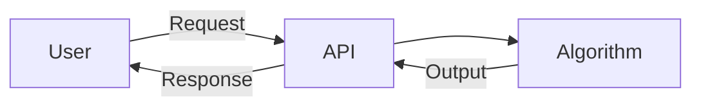

### Request and Response

When someone uses your service:

- The thing sent **to your system** is a **request**.
- The result sent **back to the user** is a **response**.

```text
User
  |
  | Request
  v
+---------+
|   API   |
+---------+
  |
  | Execute Code
  v
+---------+
|Algorithm|
+---------+
  |
  | Response
  v
User
```

---

# 2. Problems With Self-Hosting

Now imagine that you are running this service from your own desktop.

Your setup might look something like:

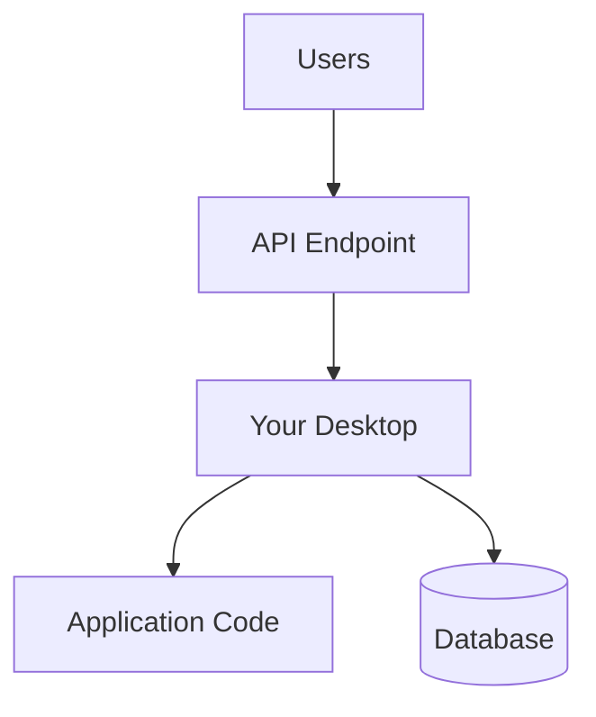

There are several things you now need to worry about:

- Connecting a database
- Configuring endpoints
- Configuring the machine
- Handling reliability
- What happens if the machine loses power?
- What happens if someone pulls the plug?

If your service is being used by paying customers, having it suddenly go down is a serious problem.

This is why we generally host services on the **cloud**.

---

# 3. Using Cloud Solutions

What is the difference between your desktop and a cloud computer?

At a basic level, not much.

The cloud is essentially a collection of computers that a provider makes available to you for money.

For example, a cloud provider such as **Amazon Web Services (AWS)** provides computing resources that can run your application.

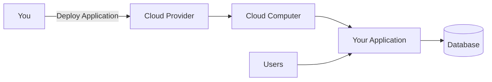

The major advantage is that the cloud provider can take care of much of the underlying:

- Configuration
- Settings
- Reliability
- Infrastructure

This allows you to focus more on your actual business requirements.

---

# 4. Scaling Your Business

Suppose your algorithm becomes popular.

More and more people start sending requests.

Eventually, your machine cannot handle all the connections.

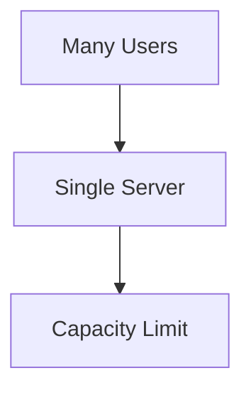

What can you do?

There are two basic approaches:

### Solution 1: Buy a Bigger Machine

```text
Small Machine
      ↓
Bigger Machine
      ↓
Even Bigger Machine
```

### Solution 2: Buy More Machines

```text
             +-- Server 1
             |
Users →      +-- Server 2
             |
             +-- Server 3
             |
             +-- Server 4
```

The ability to handle more requests by using bigger machines or more machines is called **scalability**.

> **Scalability = the ability of a system to handle more requests as demand increases.**

---

# 5. Vertical Scaling

When you buy a bigger machine, you are performing **vertical scaling**.

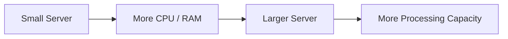

The idea is simple:

> Make the existing computer more powerful.

For example:

```text
        Vertical Scaling

        +-------------+
        | Small Server|
        +-------------+
               |
               v
        +-------------+
        | Large Server|
        +-------------+
```

---

# 6. Horizontal Scaling

When you buy more machines, you are performing **horizontal scaling**.

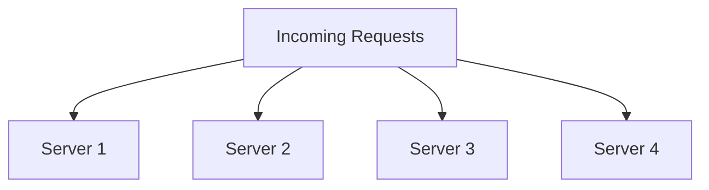

Instead of making one computer larger, requests can be distributed among multiple computers.

> **Horizontal scaling = adding more machines to handle more work.**

The two approaches are therefore:

```text
                 Scalability
                     |
          +----------+----------+
          |                     |
          v                     v
   Vertical Scaling      Horizontal Scaling
          |                     |
    Bigger Machine        More Machines
```

---

# 7. Horizontal vs Vertical Scaling

Both approaches solve the scalability problem, but they have important differences.

## 7.1 Load Balancing

With a single machine, there is no need to balance requests.

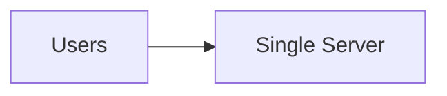

With multiple machines, requests need to be distributed.

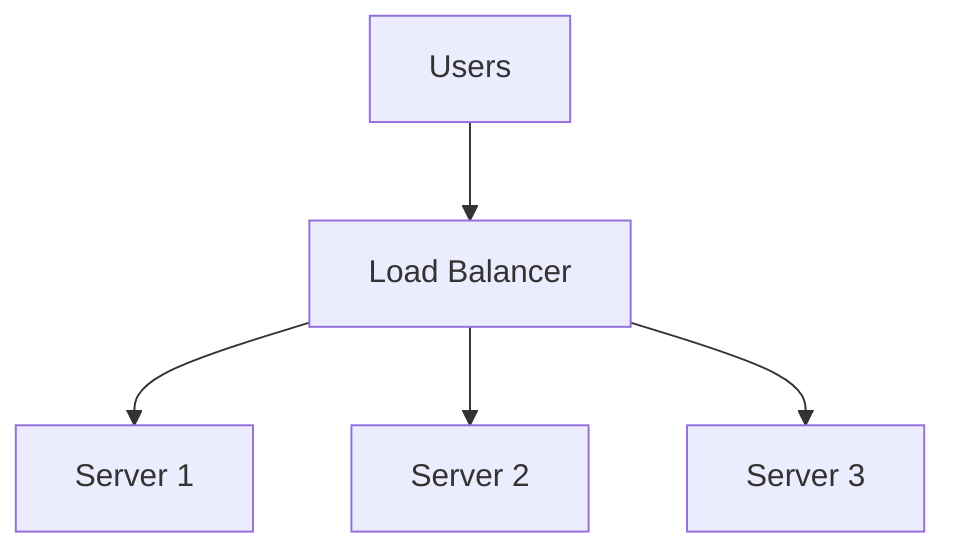

---

## 7.2 Failure and Resilience

With one machine:

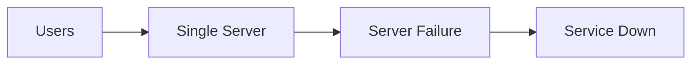

The single server is a **single point of failure**.

With multiple machines:

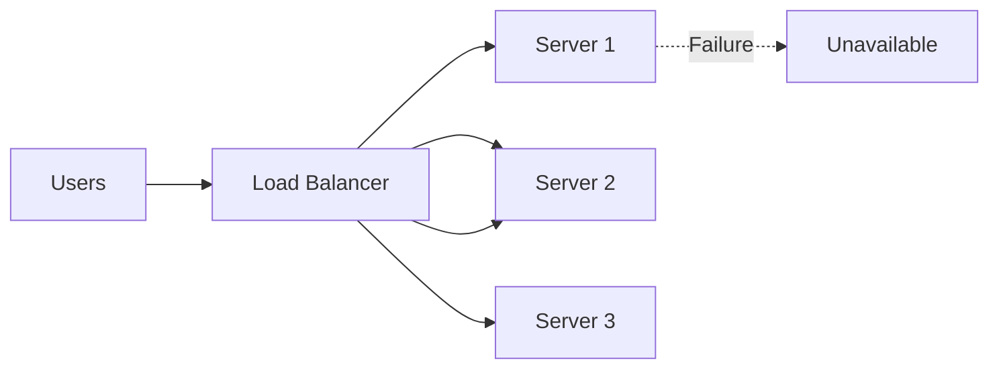

If one machine fails, requests can be redirected to another machine.

Therefore, horizontal scaling provides greater **resilience**.

---

# 8. Communication Between Servers

With a single machine, communication between processes can happen locally.

```text
Process A
    |
    | Interprocess Communication
    v
Process B
```

This is relatively fast.

With multiple machines, communication happens over a network.

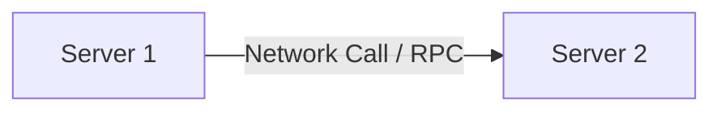

Network communication introduces additional overhead.

The source describes this as:

- **Interprocess communication** → faster
- **Network calls / remote procedure calls** → slower

So horizontal scaling introduces another consideration: communication between machines.

---

# 9. Data Consistency

Data consistency becomes another challenge when data is distributed across multiple systems.

Imagine a transaction where an operation needs to happen across several pieces of data.

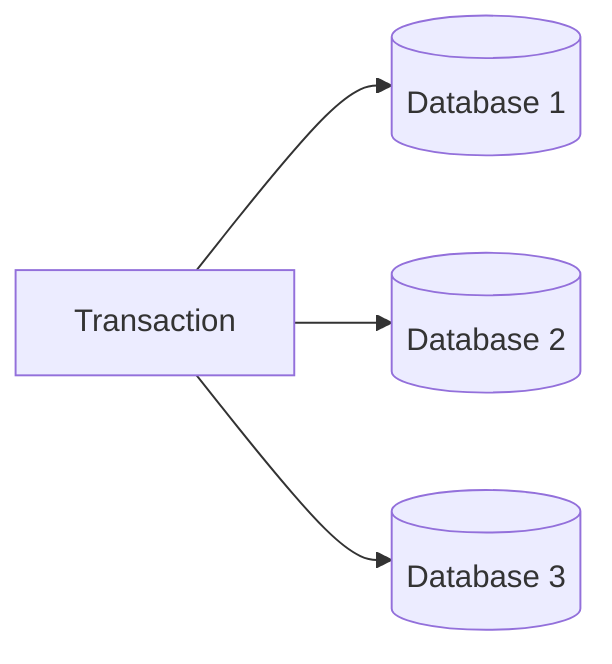

If an operation needs to be **atomic**, keeping everything perfectly coordinated can become difficult.

One theoretical approach would involve locking the relevant servers or databases, but doing that across many machines can become impractical.

Therefore, distributed systems often involve **looser transactional guarantees**, making data consistency a real concern.

With a single system:

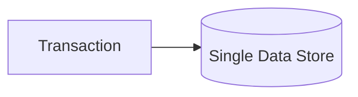

There is less distributed coordination to deal with.

---

# 10. Hardware Limitations

Vertical scaling has a physical limitation.

You cannot make one computer infinitely large.

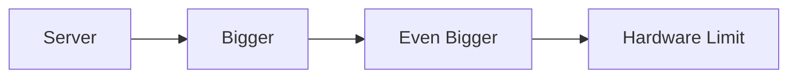

Eventually, there is a hardware limit.

Horizontal scaling does not have this same limitation in the same way.

You can continue adding machines:

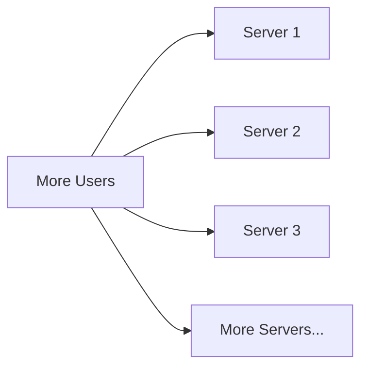

The source describes horizontal scaling as scaling well because the number of servers can increase roughly with the number of users.

---

# 11. Five Key Differences

| Aspect | Vertical Scaling | Horizontal Scaling |
|---|---|---|
| Machines | One larger machine | Multiple machines |
| Load balancing | Not required | Required |
| Failure | Single point of failure | More resilient |
| Communication | Interprocess communication | Network calls / RPC |
| Communication speed | Faster | Slower |
| Data consistency | Simpler | More difficult |
| Hardware limit | Yes | Can add more machines |
| Scaling | Limited by machine capacity | Scales by adding machines |

These are the major differences between the two approaches.

---

# 12. What Is Used in the Real World?

The answer is: **both**.

Instead of choosing only one approach, real systems can combine their advantages.

The source describes a hybrid approach:

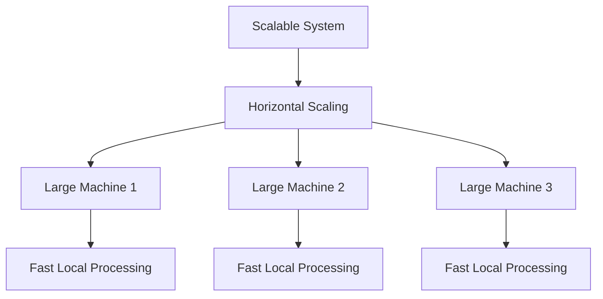

Each machine is made reasonably large, while multiple machines provide resilience and scalability.

---

# 13. Practical Strategy

Initially, when the number of users is small, you can vertically scale.

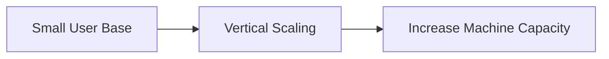

As the number of users grows and the business becomes more established, horizontal scaling becomes increasingly useful.

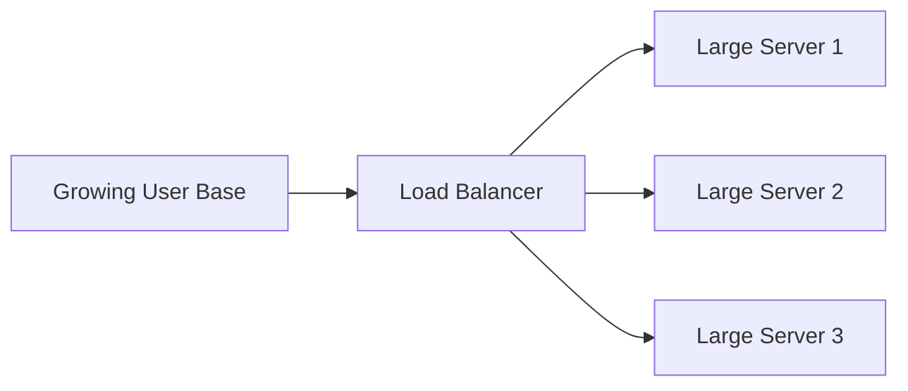

The hybrid idea can therefore be summarized as:

```text
Start
  ↓
Vertical Scaling
  ↓
System Gets Larger
  ↓
Horizontal Scaling
  ↓
Multiple Large Machines
```

---

# 14. The Three Major System Design Considerations

When designing a system, we need to ask:

### 1. Is it scalable?

Can the system handle more requests as the number of users increases?

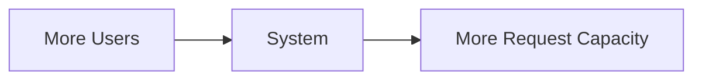

### 2. Is it resilient?

Can the system continue operating when something fails?

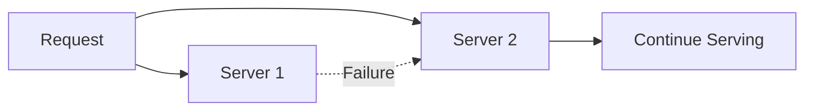

### 3. Is it consistent?

Can the system maintain correct and predictable data when operations occur?

```mermaid
flowchart LR
    WRITE[Data Operation] --> DATA[(Data)]
    DATA --> READ[Consistent Result]
```

---

# 15. System Design Is About Trade-offs

There is no single solution that gives every desirable property for free.

For example:

```mermaid
flowchart TD
    DESIGN[System Design]
    DESIGN --> SCALE[Scalability]
    DESIGN --> RES[Resilience]
    DESIGN --> CONS[Consistency]

    SCALE --> TRADEOFF[Trade-offs]
    RES --> TRADEOFF
    CONS --> TRADEOFF
```

Increasing scalability may introduce:

- More machines
- Network communication
- Load balancing
- Distributed data
- More complexity

Therefore, system design is about choosing an architecture that satisfies the actual requirements of the system.

---

# 16. The Complete Journey

Starting with one simple computer, the system evolves as requirements increase:

```mermaid
flowchart TD
    A[Algorithm on One Computer]
    --> B[Expose Through API]
    --> C[Self-Hosting Problems]
    --> D[Cloud Hosting]
    --> E[More Users]
    --> F[Scalability Problem]
    --> G{How to Scale?}

    G --> H[Vertical Scaling]
    G --> I[Horizontal Scaling]

    I --> J[Load Balancing]
    J --> K[Resilience]
    J --> L[Network Communication]
    J --> M[Data Consistency Challenges]

    H --> N[Hardware Limit]
    I --> O[Add More Machines]

    H --> P[Hybrid Approach]
    O --> P
    P --> Q[System Design Trade-offs]
```

---

# 17. What Is System Design?

At its core:

> **System design is the process of designing a system that meets its requirements while making appropriate trade-offs around properties such as scalability, resilience, and consistency.**

The process can be viewed as:

```mermaid
flowchart LR
    REQUIREMENTS[Requirements]
    --> PROBLEMS[Identify Problems]
    --> SOLUTIONS[Design Solutions]
    --> TRADEOFFS[Evaluate Trade-offs]
    --> SYSTEM[Build System]
```

The important part is not simply knowing words such as *horizontal scaling*, *vertical scaling*, or *load balancing*.

The important part is understanding **why these concepts exist**.

A system starts simple.

Then users increase.

That creates problems.

Those problems lead to architectural decisions.

And those decisions, together, form **system design**.

---

# Key Takeaways

1. An **API** exposes functionality so users can interact with an application over the internet.
2. A **request** is sent to the service, and a **response** is returned.
3. Self-hosting introduces concerns around configuration, databases, endpoints, and reliability.
4. The **cloud** provides computing resources that can run your service.
5. **Scalability** means being able to handle more requests.
6. **Vertical scaling** means buying a bigger machine.
7. **Horizontal scaling** means buying more machines.
8. Horizontal scaling generally requires **load balancing**.
9. Multiple machines provide greater **resilience** because another machine can handle requests when one fails.
10. Multiple machines introduce **network communication**, which is slower than local interprocess communication.
11. Distributed data makes **consistency** more complicated.
12. Vertical scaling eventually encounters **hardware limitations**.
13. Real-world systems can combine vertical and horizontal scaling.
14. System design involves **trade-offs**.
15. Three major considerations introduced here are **scalability, resilience, and consistency**.

---

# Final Mental Model

Remember the entire topic through this progression:

```text
One Computer
     ↓
Expose an API
     ↓
Users Increase
     ↓
Machine Becomes a Bottleneck
     ↓
 ┌───────────────┬────────────────┐
 ↓                                ↓
Vertical Scaling           Horizontal Scaling
 ↓                                ↓
Bigger Machine             More Machines
 ↓                                ↓
Hardware Limit             Load Balancer
                                ↓
                         More Resilience
                                ↓
                         Network Calls
                                ↓
                      Consistency Challenges
                                ↓
                         More Trade-offs
```

**That is the beginning of system design.**