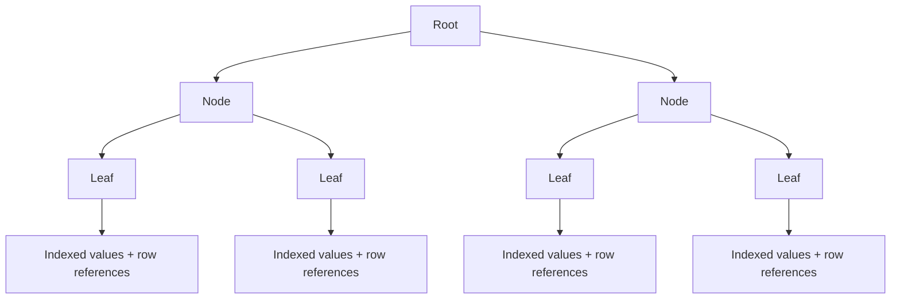
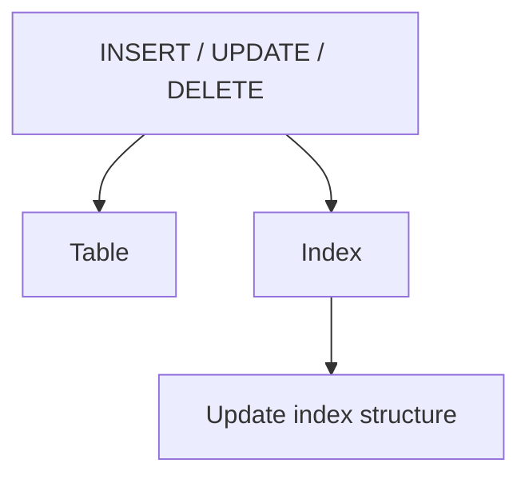
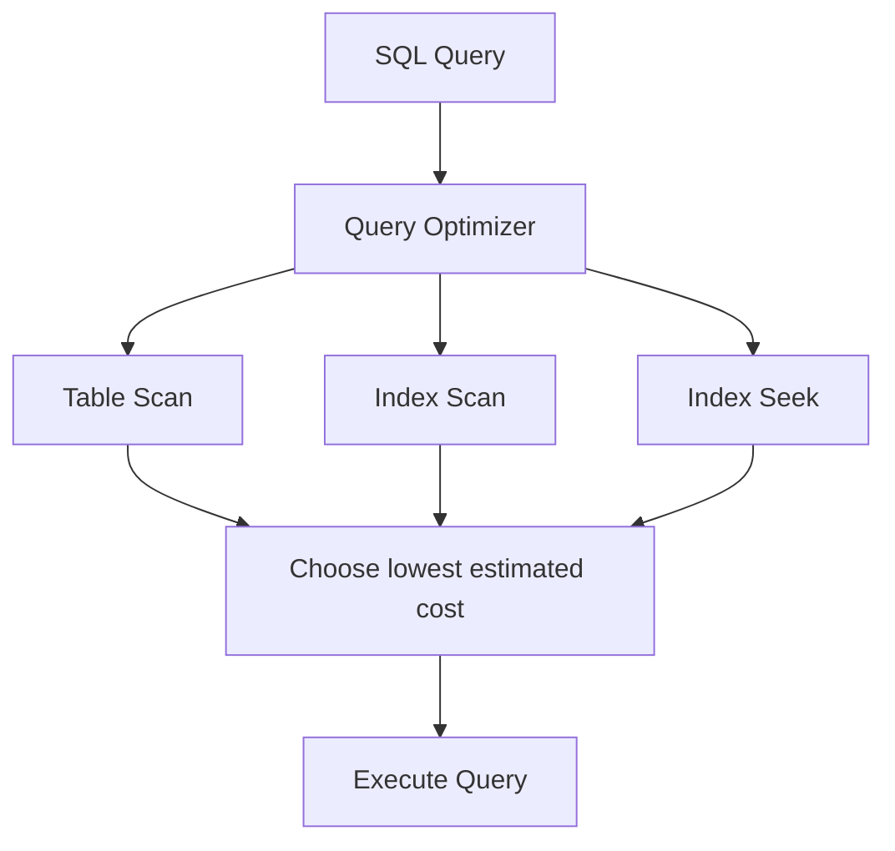
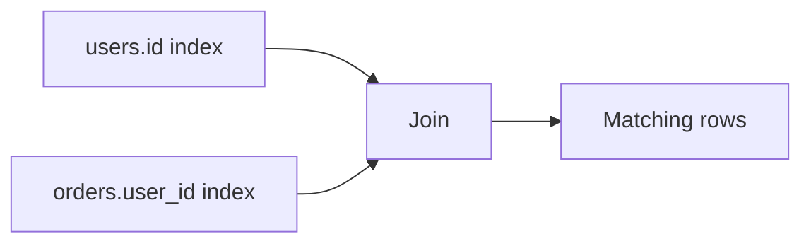
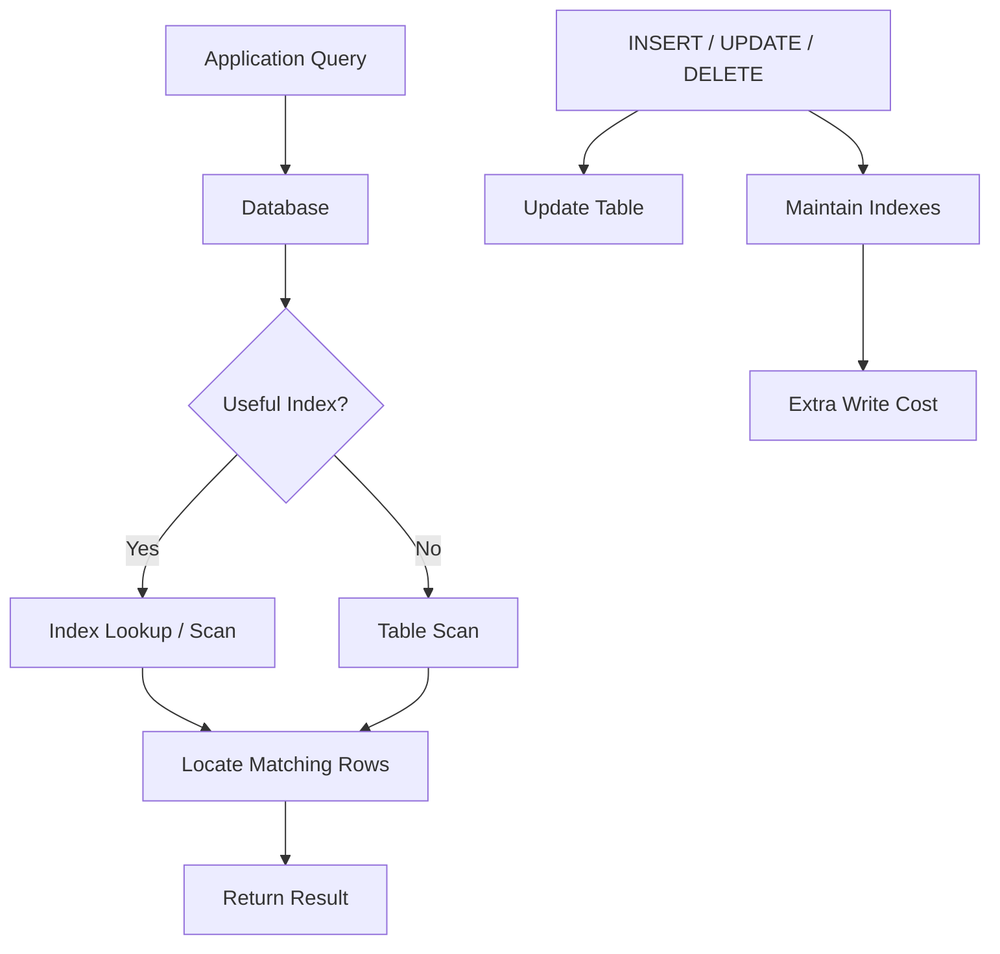

# What are Database Indexes?

## 1. What is a Database Index?

A **database index** is a data structure that helps the database find rows faster without scanning the entire table.

Think of a book:

```text
Without index:
Book → Check page 1 → page 2 → page 3 → ... → page 500
```

With an index:

```text
Index → "Database Indexes" → Page 347
```

The database can jump much closer to the required data.

### Core idea

```text
Table
  ↓
Index on a column
  ↓
Fast lookup
  ↓
Matching rows
```

---

# 2. Why Do We Need Indexes?

Suppose we have a `users` table with **10 million rows**:

```text
USERS

id | name   | email
---|--------|--------------------
1  | Tapan  | tapan@example.com
2  | Rahul  | rahul@example.com
...
10,000,000 rows
```

Now run:

```sql
SELECT *
FROM users
WHERE email = 'tapan@example.com';
```

Without an index on `email`, the database may need to examine many rows.

```text
10,000,000 rows
       ↓
   Scan rows
       ↓
Find matching email
```

This is called a **table scan** or **full table scan**.

With an index:

```text
email index
     ↓
Find email
     ↓
Locate row
     ↓
Fetch row
```

The amount of work can be dramatically smaller.

---

# 3. What Does an Index Actually Store?

An index generally stores:

```text
indexed value → reference to the corresponding row
```

For example:

```text
EMAIL INDEX

tapan@example.com → row 1
rahul@example.com → row 2
amit@example.com  → row 3
```

The exact physical representation depends on the database and index type.

A very common structure for database indexes is a **B-tree / B+ tree family structure**.



The tree keeps values organized so the database does not have to inspect every row.

---

# 4. Without Index vs With Index

## Without Index


## With Index


The index acts as a shortcut.

---

# 5. Creating an Index

Example:

```sql
CREATE INDEX idx_users_email
ON users(email);
```

Now the database has an index for the `email` column.

A query such as:

```sql
SELECT *
FROM users
WHERE email = 'tapan@example.com';
```

may use that index.

Important:

> Creating an index does not guarantee that every query will use it. The database optimizer decides whether the index is beneficial.

---

# 6. Primary Keys and Indexes

A primary key is commonly backed by an index.

Example:

```sql
CREATE TABLE users (
    id INT PRIMARY KEY,
    name VARCHAR(100)
);
```

The database normally creates or uses an index to efficiently enforce the primary-key uniqueness and locate rows by `id`.

So:

```sql
SELECT *
FROM users
WHERE id = 100;
```

can be very efficient.

The exact implementation varies by database.

---

# 7. Common Types of Indexes

## 7.1 Single-Column Index

Index on one column.

```sql
CREATE INDEX idx_users_email
ON users(email);
```

Useful for:

```sql
WHERE email = ?
```

---

## 7.2 Composite Index

Index on multiple columns.

```sql
CREATE INDEX idx_users_city_age
ON users(city, age);
```

This is useful when queries commonly filter or sort using those columns.

Example:

```sql
SELECT *
FROM users
WHERE city = 'Bengaluru'
  AND age = 25;
```

---

# 8. Column Order Matters in Composite Indexes

Suppose:

```sql
CREATE INDEX idx_users_city_age
ON users(city, age);
```

The index is conceptually organized like:

```text
(city, age)
```

So queries beginning with `city` can often benefit.

```sql
WHERE city = 'Bengaluru'
```

and:

```sql
WHERE city = 'Bengaluru'
  AND age = 25
```

can use the index effectively.

But a query only on:

```sql
WHERE age = 25
```

may not benefit in the same way.

### Leftmost-prefix idea

For:

```text
(city, age, name)
```

the useful prefixes are conceptually:

```text
(city)
(city, age)
(city, age, name)
```

Not necessarily:

```text
(age)
(age, name)
```

This is an important interview concept.

---

# 9. Indexes and Sorting

Indexes can also help with `ORDER BY`.

Example:

```sql
CREATE INDEX idx_users_age
ON users(age);
```

Query:

```sql
SELECT *
FROM users
ORDER BY age;
```

An index that stores values in an ordered structure can reduce the work required to produce ordered results.

Whether the optimizer chooses the index depends on the query and data distribution.

---

# 10. Indexes and Range Queries

Indexes are especially useful for many range queries.

Example:

```sql
SELECT *
FROM orders
WHERE amount > 1000;
```

Or:

```sql
SELECT *
FROM orders
WHERE created_at >= '2026-01-01'
  AND created_at < '2026-02-01';
```

A tree-based index can navigate to the relevant portion of the ordered values.

```text
Index

100
200
300
400
500
600
700
800
900
1000
...
        ↑
     start here
        ↓
1000 → 1100 → 1200 → 1300 ...
```

---

# 11. The Big Trade-off: Read vs Write

Indexes make reads faster, but they are not free.

Whenever data changes:

```sql
INSERT
UPDATE
DELETE
```

the database may also need to update the relevant indexes.



Therefore:

```text
More indexes
    ↓
Faster reads in suitable queries
    +
More storage
    +
More write work
    +
More maintenance
```

This is one of the most important system-design trade-offs.

---

# 12. Why Not Index Every Column?

Because indexes have costs.

Suppose we create indexes on:

```text
id
name
email
age
city
country
phone
created_at
status
...
```

Reads may improve for some queries, but:

- Storage usage increases
- Inserts become more expensive
- Updates can become more expensive
- Deletes can become more expensive
- Database maintenance increases
- The optimizer has more choices to evaluate

So:

> **Index the columns that support important query patterns, not every column blindly.**

---

# 13. Selectivity

**Selectivity** describes how well a column distinguishes rows.

Example:

```text
gender

male
female
male
male
female
...
```

There may be only a few distinct values.

Compare that with:

```text
email

a@example.com
b@example.com
c@example.com
...
```

Emails are usually much more selective.

A highly selective condition can make an index more useful because it narrows the result set substantially.

---

# 14. High vs Low Cardinality

**Cardinality** refers to the number of distinct values in a column.

Example:

```text
status

PENDING
PENDING
PAID
PAID
PAID
FAILED
```

Low cardinality:

```text
3 distinct values
```

Example:

```text
user_id

101
102
103
104
105
...
```

Usually much higher cardinality.

### Important

High cardinality does not automatically mean "always index".

The usefulness of an index depends on:

```text
Query pattern
+
Data distribution
+
Selectivity
+
Table size
+
Index type
+
Optimizer cost estimates
```

---

# 15. Clustered vs Non-Clustered Index

Some database systems support a distinction between clustered and non-clustered indexes.

## Clustered Index

The table's data is organized around the index ordering.

Conceptually:

```text
Clustered index
      ↓
[Data organized according to index]
```

There is typically only one clustered ordering for a table.

## Non-Clustered Index

The index is a separate structure containing indexed values and references to the underlying rows.

```text
Non-clustered index
        ↓
Value → Row reference
```

A table can generally have multiple non-clustered indexes.

> Exact behavior and terminology vary between database systems.

---

# 16. Covering Index

A **covering index** contains all the columns needed by a particular query.

Suppose:

```sql
CREATE INDEX idx_users_email_name
ON users(email, name);
```

Query:

```sql
SELECT name
FROM users
WHERE email = 'tapan@example.com';
```

The index already contains:

```text
email
name
```

So the database may be able to answer the query directly from the index without fetching the full table row.

Conceptually:


This can reduce extra table lookups.

---

# 17. Index Scan vs Index Seek

These terms are commonly used when examining query execution plans.

### Index Seek

The database navigates to the relevant portion of an index.

```text
Index
 ↓
Find target area
 ↓
Fetch matching entries
```

### Index Scan

The database reads a larger portion of the index.

```text
Index
 ↓
Read many/all index entries
 ↓
Filter/use results
```

A seek is not automatically "good" and a scan is not automatically "bad". The optimizer chooses based on estimated cost.

For example, if a query needs most rows, scanning can be cheaper than repeatedly looking up individual rows.

---

# 18. Index and Query Optimizer

Modern relational databases have a **query optimizer**.

When you execute:

```sql
SELECT *
FROM users
WHERE email = 'tapan@example.com';
```

the database considers possible execution strategies.

Conceptually:



The database does **not** simply say:

```text
"Index exists → always use index"
```

It estimates which plan is likely to be cheaper.

---

# 19. `EXPLAIN`

To understand whether an index is being used, databases provide execution-plan tools.

For example:

```sql
EXPLAIN
SELECT *
FROM users
WHERE email = 'tapan@example.com';
```

Depending on the database, `EXPLAIN` can show information such as:

```text
Access method
Index used
Estimated rows
Join strategy
Cost
```

This is extremely useful when diagnosing slow queries.

---

# 20. Indexes in System Design

Imagine an e-commerce system.

Tables:

```text
users
products
orders
order_items
payments
```

Common queries might be:

```sql
-- Find user by email
SELECT *
FROM users
WHERE email = ?;

-- Find user's orders
SELECT *
FROM orders
WHERE user_id = ?;

-- Find recent orders
SELECT *
FROM orders
WHERE user_id = ?
ORDER BY created_at DESC;
```

Potential indexes:

```text
users(email)

orders(user_id)

orders(user_id, created_at)
```

The exact indexes should be chosen from real query patterns and workload.

---

# 21. Indexing a Foreign Key

Suppose:

```text
orders.user_id → users.id
```

and we frequently query:

```sql
SELECT *
FROM orders
WHERE user_id = 123;
```

An index on:

```text
orders(user_id)
```

can make that lookup much faster.

This is particularly important for foreign-key columns that are frequently used in joins or filters.

---

# 22. Indexes and Joins

Consider:

```sql
SELECT *
FROM users u
JOIN orders o
    ON u.id = o.user_id
WHERE u.id = 123;
```

Indexes on join/filter columns can make this operation much more efficient.

Conceptually:



The exact optimal plan depends on the database and data distribution.

---

# 23. Common Indexing Mistakes

### Mistake 1: Indexing everything

```text
Every column → Index
```

❌ Creates unnecessary write and storage overhead.

### Mistake 2: Ignoring query patterns

An index should exist because a workload needs it.

### Mistake 3: Wrong composite-column order

```text
INDEX(city, age)
```

is not equivalent to:

```text
INDEX(age, city)
```

for all query patterns.

### Mistake 4: Not checking the execution plan

Always investigate with tools such as:

```sql
EXPLAIN
```

when optimizing query performance.

### Mistake 5: Assuming an index guarantees speed

An index can be ignored if the optimizer estimates that another plan is cheaper.

---

# 24. Indexes and NULLs

Index behavior involving `NULL` values varies somewhat by database system and index type.

Do not memorize a universal rule such as:

```text
"Indexes never store NULL"
```

That is not generally correct across all database systems.

Always check the specific database's indexing behavior when `NULL` semantics matter.

---

# 25. Unique Index

A unique index enforces uniqueness of indexed values.

Example:

```sql
CREATE UNIQUE INDEX idx_users_email
ON users(email);
```

Now duplicate email values are rejected according to the database's uniqueness and `NULL` semantics.

Conceptually:

```text
tapan@example.com  ✅
rahul@example.com  ✅
tapan@example.com  ❌
```

This is useful when a business rule says a value must be unique.

---

# 26. Partial / Filtered Index

Some databases support indexes that include only rows matching a condition.

Conceptually:

```text
All orders
    ↓
Only WHERE status = 'PENDING'
    ↓
Index
```

For example, a database may support syntax similar to:

```sql
CREATE INDEX idx_pending_orders
ON orders(created_at)
WHERE status = 'PENDING';
```

Exact syntax and support depend on the database.

This can reduce index size when only a subset of rows matters.

---

# 27. Full-Text Index

Traditional B-tree indexes are not designed for general text-search problems.

For queries such as:

```text
"find documents containing the words database and index"
```

databases may provide **full-text indexes** or applications may use dedicated search engines.

Examples of use cases:

```text
Product search
Document search
Article search
Keyword search
```

---

# 28. Indexes in Large-Scale Systems

Suppose:

```text
1 billion rows
```

A query:

```sql
WHERE user_id = 123
```

without a useful index could require a huge scan.

With an appropriate index:

```text
Query
  ↓
Index
  ↓
Small set of matching row references
  ↓
Fetch rows
```

At scale, indexing becomes a major part of database performance design.

But indexes do not solve every scaling problem.

Eventually you may also need:

```text
Read replicas
Caching
Partitioning
Sharding
Archiving
Data modeling
```

---

# 29. Indexes + Caching

Indexes and caches solve different problems.

```text
Cache
  ↓
Avoid database query entirely
```

while:

```text
Index
  ↓
Make database query faster
```

A common architecture can use both:


---

# 30. Important Trade-off

The most important mental model:

```text
                 INDEX
                   │
        ┌──────────┴──────────┐
        ▼                     ▼
      READS                  WRITES
        │                     │
        ▼                     ▼
   Usually faster       Usually more work
                              │
                              ▼
                         More storage
```

So database indexing is a **performance trade-off**, not a free speed button.

---

# 31. Practical Example

Suppose your application frequently runs:

```sql
SELECT *
FROM orders
WHERE user_id = 123
ORDER BY created_at DESC;
```

A possible index is:

```sql
CREATE INDEX idx_orders_user_created
ON orders(user_id, created_at);
```

Why?

The query uses:

```text
user_id
   ↓
created_at
```

which matches the index column order.

Conceptually:

```text
(user_id, created_at)
       ↓
Find user 123
       ↓
Relevant orders are organized by created_at
       ↓
Return recent orders efficiently
```

The exact performance should be verified using the database's execution plan and real workload.

---

# 32. Backend Developer Perspective

When designing an API, think about the database query behind each endpoint.

Example:

```text
GET /users/123/orders
```

May execute:

```sql
SELECT *
FROM orders
WHERE user_id = 123
ORDER BY created_at DESC;
```

Then ask:

```text
1. How many orders exist?
2. How frequently is this endpoint called?
3. Is user_id indexed?
4. Is sorting expensive?
5. Would (user_id, created_at) be better?
6. What does EXPLAIN show?
7. How does this behave with millions of rows?
```

This is how indexing becomes part of **system design**, rather than just a database feature.

---

# 33. Interview Cheat Sheet

| Concept | Remember |
|---|---|
| Index | Data structure for faster data lookup |
| Main benefit | Faster reads for suitable queries |
| Main cost | Extra storage + write/maintenance overhead |
| Common structure | B-tree/B+ tree family |
| Single-column index | Index on one column |
| Composite index | Index on multiple columns |
| Column order | Matters in composite indexes |
| Selectivity | How well a condition narrows rows |
| Cardinality | Number of distinct values |
| Covering index | Index contains all needed query columns |
| Unique index | Enforces uniqueness |
| Index seek | Navigates to relevant index entries |
| Index scan | Reads a larger portion of an index |
| EXPLAIN | Helps inspect query execution plans |
| Optimizer | Chooses an execution strategy |
| Foreign-key index | Often useful for joins/filtering |
| Main rule | Index based on real query patterns |

---

# 34. Final Mental Model



### Remember this:

```text
Index = Shortcut for finding data

Good index
    ↓
Fewer rows examined
    ↓
Faster suitable queries

But...

More indexes
    ↓
More storage
    +
More write/maintenance cost
```

The goal is **not** to have the maximum number of indexes.

The goal is to have the **right indexes for the important query patterns**.
