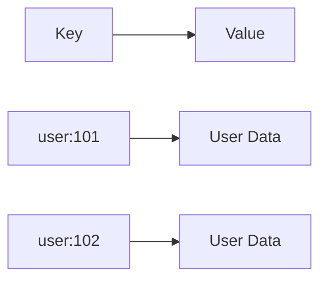
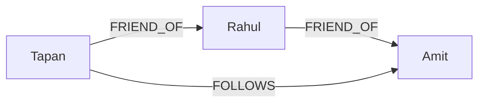
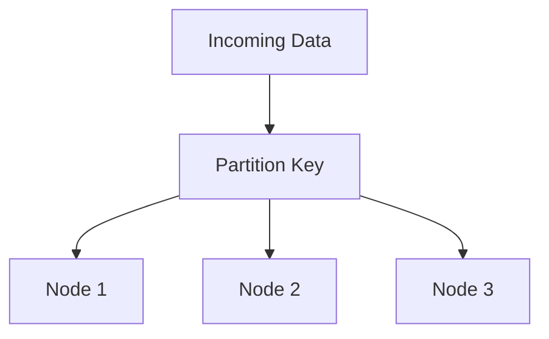
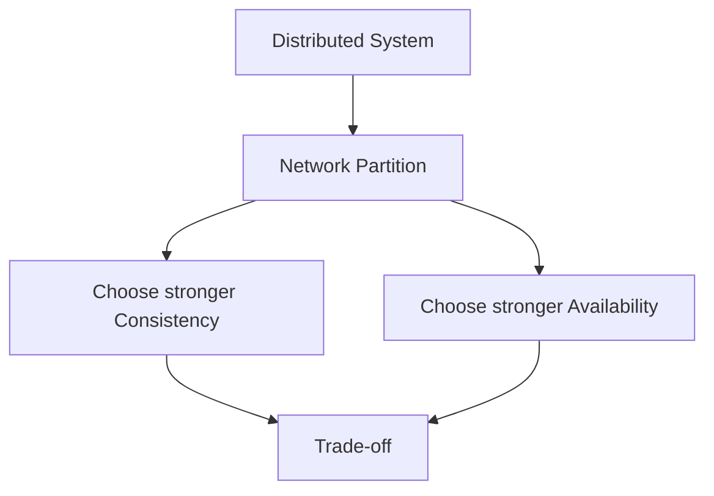
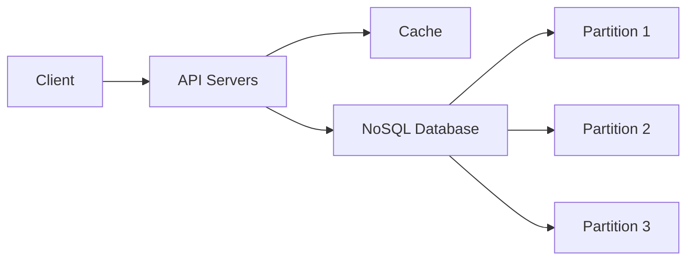
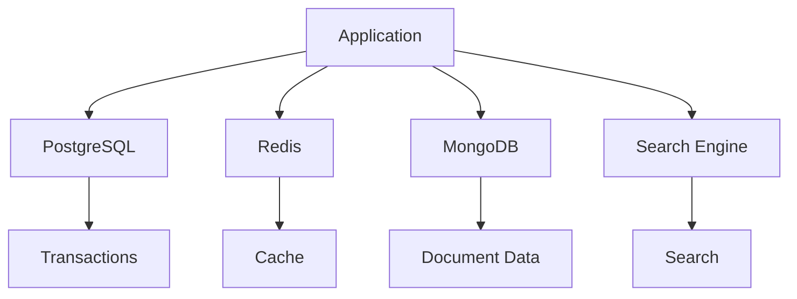
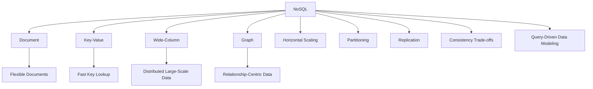

# What are NoSQL Databases?

## 1. What is NoSQL?

**NoSQL** databases are databases designed to store and retrieve data without requiring the traditional relational table model.

NoSQL commonly means:

> **Not Only SQL**

It does **not** necessarily mean "SQL is not supported". The idea is that these databases provide data models and scaling approaches beyond traditional relational databases.

Instead of forcing all data into tables like:

```text
USERS
+----+--------+-------------------+
| id | name   | email             |
+----+--------+-------------------+
| 1  | Tapan  | tapan@example.com |
| 2  | Rahul  | rahul@example.com |
+----+--------+-------------------+
```

a NoSQL database might store a user as a document:

```json
{
  "id": 1,
  "name": "Tapan",
  "email": "tapan@example.com"
}
```

---

# 2. Why Were NoSQL Databases Needed?

Traditional relational databases are extremely powerful, but large-scale applications can face challenges such as:

```text
Huge data volume
       +
Very high traffic
       +
Rapidly changing data
       +
Horizontal scaling requirements
       ↓
Need for different database designs
```

NoSQL databases became popular for workloads where flexibility, horizontal scaling, or very high throughput were important.

Common use cases include:

```text
Large-scale web applications
Real-time applications
Caching
Gaming
IoT
Analytics
Social networks
Event data
Product catalogs
```

---

# 3. Relational vs NoSQL

## Relational Database

Data is typically organized into tables.

```text
USERS
       ↓
ORDERS
       ↓
ORDER_ITEMS
```

Relationships are represented using keys.

## NoSQL

Data can be modeled according to the application's access patterns.

For example:

```text
USER
 ├── name
 ├── email
 └── orders
      ├── order 1
      └── order 2
```

The exact model depends on the NoSQL database type.

---

# 4. Main Types of NoSQL Databases

There are four commonly discussed categories:

```text
                 NoSQL
                   │
       ┌───────────┼───────────┬───────────┐
       ▼           ▼           ▼           ▼
   Document      Key-Value   Wide-Column  Graph
```

Examples:

| Type | Examples |
|---|---|
| Document | MongoDB, Couchbase |
| Key-Value | Redis, Amazon DynamoDB |
| Wide-Column | Apache Cassandra, HBase |
| Graph | Neo4j |

The same product can have additional capabilities, so these categories are useful conceptual models rather than rigid boxes.

---

# 5. Document Databases

A **document database** stores data as documents, commonly using JSON-like structures.

Example:

```json
{
  "id": 101,
  "name": "Tapan",
  "email": "tapan@example.com",
  "address": {
    "city": "Bengaluru",
    "country": "India"
  }
}
```

Instead of splitting the information across multiple tables, related data can sometimes be stored together.

### Example

Relational approach:

```text
USERS
      ↓
USER_ADDRESSES
```

Document approach:

```json
{
  "id": 101,
  "name": "Tapan",
  "address": {
    "city": "Bengaluru"
  }
}
```

This can be convenient when an application usually reads the data together.

---

# 6. Key-Value Databases

A key-value database stores data as:

```text
KEY → VALUE
```

Example:

```text
user:101 → {"name":"Tapan","age":25}
user:102 → {"name":"Rahul","age":28}
```

Conceptually:



These databases are often useful for:

```text
Caching
Sessions
Counters
Feature flags
Fast lookups
Temporary state
```

---

# 7. Wide-Column Databases

Wide-column databases organize data around rows and columns but are designed differently from traditional relational databases.

Examples:

```text
Apache Cassandra
Apache HBase
```

They are particularly useful for some very large-scale distributed workloads.

A simplified conceptual representation:

```text
Partition
   ↓
Rows
   ↓
Columns
```

The data model is heavily influenced by the queries and partitioning strategy.

---

# 8. Graph Databases

Graph databases represent data using:

```text
Nodes
+
Edges
+
Properties
```

Example:

```text
Tapan
  │
  │ FRIEND_OF
  ▼
Rahul
  │
  │ FRIEND_OF
  ▼
Amit
```

This is useful when relationships themselves are central to the application.

Examples:

```text
Social networks
Recommendation systems
Fraud detection
Knowledge graphs
Network topology
```

Conceptually:



---

# 9. Schema Flexibility

One major characteristic of many NoSQL systems is **schema flexibility**.

For example, documents may have different fields:

```json
{
  "id": 1,
  "name": "Tapan"
}
```

Another document could contain:

```json
{
  "id": 2,
  "name": "Rahul",
  "phone": "1234567890"
}
```

The database may allow these documents to coexist without requiring the exact same set of columns.

### Important

Schema flexibility does **not** mean:

```text
No structure
```

It means the database may enforce less rigid schema structure at the database layer.

The application can still have a well-defined schema.

---

# 10. Horizontal Scaling

One of the major reasons NoSQL databases are used is their ability to scale horizontally in many deployments.

### Vertical Scaling

Make one machine bigger:

```text
Small Server
     ↓
More CPU
More RAM
More Storage
```

### Horizontal Scaling

Add more machines:

```text
        Database
       /   |         /    |       Node 1 Node 2 Node 3
```

This can allow systems to handle increasing traffic and data volumes.

---

# 11. Partitioning

Large NoSQL systems commonly distribute data across multiple nodes.

Example:

```text
Users

user_id 1-1000      → Node 1
user_id 1001-2000   → Node 2
user_id 2001-3000   → Node 3
```

This is called **partitioning**.

A **partition key** determines where data is stored.



The exact partitioning mechanism depends on the database.

---

# 12. Replication

Replication means keeping copies of data on multiple nodes.

```text
             Data
               ↓
       ┌───────┼───────┐
       ▼       ▼       ▼
     Node 1  Node 2  Node 3
      Copy    Copy    Copy
```

Benefits can include:

- High availability
- Fault tolerance
- Disaster recovery
- Read scaling in some architectures

---

# 13. CAP Theorem

CAP is a major concept when studying distributed NoSQL systems.

CAP stands for:

```text
C = Consistency
A = Availability
P = Partition Tolerance
```

The theorem states that in the presence of a network partition, a distributed system cannot simultaneously guarantee both perfect consistency and availability for all operations.



### Important

Partition tolerance is generally necessary in a distributed system that must continue operating despite network failures.

So the practical trade-off during a partition is commonly discussed as:

```text
Consistency vs Availability
```

---

# 14. Eventual Consistency

Some distributed NoSQL systems support **eventual consistency** for certain operations/configurations.

Suppose data is replicated:

```text
Node 1 → value = 100
Node 2 → value = 100
Node 3 → value = 100
```

An update occurs:

```text
Node 1 → value = 200
```

The replicas may temporarily differ:

```text
Node 1 → 200
Node 2 → 100
Node 3 → 100
```

After replication catches up:

```text
Node 1 → 200
Node 2 → 200
Node 3 → 200
```

This is the basic idea of eventual consistency.

```text
Update
  ↓
Replication
  ↓
Temporary difference
  ↓
Convergence
  ↓
Same value
```

Not every NoSQL database or workload is simply "eventually consistent". Consistency guarantees vary by product and configuration.

---

# 15. Denormalization

Relational databases often normalize data to reduce duplication.

NoSQL systems often use **denormalization** when it makes common reads faster or simpler.

Instead of:

```text
USER
  ↓
ORDER
  ↓
PRODUCT
```

you might store commonly needed data together:

```json
{
  "orderId": 101,
  "userId": 1,
  "userName": "Tapan",
  "items": [
    {
      "productId": 10,
      "productName": "Keyboard",
      "quantity": 1
    }
  ]
}
```

Now one read may provide most of the information needed by the application.

### Trade-off

```text
Faster / simpler reads
        +
Less need for joins
        ↓
More duplicated data
        +
More complex updates
```

---

# 16. NoSQL Often Designs Around Queries

One of the biggest mindset differences is:

### Relational thinking

```text
Design normalized entities
        ↓
Create relationships
        ↓
Write queries
```

### NoSQL thinking

```text
Identify important queries
        ↓
Choose partition key
        ↓
Design data around access patterns
        ↓
Optimize common reads/writes
```

This is extremely important in system design interviews.

---

# 17. Example: User Orders

Suppose the main query is:

```text
Get all orders for a user
```

A NoSQL design might organize data around:

```text
Partition Key = user_id
```

Conceptually:

```text
user_id = 101
    ↓
Partition
    ├── order 1
    ├── order 2
    └── order 3
```

Now the database can locate the user's data directly using the partition key.

---

# 18. NoSQL vs SQL

| Feature | Relational / SQL | NoSQL |
|---|---|---|
| Data model | Tables | Document / Key-Value / Wide-Column / Graph |
| Schema | Usually structured | Often more flexible |
| Relationships | Strong relational model | Depends on database type |
| Joins | Common | Often avoided or database-specific |
| Scaling | Vertical + horizontal options | Often designed heavily around horizontal scaling |
| Transactions | Strong transactional support | Varies by product |
| Consistency | Often strong consistency | Varies by product/configuration |
| Query language | SQL | Database-specific APIs/languages |
| Best for | Structured relational workloads | Workloads needing specific NoSQL models/scaling patterns |

Do not interpret this table as "SQL cannot scale" or "NoSQL cannot provide transactions". Modern systems can do both. The difference is primarily in data model, workload characteristics, and trade-offs.

---

# 19. SQL vs NoSQL Example

## SQL

Suppose:

```text
users
orders
order_items
```

To get a user's orders, you may use joins:

```sql
SELECT *
FROM users u
JOIN orders o
    ON u.id = o.user_id
WHERE u.id = 101;
```

## Document Database

The data might be modeled around the user:

```json
{
  "userId": 101,
  "name": "Tapan",
  "orders": [
    {
      "orderId": 1,
      "amount": 500
    },
    {
      "orderId": 2,
      "amount": 900
    }
  ]
}
```

The right design depends on how the application reads and updates the data.

---

# 20. Advantages of NoSQL

## 1. Flexible Data Models

Useful when data structure changes frequently.

## 2. Horizontal Scaling

Many NoSQL systems are designed for distributing data across nodes.

## 3. High Throughput

Some NoSQL systems are optimized for very large numbers of reads/writes.

## 4. Application-Specific Data Modeling

Data can be designed around access patterns.

## 5. Large Distributed Workloads

NoSQL databases can be a good fit for certain massive distributed workloads.

---

# 21. Disadvantages of NoSQL

NoSQL is not automatically better than SQL.

Potential disadvantages include:

### 1. Data Duplication

Denormalization can create duplicate data.

### 2. Complex Updates

Updating duplicated data may require changes in multiple places.

### 3. Limited Joins in Some Systems

Applications may need to perform more work themselves.

### 4. Consistency Trade-offs

Some distributed designs may trade stronger consistency for availability or performance.

### 5. Query Flexibility

Some NoSQL databases are optimized for specific access patterns rather than arbitrary ad-hoc queries.

### 6. Data Modeling Can Be Hard

Choosing the wrong partition key or access pattern can create serious performance problems.

---

# 22. When Should You Use NoSQL?

NoSQL can be a good choice when you have requirements such as:

```text
Very large scale
      +
High throughput
      +
Distributed architecture
      +
Flexible or specialized data model
      +
Known access patterns
```

Examples:

### Redis-style key-value use case

```text
Session storage
Caching
Counters
```

### Document database use case

```text
Product catalogs
Content management
User profiles
```

### Wide-column use case

```text
Massive event/time-series workloads
High write throughput
```

### Graph database use case

```text
Fraud detection
Recommendations
Social relationships
```

---

# 23. When Should You Prefer SQL?

A relational database is often a strong choice when you need:

```text
Complex relationships
Strong transactions
Rich joins
Strict constraints
Structured data
Complex ad-hoc queries
```

For example:

```text
Banking
Accounting
Order/payment transactions
Inventory
Financial records
```

Again, this is a rule of thumb, not an absolute boundary.

---

# 24. NoSQL in System Design

A typical architecture might look like:



As traffic increases:

```text
          NoSQL Cluster
       ┌──────┼──────┐
       ▼      ▼      ▼
     Node 1 Node 2 Node 3
       │      │      │
       └──────┼──────┘
              ▼
          More Nodes
```

This is where concepts such as:

```text
Partitioning
Replication
Sharding
Consistency
Availability
Fault tolerance
```

become important.

---

# 25. NoSQL Does NOT Mean "No SQL"

This is an important interview point.

NoSQL is commonly interpreted as:

```text
Not Only SQL
```

It means databases can use models beyond the traditional relational model.

It does **not** mean:

```text
SQL = bad
NoSQL = good
```

Instead:

```text
Choose database
      ↓
Understand workload
      ↓
Understand access patterns
      ↓
Understand consistency requirements
      ↓
Choose appropriate trade-offs
```

---

# 26. SQL + NoSQL Together

Large systems often use multiple databases.

Example:



This is called **polyglot persistence**.

The idea is:

> Use the database that best fits each workload.

---

# 27. Common NoSQL Interview Questions

### Q1. What does NoSQL mean?

**Not Only SQL**, referring to non-relational database models and approaches.

### Q2. What are the four major NoSQL types?

```text
Document
Key-Value
Wide-Column
Graph
```

### Q3. Why use NoSQL?

For suitable workloads requiring things such as:

```text
Horizontal scaling
High throughput
Flexible/specialized data models
Distributed storage
```

### Q4. Does NoSQL support transactions?

Yes, depending on the database and transaction scope. Capabilities vary significantly across NoSQL systems.

### Q5. What is denormalization?

Intentionally duplicating related data to optimize access patterns, often reducing the need for joins.

### Q6. What is a partition key?

A value used by many distributed NoSQL systems to determine how data is distributed across partitions/nodes.

### Q7. SQL or NoSQL?

There is no universal winner.

```text
Requirements
     ↓
Data model
     ↓
Access patterns
     ↓
Consistency needs
     ↓
Scale
     ↓
Choose database
```

---

# 28. Final Mental Model



## One-line memory trick

```text
SQL → relationships + structured data + strong relational model

NoSQL → specialized data models + distributed scaling + access-pattern-driven design
```

## System Design Flow

```text
Requirements
     ↓
What data do we have?
     ↓
How will we query it?
     ↓
How much traffic?
     ↓
How much data?
     ↓
Consistency requirements?
     ↓
SQL or NoSQL?
     ↓
Choose the appropriate data model
     ↓
Design indexes / partitions / replicas
```
