# What is System Design?

System design is the process of taking a real-world problem, identifying
the problems that appear as the system grows, and designing technical
solutions for those problems.

A useful way to understand system design is to start with something
familiar: **a restaurant**.

We will use a pizza shop to understand how common system-design concepts
emerge naturally as the business grows.

------------------------------------------------------------------------

## 1. Start With One Chef

### Basic System

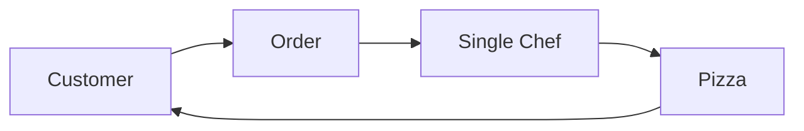

Imagine a pizza shop with **one chef**.

Initially, this works perfectly. But as the number of customers and
orders increases, the chef eventually cannot handle all the work.

The first solution is to make the existing chef more capable:

-   Ask the chef to work harder.
-   Pay more for additional effort.
-   Optimize the chef's processes.
-   Increase the amount of work produced by the same resource.

In a computer system, increasing the power of an existing machine is
called **vertical scaling**.

### Vertical Scaling

> **Vertical scaling = increasing the capacity of an existing
> machine/resource.**

Instead of adding more machines, you make the current machine stronger.

------------------------------------------------------------------------

## 2. Preprocessing With Scheduled Jobs

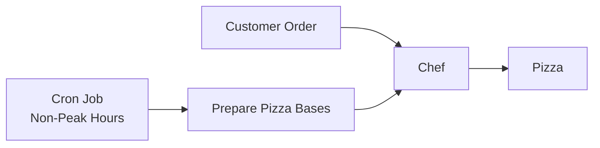

Not every task needs to happen when a customer places an order.

For example, making pizza dough can be done beforehand during non-peak
hours.

If orders are usually low at around 4:00 AM, the restaurant can prepare
the dough then. When customers arrive later, the chef does not have to
spend time preparing it.

In software systems, similar work can be performed ahead of time using
scheduled jobs such as **cron jobs**.

### Key Idea

Move expensive work away from the critical request path whenever
possible.

------------------------------------------------------------------------

## 3. Avoid Single Points of Failure

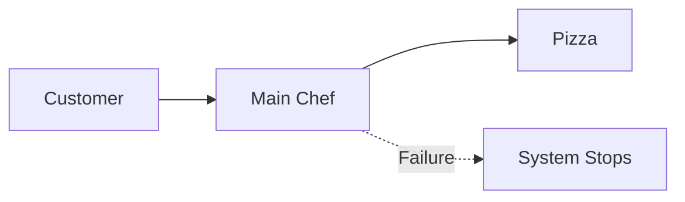

With a backup:

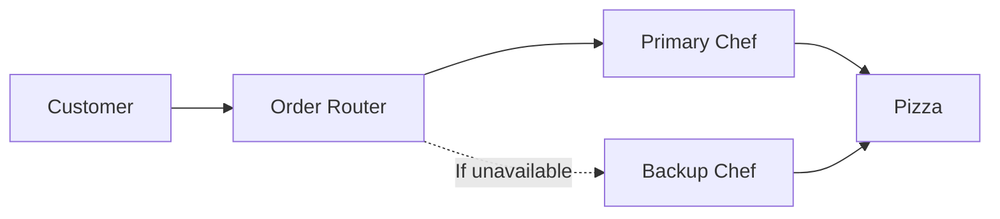

Now imagine that the only chef becomes sick.

The restaurant cannot operate.

The chef is therefore a **single point of failure**: if that one
component fails, the entire system stops working.

A simple solution is to have a backup chef.

If the main chef is unavailable, the backup chef can take over.

### In System Design

Keep backups for important components so that one failure does not bring
down the entire system.

This is the basic idea behind architectures where a primary component
has a backup.

------------------------------------------------------------------------

## 4. Horizontal Scaling

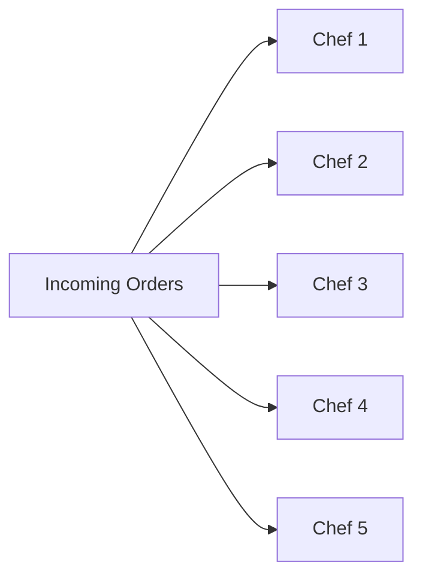

Instead of making one chef infinitely stronger, we add more chefs.

Suppose the pizza shop continues to grow.

Instead of having one chef do more and more work, hire more chefs.

For example:

``` text
Before:

       [ Chef ]
          |
       All Orders


After:

   [Chef 1] [Chef 2] [Chef 3] ... [Chef 10]
        \       |       |          /
              Orders
```

This is **horizontal scaling**.

### Horizontal Scaling

> **Horizontal scaling = adding more machines/resources of a similar
> type to handle more work.**

Instead of making one machine stronger, you add more machines.

------------------------------------------------------------------------

## 5. Divide Responsibilities: Microservices

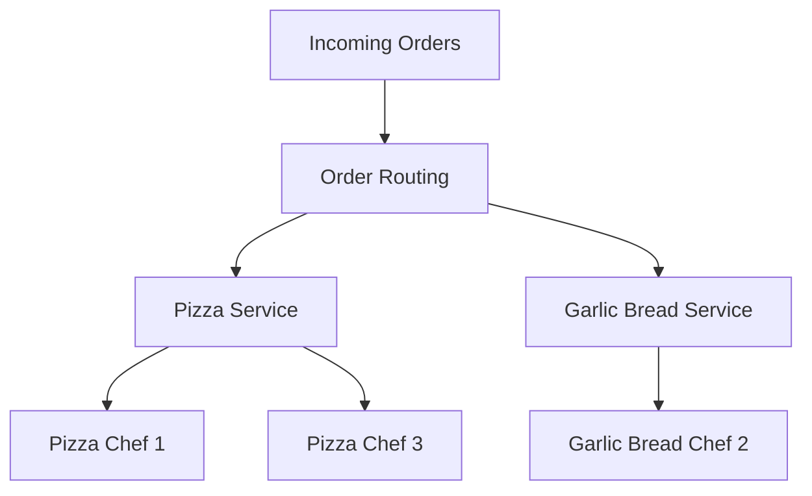

Each specialized team can also be scaled independently:

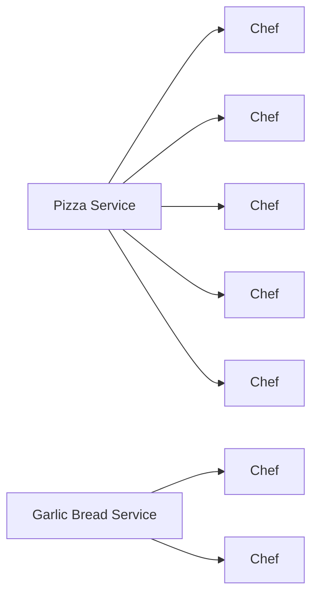

Now suppose the chefs have different specialties.

-   Chef 1 and Chef 3 are experts at making pizza.
-   Chef 2 is an expert at making garlic bread.

If every order is randomly assigned to any chef, the system is not using
the team's strengths efficiently.

A better approach is:

``` text
                 Incoming Orders
                       |
              +--------+--------+
              |                 |
            Pizza          Garlic Bread
              |                 |
        +-----+-----+         [Chef 2]
        |           |
     [Chef 1]    [Chef 3]
```

Now:

-   Pizza orders go to pizza specialists.
-   Garlic bread orders go to the garlic-bread specialist.

This makes the system easier to manage.

If the garlic-bread recipe changes, you know exactly which specialist
needs to handle the change.

You can also scale each group independently.

For example:

-   7 chefs can handle pizzas.
-   3 chefs can handle garlic bread.

If pizza orders increase, add more pizza specialists without necessarily
changing the garlic-bread team.

### Microservice Architecture

This leads to the idea of a **microservice architecture**:

> Responsibilities are divided into well-defined services that can be
> scaled and managed independently.

Each service focuses on its own business responsibility.

------------------------------------------------------------------------

## 6. Distributed Systems

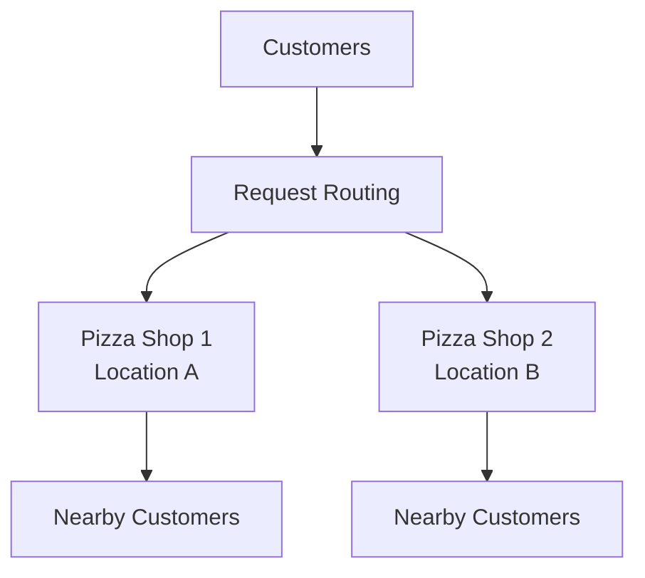

A failure at one location does not necessarily stop the entire business:

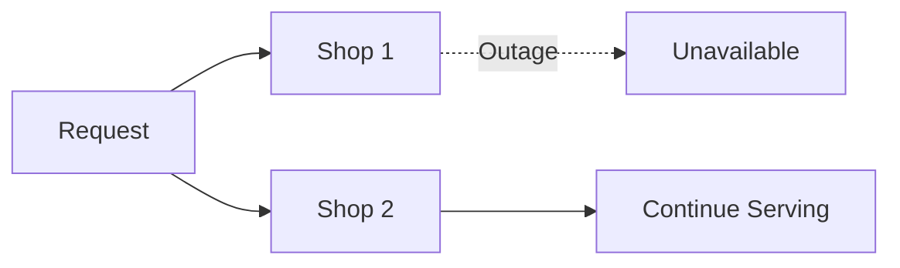

The restaurant is now doing well.

It has:

-   Multiple chefs
-   Specialized teams
-   Independent scaling
-   Backup resources

But there is still a major problem.

What happens if the **entire restaurant** loses electricity?

Or what if the restaurant loses its license for a day?

The whole business stops.

The solution is to open another restaurant in a different location.

``` text
                 Customers
                /         \
               /           \
        [Pizza Shop 1]   [Pizza Shop 2]
```

Now, if one shop becomes unavailable, the other shop can continue
serving customers.

This introduces a **distributed system**.

### Distributed System

A distributed system spreads the work across multiple locations or
machines instead of putting everything in one place.

There is an additional advantage: customers can often be served by the
location closest to them.

This can improve response times.

Large-scale systems use similar ideas by distributing servers across
different locations so requests can be handled closer to the users.

### Benefits

A distributed system can provide:

-   Better fault tolerance
-   Faster response times for local users
-   The ability to serve more users
-   Less dependence on a single location

However, distribution also introduces more complexity because the
different parts of the system now need to communicate and coordinate.

------------------------------------------------------------------------

## 7. Load Balancing

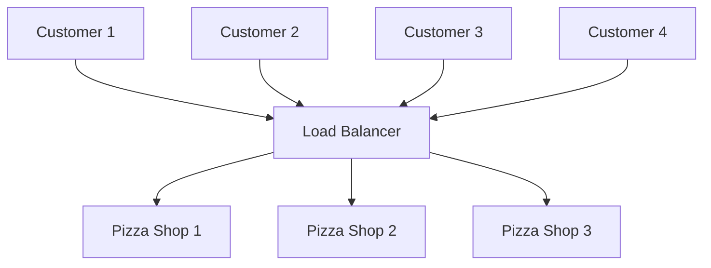

The load balancer can use current information to choose a better destination:

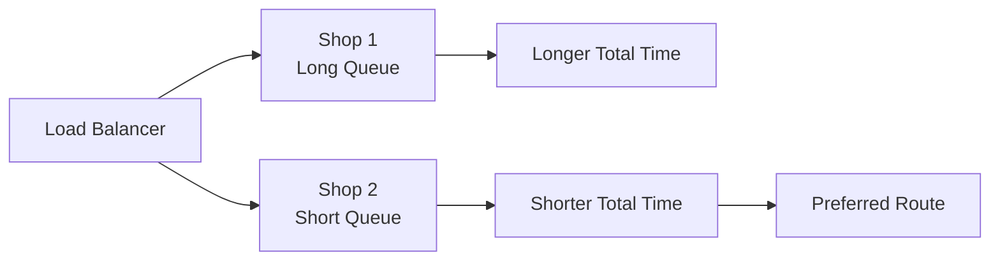

Now we have multiple pizza shops.

A customer should not have to decide which shop should process their
order.

Instead, we introduce a central component that receives requests and
routes them intelligently.

This component is called a **load balancer**.

``` text
                         Customer
                            |
                            v
                     +--------------+
                     | Load Balancer|
                     +--------------+
                       /          \
                      /            \
                     v              v
              [Pizza Shop 1]  [Pizza Shop 2]
```

But how should the load balancer choose a shop?

Consider:

### Pizza Shop 1

-   Queue: 1 hour
-   Preparation: 5 minutes
-   Delivery: 10 minutes

Total:

``` text
1 hour 15 minutes
```

### Pizza Shop 2

-   Queue: very short
-   Preparation: 5 minutes
-   Delivery: 10 minutes

Total:

``` text
1 hour 5 minutes
```

The load balancer should route the request to the shop that can serve it
faster.

The important point is that the routing decision can be based on
**real-time information**.

### Load Balancer

> A load balancer routes incoming requests to appropriate resources
> instead of making the client handle that responsibility.

The routing strategy can consider relevant system information to make
better decisions.

------------------------------------------------------------------------

## 8. Decoupling

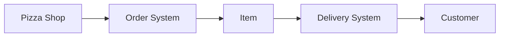

The delivery system focuses on delivery rather than being tightly tied to a specific product:

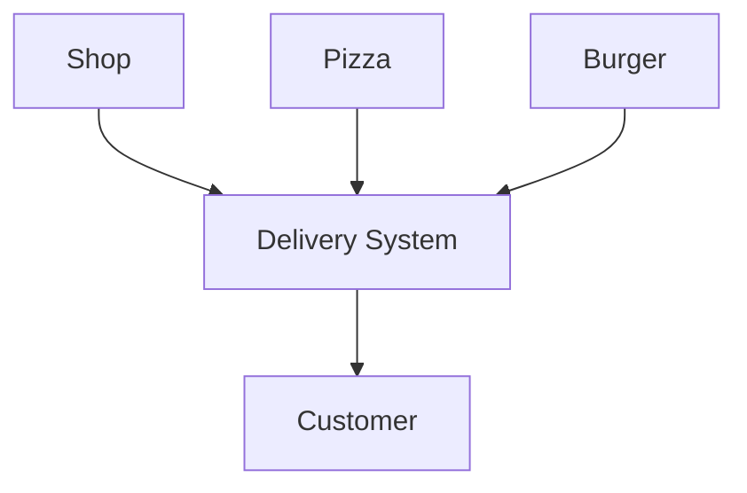

At this stage, notice something important.

The pizza shop and the delivery agent have different responsibilities.

The delivery agent does not really care whether the item being delivered
is:

-   Pizza
-   Burger
-   Something else

The delivery agent's responsibility is to deliver the item to the
customer.

Similarly, the pizza shop does not need to care whether the customer:

-   Uses a delivery agent
-   Picks up the order themselves

These responsibilities can therefore be separated.

This is called **decoupling**.

### Decoupling

> **Decoupling = separating responsibilities so different parts of the
> system can operate and change more independently.**

Instead of tightly connecting every part of the business, we separate
concerns.

``` text
+-------------+          +----------------+
| Pizza Shop  |          | Delivery System|
+-------------+          +----------------+
       |                         |
       +------ Order ------------+
                    |
                 Customer
```

This makes individual systems easier to change and manage.

------------------------------------------------------------------------

## 9. Logging and Metrics

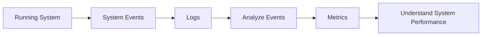

A simplified request timeline:

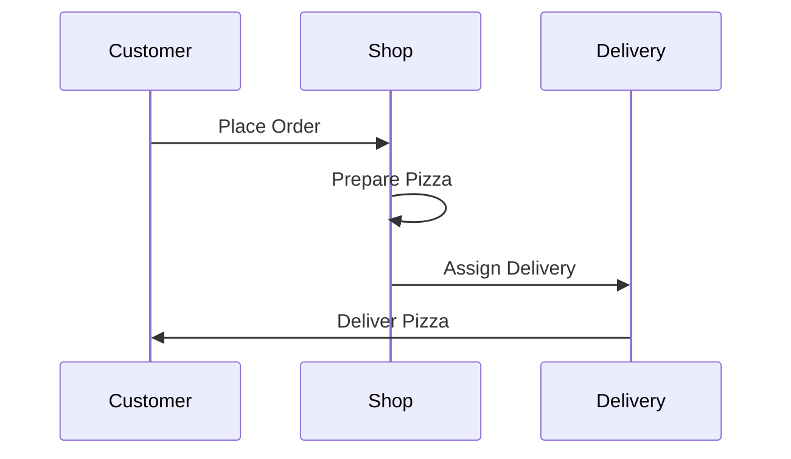

Systems fail.

Imagine:

-   A pizza shop has a faulty oven.
-   A delivery agent has a faulty bike.
-   Orders suddenly take longer than usual.

How do we understand what happened?

We need to record events.

### Logging

Logging means recording what happened and when it happened.

For example:

``` text
10:05 - Order received
10:07 - Order assigned to Shop 2
10:12 - Pizza preparation started
10:25 - Pizza completed
10:26 - Delivery assigned
10:40 - Order delivered
```

These events help us understand the behavior of the system.

### Metrics

Logs contain individual events.

Metrics help us turn those events into useful measurements.

For example:

-   Average order time
-   Number of orders
-   Delivery time
-   Failure rate

The goal is to condense system events into information that helps us
understand how the system is performing.

------------------------------------------------------------------------

## 10. Extensibility

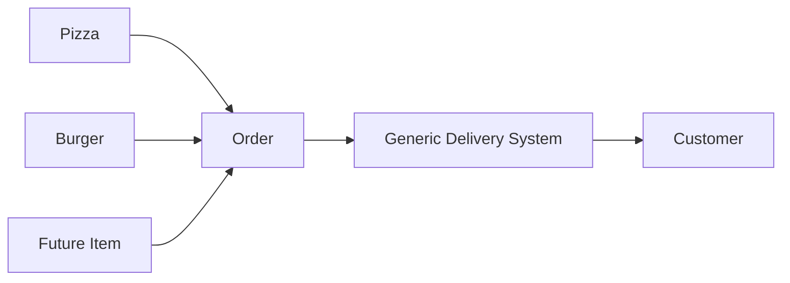

The delivery system remains useful even when the type of item changes.

The final important property is **extensibility**.

As a backend engineer, you do not want to rewrite the entire system
every time the business changes.

Consider the delivery system.

The delivery agent should not need to know that the item is specifically
a pizza.

Today:

``` text
Pizza → Delivery Agent → Customer
```

Tomorrow:

``` text
Burger → Delivery Agent → Customer
```

The delivery system can remain useful because it was designed around the
responsibility of **delivery**, rather than being tightly tied to pizza.

This kind of separation makes it easier to extend the system for new use
cases.

### Extensibility

> A system is extensible when it can support new requirements without
> requiring the entire system to be rewritten.

Decoupling responsibilities helps make this possible.

------------------------------------------------------------------------

# The System Design Journey

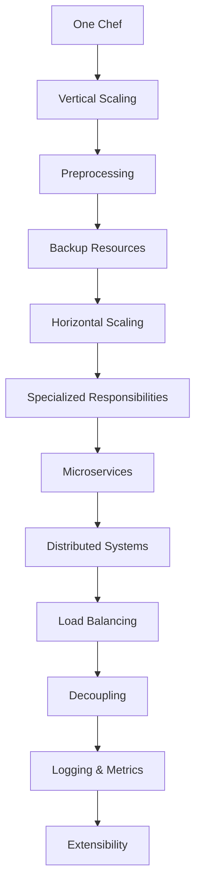

Starting from a simple pizza shop, we gradually introduced solutions to
problems that appeared as the business grew.

``` text
One Chef
   |
   v
Vertical Scaling
   |
   v
Preprocessing / Scheduled Jobs
   |
   v
Backup Resources
   |
   v
Horizontal Scaling
   |
   v
Specialized Responsibilities
   |
   v
Microservices
   |
   v
Distributed Systems
   |
   v
Load Balancing
   |
   v
Decoupling
   |
   v
Logging & Metrics
   |
   v
Extensibility
```

The important lesson is that these technical concepts are not isolated
buzzwords.

They are solutions to real problems.

------------------------------------------------------------------------

# High-Level System Design

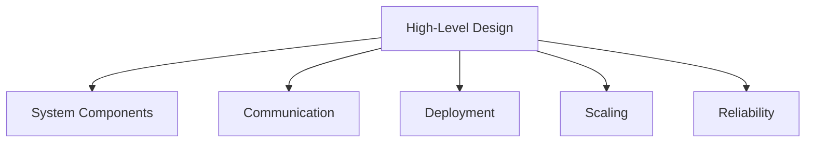

The process above leads to **High-Level Design (HLD)**.

High-level system design focuses on questions such as:

-   What components does the system need?
-   How should responsibilities be divided?
-   How do different systems interact?
-   How should the system be deployed?
-   How can the system scale?
-   How can the system remain available when components fail?

In simple terms:

> **HLD focuses on the architecture of the system and how its major
> components interact.**

------------------------------------------------------------------------

# Low-Level System Design

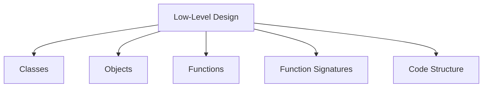

There is another level called **Low-Level Design (LLD)**.

LLD focuses much more on how the system is actually implemented in code.

For example:

-   Classes
-   Objects
-   Functions
-   Function signatures
-   Code structure
-   Writing efficient and clean code

In simple terms:

> **LLD focuses on the detailed implementation of the system.**

------------------------------------------------------------------------

# HLD vs LLD

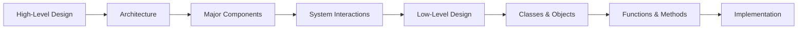

  High-Level Design               Low-Level Design
  ------------------------------- --------------------------
  System architecture             Code-level design
  Major components                Classes and objects
  Communication between systems   Functions and methods
  Deployment and infrastructure   Implementation details
  Scaling and reliability         Clean and efficient code

A simple way to remember it:

``` text
High-Level Design
        ↓
"What components do we need?"
        ↓
"How do they communicate?"
        ↓
"How do we scale and distribute them?"
        ↓
Low-Level Design
        ↓
"How do we implement those components in code?"
```

------------------------------------------------------------------------

# Key Takeaways

1.  **Vertical scaling** increases the power of an existing resource.
2.  **Preprocessing** moves work ahead of time, often using scheduled
    jobs.
3.  **Backups** help avoid single points of failure.
4.  **Horizontal scaling** adds more resources of a similar type.
5.  **Microservices** divide responsibilities into specialized services.
6.  **Distributed systems** spread systems across multiple locations or
    machines.
7.  **Load balancers** route requests intelligently across available
    resources.
8.  **Decoupling** separates responsibilities so systems can evolve
    independently.
9.  **Logging** records what happened in the system.
10. **Metrics** turn system events into useful measurements.
11. **Extensibility** allows the system to support new use cases without
    rewriting everything.
12. **HLD** focuses on architecture and system-level interactions.
13. **LLD** focuses on detailed code-level implementation.

------------------------------------------------------------------------

## The Big Picture

System design is ultimately about **solving problems that appear when a
system grows**.

You start with something simple:

> "One chef can make the pizzas."

Then reality starts throwing tomatoes:

> "There are too many orders."

So you scale.

> "The chef is sick."

So you add redundancy.

> "There are different kinds of orders."

So you divide responsibilities.

> "One restaurant is not enough."

So you distribute the system.

> "Customers shouldn't decide which restaurant to use."

So you introduce load balancing.

> "The delivery system shouldn't depend on pizza."

So you decouple it.

> "Something went wrong. What happened?"

So you add logging and metrics.

> "Tomorrow we're delivering burgers too."

So you make the system extensible.

That progression is the heart of system design: **identify the problem,
design a solution, and map that solution to a technical architecture.**
