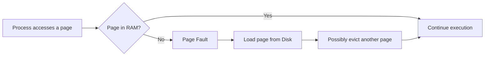
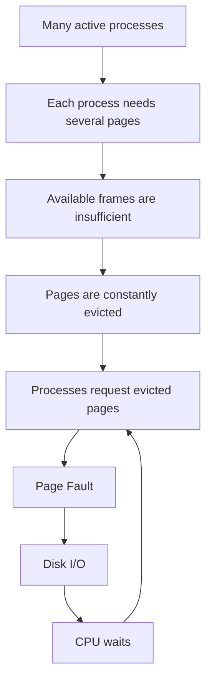
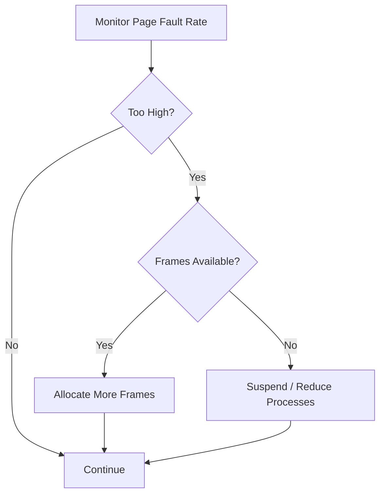
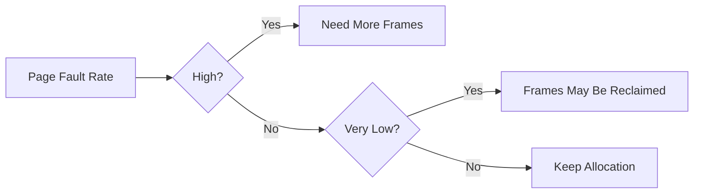
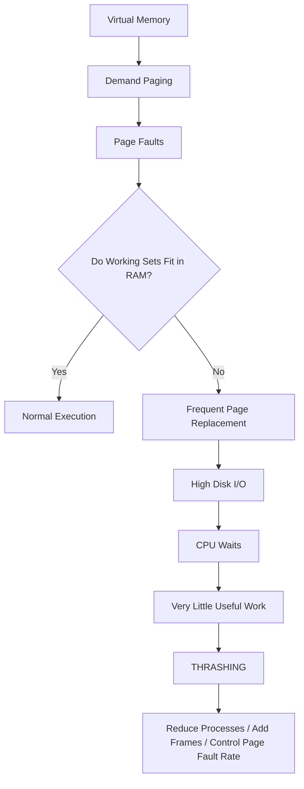

# What is Thrashing?

## 1. Definition

**Thrashing** is a condition in an operating system where the system spends **most of its time handling page faults and moving pages between RAM and secondary storage**, instead of doing useful CPU work.

> **Core idea:** The processes need more pages than their allocated physical frames can hold, so pages are continuously brought into RAM and removed again.

### In one line

**Insufficient RAM for active working sets → page faults ↑ → disk I/O ↑ → useful CPU work ↓ → severe slowdown = Thrashing**

---

## 2. First Understand the Connection

Thrashing is closely related to **virtual memory** and **demand paging**.



A few page faults are normal.

The problem starts when page faults become **so frequent** that the OS spends more time managing memory than executing processes.

---

# 3. How Thrashing Happens

Suppose RAM can comfortably support 3 processes, but the OS keeps many more processes active.

Each process needs a set of pages that it is actively using. This set is called its **working set**.

If the combined working sets require more frames than RAM has available:



The system gets trapped in a cycle:

```text
More processes
      ↓
Less memory available per process
      ↓
More page faults
      ↓
More disk I/O
      ↓
CPU waits more
      ↓
Less useful work
      ↓
Performance collapses
```

---

# 4. Why Page Faults Cause the Problem

A **page fault** occurs when a process references a page that is not currently in physical memory.

The OS must:

1. Trap into the OS.
2. Locate the required page on disk.
3. Find a free frame or evict another page.
4. Read the page into RAM.
5. Update page tables.
6. Resume the process.

Disk/storage access is dramatically slower than RAM.

Therefore:

> **One page fault is expensive. Millions of page faults can dominate execution time.**

---

# 5. Working Set

A process does not normally need every page of its virtual address space at the same time.

It usually works on a relatively small set of pages.

This active set is called the **working set**.

### Example

A process has 1 GB of virtual memory, but during a particular phase it repeatedly accesses only:

```text
Code pages
+
Stack pages
+
Current data pages
+
Frequently used library pages
```

Those actively used pages form its working set.

If the working set fits in the allocated frames:

```text
Working Set ≤ Available Frames
        ↓
Few page faults
        ↓
Good performance
```

If it does not:

```text
Working Set > Available Frames
        ↓
Constant page replacement
        ↓
Many page faults
        ↓
Thrashing
```

---

# 6. Degree of Multiprogramming

The **degree of multiprogramming** refers to how many processes are kept active/in memory at the same time.

Increasing it can initially improve CPU utilization because while one process waits for I/O, another can execute.

But beyond a point, too many processes compete for memory.


### Important relationship

| Degree of Multiprogramming | Typical Effect |
|---|---|
| Too low | CPU may be underutilized |
| Moderate | CPU utilization improves |
| Too high | Memory pressure and page faults increase |
| Extremely high | Thrashing and severe slowdown |

This creates an important idea:

> **More processes do not always mean better performance.**

---

# 7. CPU Utilization and Thrashing

A classic symptom of thrashing is **very high page-fault/disk activity combined with low useful CPU utilization**.

```text
                    Thrashing begins
                         ↓
CPU Utilization  ────────╲____
Page Faults      _________╱‾‾‾
Disk I/O         _________╱‾‾‾
```

The CPU is not necessarily idle because there is nothing to do.

It is often **waiting for memory operations and storage I/O**.

---

# 8. Normal Paging vs Thrashing

| Feature | Normal Paging | Thrashing |
|---|---|---|
| Page faults | Occasional | Extremely frequent |
| Disk I/O | Manageable | Very high |
| CPU | Mostly useful work | Spends significant time waiting |
| Memory pressure | Controlled | Severe |
| Process execution | Progresses normally | Makes very little progress |
| Performance | Acceptable | Extremely poor |
| Working sets | Mostly fit in available frames | Do not fit |

---

# 9. Thrashing vs Paging vs Swapping

These terms are related but **not the same**.

| Concept | Meaning |
|---|---|
| **Paging** | Moving fixed-size pages between RAM and secondary storage |
| **Page Fault** | Event triggered when a required page is not in RAM |
| **Swapping** | Moving process memory between RAM and secondary storage; historically often refers to whole processes |
| **Thrashing** | A pathological state caused by excessive paging/page faults |
| **Virtual Memory** | Technique that gives processes a larger logical address space than physical RAM |

### Remember

```text
Virtual Memory
      ↓
Demand Paging
      ↓
Page Faults
      ↓
Too many page faults
      ↓
THRASHING
```

---

# 10. Main Causes of Thrashing

| Cause | Explanation |
|---|---|
| **Insufficient RAM** | Active working sets cannot fit |
| **Too many processes** | Processes compete for limited frames |
| **High degree of multiprogramming** | Too many active memory demands |
| **Poor frame allocation** | A process receives too few frames |
| **Poor locality** | Process accesses a large/changing set of pages |
| **Aggressive process admission** | OS keeps adding work despite memory pressure |

---

# 11. Locality of Reference

Programs usually exhibit **locality of reference**.

They tend to repeatedly access a relatively small region of memory for a period of time.

Two important types:

| Locality | Meaning |
|---|---|
| **Temporal locality** | Recently used data/instructions are likely to be used again |
| **Spatial locality** | Nearby memory locations are likely to be accessed |

Good locality helps paging work efficiently because the working set remains relatively small.

Poor locality can increase memory pressure and page faults.

---

# 12. How Can the OS Control Thrashing?

## A. Reduce Degree of Multiprogramming

The OS can suspend or remove some processes from active execution.

```text
Too many processes
       ↓
Suspend some processes
       ↓
More frames available per remaining process
       ↓
Page faults decrease
       ↓
Performance improves
```

## B. Working Set Model

The OS estimates the pages actively needed by a process.

It tries to ensure:

```text
Frames allocated ≈ Working Set
```

If the system cannot provide enough frames for the active working sets, some processes may need to be suspended.

## C. Page-Fault Frequency (PFF)

The OS monitors the page-fault rate.



### PFF intuition

```text
Page fault rate too high
        ↓
Process needs more memory
        ↓
Give it more frames if possible

If frames are unavailable
        ↓
Reduce active processes
```

---

# 13. Working Set Model

Let:

- `WSSᵢ` = working-set size of process `i`
- `D` = total demand for frames

Then:

```text
D = Σ WSSᵢ
```

If:

```text
D ≤ Total Available Frames
```

the system can potentially keep the active working sets in memory.

If:

```text
D > Total Available Frames
```

the system is under severe memory pressure and may enter thrashing.

### Example

Suppose:

```text
Process P1 → 5 frames
Process P2 → 4 frames
Process P3 → 6 frames

Total working-set demand = 15 frames
```

If RAM has only:

```text
10 available frames
```

then:

```text
15 > 10
```

The system cannot keep all active working sets resident, increasing the risk of excessive page faults.

---

# 14. Page-Fault Frequency (PFF)

PFF focuses on the **rate of page faults** rather than directly estimating the entire working set.

Conceptually:



The exact thresholds and policies depend on the OS.

---

# 15. Why Adding More Processes Can Make Things Worse

This is one of the most important concepts.

Normally:

```text
More processes
      ↓
More CPU work available
      ↓
Higher utilization
```

But after memory becomes the bottleneck:

```text
More processes
      ↓
Less memory per process
      ↓
More page faults
      ↓
More disk I/O
      ↓
Less useful CPU work
```

So the relationship is **not always linear**.

---

# 16. Example: A Simple Scenario

Imagine RAM has **8 usable frames**.

Three processes need:

```text
P1 → 3 frames
P2 → 3 frames
P3 → 3 frames

Total = 9 frames
```

But only 8 are available.

Now suppose the processes repeatedly need all of their working-set pages.

The OS may repeatedly do:

```text
P1 needs page A → load A
P2 needs page B → load B
P3 needs page C → load C
P1 needs page D → evict something
P2 needs evicted page → load it
P3 needs evicted page → load it
...
```

Pages are constantly being evicted and immediately needed again.

That is the classic pattern behind thrashing.

---

# 17. Symptoms of Thrashing

| Symptom | What it suggests |
|---|---|
| Very high page-fault rate | Excessive memory misses |
| Very high disk I/O | Constant page movement |
| Low useful CPU utilization | CPU waits for memory/storage |
| System becomes extremely slow | Memory subsystem is overloaded |
| Processes make little progress | Most time spent handling faults |

---

# 18. Thrashing in Modern Systems

Modern operating systems have sophisticated memory management, but the underlying problem still exists.

Thrashing-like behavior can appear when:

- RAM is heavily overcommitted.
- Many applications/processes are active.
- Containers/VMs have tight memory limits.
- The system relies heavily on swap.
- Working sets exceed available memory.

### Backend / Cloud Perspective

Imagine a server running many services:


For backend systems, this can appear as:

```text
RAM pressure
    ↓
Paging / swap activity
    ↓
Higher I/O latency
    ↓
Application latency increases
    ↓
Requests take longer
    ↓
Throughput decreases
```

This is why **memory limits and working-set size matter** in production systems.

---

# 19. Thrashing vs Out-of-Memory

They are also different.

| Thrashing | Out-of-Memory |
|---|---|
| System is still running but extremely slowly | System cannot satisfy memory demands |
| Excessive paging | Memory allocation fails / OS must reclaim or terminate something |
| High page-fault and I/O activity | May lead to process termination |
| Main issue is lack of effective memory for active working sets | Main issue is inability to provide required memory |

A system can experience severe memory pressure before reaching an OOM condition.

---

# 20. Important Exam / Interview Points

### Remember these 7 points

1. **Thrashing = excessive paging.**
2. It is strongly associated with **frequent page faults**.
3. Main cause: **working-set demand exceeds available physical frames**.
4. A high **degree of multiprogramming** can trigger it.
5. Disk I/O becomes extremely high.
6. CPU utilization can **drop** because useful work is replaced by waiting.
7. Common controls: **reduce multiprogramming, Working Set Model, and Page-Fault Frequency**.

---

# 21. Common Misconceptions

### ❌ "Any page fault means thrashing."

No.

```text
Occasional page faults → normal
Excessive page faults → possible thrashing
```

### ❌ "Thrashing means CPU is doing nothing."

Not exactly.

The CPU may spend time handling memory-management work and waiting for storage I/O, while doing very little useful application work.

### ❌ "More processes always improve CPU utilization."

Only up to a point.

Beyond the memory-capacity point, additional processes can cause thrashing and **reduce** performance.

---

# 22. Final Mental Model



## 🎯 One-Line Interview Answer

> **Thrashing is a condition where excessive page faults cause the OS to spend most of its time moving pages between memory and secondary storage instead of executing processes, resulting in severe performance degradation.**

## 🧠 Ultimate Shortcut

**Working set doesn't fit → page faults ↑ → paging ↑ → disk I/O ↑ → useful CPU work ↓ → performance ↓ → THRASHING**
