# What is Cache?

## 1. What is a Cache?

A **cache** is a fast storage layer that keeps frequently or recently needed data so future requests can be served faster.

```text
Original Data Source
        ↓
      Cache
        ↓
Next Request → Cache → Faster Response
```

The cache is usually an optimization layer, not the primary source of truth.

---

# 2. Simple Example

Suppose an API frequently needs a user's profile:

```text
GET /users/123
```

Without cache:

```text
Client
  ↓
API Server
  ↓
Database
  ↓
User Data
  ↓
API Server
  ↓
Client
```

With cache:

```text
Client
  ↓
API Server
  ↓
Cache
  ↓
User Data
```

If the data is already cached, the database query can be avoided.

---

# 3. Why Do We Need Caching?

Suppose 10,000 requests repeatedly ask for the same product.

Without cache:

```text
10,000 Requests
       ↓
10,000 Database Queries
```

With cache:

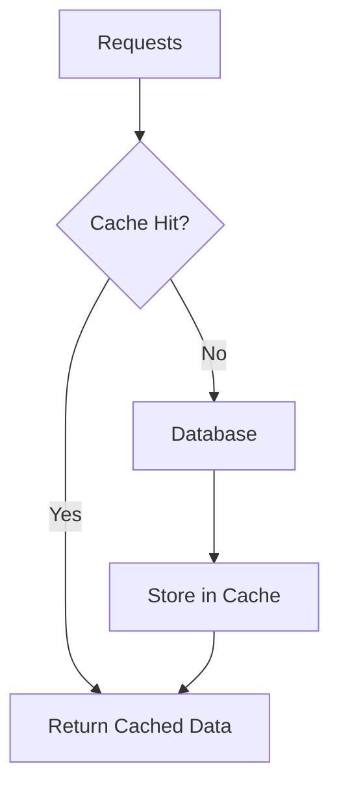

Caching can:

- Reduce database load
- Reduce latency
- Increase throughput
- Reduce repeated expensive work

---

# 4. Cache Hit vs Cache Miss

## Cache Hit

Requested data exists in the cache.

```text
Request
   ↓
Cache
   ↓
Found ✅
   ↓
Return Data
```

## Cache Miss

Requested data is not in the cache.

```text
Request
   ↓
Cache
   ↓
Not Found ❌
   ↓
Database
   ↓
Store in Cache
   ↓
Return Data
```

---

# 5. Cache Hit Ratio

A useful metric is:

```text
Cache Hit Ratio =
Cache Hits / Total Cache Requests
```

Example:

```text
1000 requests
900 hits
100 misses
```

Therefore:

```text
Hit Ratio = 900 / 1000
          = 90%
```

A high hit ratio generally means the cache is serving a large portion of requests.

---

# 6. Where Can a Cache Exist?

Caching can happen at multiple layers:


Common locations:

```text
Browser
CDN
Reverse Proxy
Application Memory
Distributed Cache
Database / Storage Layers
```

---

# 7. Browser Cache

Browsers can cache:

```text
Images
CSS
JavaScript
Fonts
HTTP Responses
```

Example:

```text
First Visit
Browser → Server → Image
                  ↓
             Browser Cache

Next Visit
Browser → Cache → Image
```

---

# 8. CDN Cache

A **CDN (Content Delivery Network)** caches content at distributed edge locations.

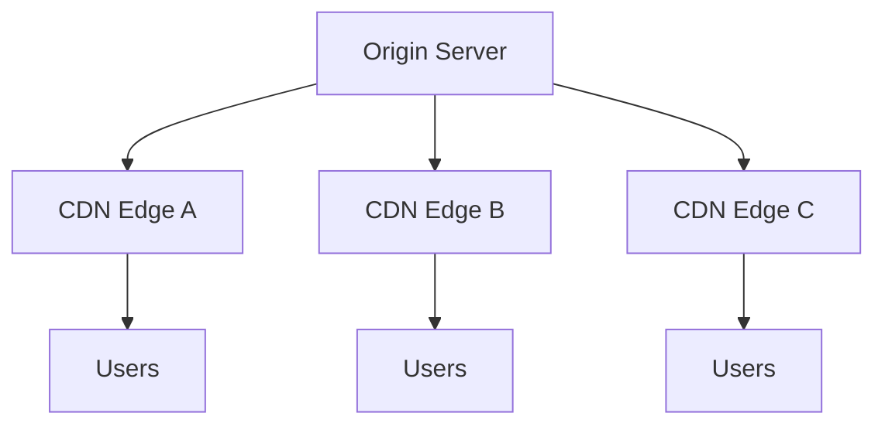

Commonly cached content:

```text
Images
Videos
CSS
JavaScript
Static Files
Some API Responses
```

A nearby CDN edge can serve cached content without contacting the origin every time.

---

# 9. Application-Level Cache

An application can cache frequently accessed data.

```text
API Server
    ↓
Cache
    ↓
Database
```

Common flow:

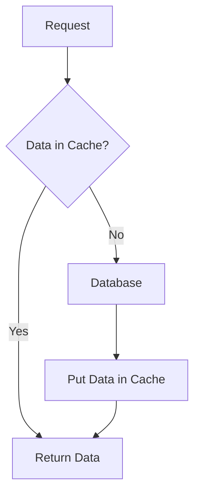

---

# 10. Distributed Cache

With multiple application servers, a shared cache can be used.

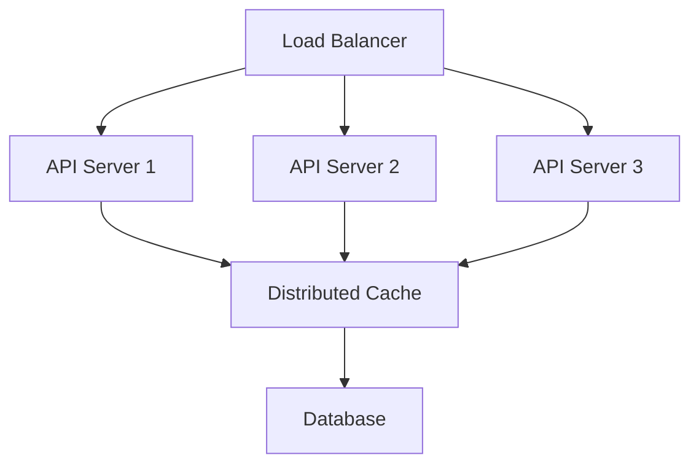

Common technologies include:

```text
Redis
Memcached
```

A shared cache allows different application instances to access the same cached data.

---

# 11. Why Is Cache Fast?

Caches often use memory, which can provide very low-latency access.

Conceptually:

```text
Memory
  ↓
Very Fast

Storage / Database Work
  ↓
Generally More Expensive
```

Actual latency depends on the architecture, network, workload, and implementation.

---

# 12. Cache-Aside Pattern

One of the most common strategies is **cache-aside**.

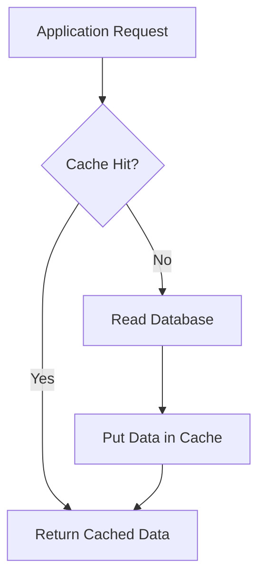

Example:

```python
data = cache.get(key)

if data is None:
    data = database.get(key)
    cache.set(key, data)

return data
```

The application handles the cache miss.

---

# 13. Write-Through Cache

With **write-through caching**, writes are propagated through the cache to the backing data store.

Conceptually:

```text
Application
    ↓
Cache
    ↓
Database
```

A write updates the cache and underlying store according to the implementation.

Benefit:

```text
Cache remains relatively fresh
```

Trade-off:

```text
Write path can be more expensive
```

---

# 14. Write-Back / Write-Behind Cache

With write-back caching, data can be written to the cache first and persisted to the underlying database later.

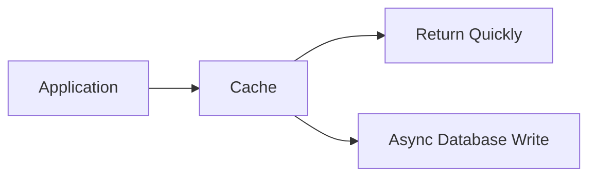

Potential benefit:

```text
Lower write latency
```

Potential risk:

```text
Cache failure before persistence
        ↓
Possible data loss
```

This strategy requires careful durability and failure handling.

---

# 15. Read-Through Cache

With **read-through caching**, the cache handles loading missing data from the backing store.

```text
Application
    ↓
Cache
    ↓
Cache Miss
    ↓
Database
    ↓
Cache
    ↓
Application
```

Key difference:

```text
Cache-Aside
→ Application handles loading

Read-Through
→ Cache handles loading
```

---

# 16. Cache Eviction

Cache memory is limited.

When the cache needs space, entries can be removed.

This is called **eviction**.

```text
Cache Full
    ↓
Need Space
    ↓
Evict Entries
    ↓
Store New Data
```

Common strategies:

### LRU

**Least Recently Used**

Remove entries that have not been accessed recently.

### LFU

**Least Frequently Used**

Remove entries accessed least frequently.

### FIFO

**First In, First Out**

Remove the oldest entries first.

Exact support and behavior depend on the caching technology.

---

# 17. TTL

**TTL = Time To Live**

A cache entry can automatically expire after a specified period.

Example:

```text
user:123
TTL = 60 seconds
```

After expiration:

```text
Cache Entry Expires
       ↓
Cache Miss
       ↓
Fetch Fresh Data
```

TTL is useful when cached data should not remain indefinitely.

---

# 18. Cache Invalidation

One of the hardest caching problems is keeping cached data consistent with the source of truth.

Example:

```text
Database:
price = ₹500

Cache:
price = ₹500
```

Price changes:

```text
Database:
price = ₹600

Cache:
price = ₹500  ← Stale
```

The application may now return stale data.

A common strategy:


When designing caching, decide:

```text
How fresh must the data be?
How long can it be stale?
When should it be invalidated?
What happens if invalidation fails?
```

---

# 19. Cache Stampede

A **cache stampede** occurs when a popular cache entry expires and many requests simultaneously try to regenerate it.

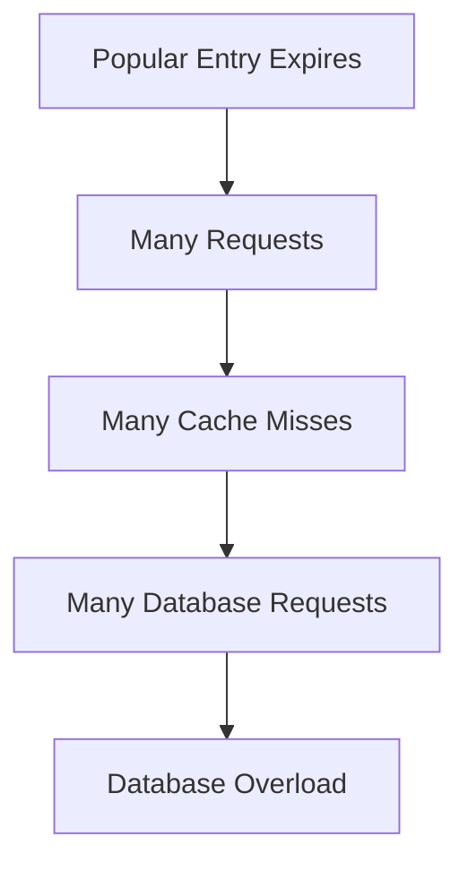

Common mitigation techniques:

```text
Request coalescing
Locks
Staggered TTLs
Early refresh
Cache warming
```

---

# 20. Cache Penetration

Cache penetration occurs when requests repeatedly ask for data that does not exist.

Example:

```text
Request user:999999
       ↓
Cache Miss
       ↓
Database
       ↓
User Does Not Exist
```

Repeated requests can keep hitting the database.

Possible techniques:

```text
Negative caching
Bloom filters
Input validation
Rate limiting
```

---

# 21. Cache Avalanche

A cache avalanche can happen when many cache entries expire at approximately the same time.

```text
Cache
├── Key A → expires
├── Key B → expires
├── Key C → expires
└── Key D → expires
          ↓
Many Cache Misses
          ↓
Database Traffic Spike
```

Possible mitigations:

```text
Randomized TTLs
Staggered expiration
Prewarming
Rate limiting
Fallback strategies
```

---

# 22. Cache Consistency

A cache introduces another copy of data.

```text
Database = Source of Truth

Cache = Temporary Copy
```

Therefore:

```text
Database Changes
       ↓
Cache May Become Stale
```

You need to decide:

```text
Freshness requirement
TTL
Invalidation strategy
Failure behavior
Consistency guarantees
```

---

# 23. Cache Failure

A cache is often an optimization layer rather than the only source of truth.

If the cache fails:

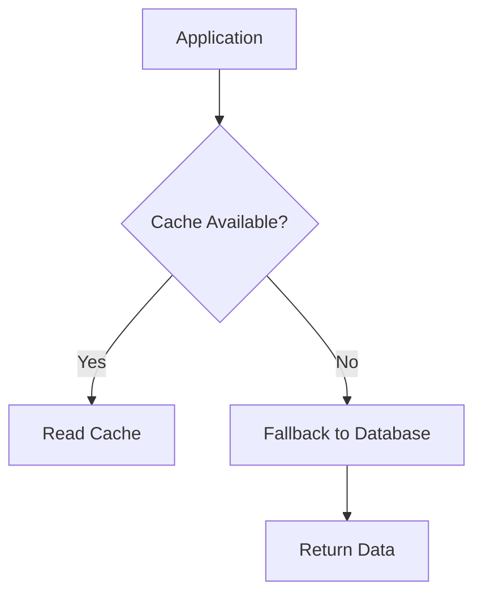

But there is a danger:

```text
Cache Failure
    ↓
Many requests hit Database
    ↓
Database Load Spike
```

So cache failures need to be considered in capacity planning.

---

# 24. Cache Key Design

A cache needs a key.

Examples:

```text
user:123
product:456
order:789
```

Good cache keys should generally be:

```text
Unique
Predictable
Consistent
Easy to construct
```

Namespaces are useful:

```text
user:123
product:456
session:abc123
```

---

# 25. What Should We Cache?

Good candidates often include:

```text
Frequently read data
Expensive computations
Slow database queries
External API responses
Static/semi-static data
Sessions
Configuration
```

Examples:

```text
Product catalog
User profiles
Popular posts
Feature configuration
```

---

# 26. What Should We NOT Cache Blindly?

Be careful with:

```text
Highly sensitive data
Frequently changing data
Very large objects
Rarely accessed data
Data requiring strict freshness
```

Consider:

```text
Read frequency
Data size
Freshness requirement
Memory cost
Invalidation complexity
```

---

# 27. Cache vs Database

| Feature | Cache | Database |
|---|---|---|
| Main purpose | Fast temporary access | Durable data storage |
| Speed | Usually very fast | Usually slower than memory cache |
| Persistence | Often limited/optional | Designed for durable storage |
| Capacity | Usually smaller | Usually much larger |
| Freshness | Can become stale | Often source of truth |
| Querying | Often limited/specialized | Rich querying depending on DB |

Remember:

> **A cache is generally an optimization layer, not a replacement for the primary database.**

---

# 28. Cache vs Database Index

These are different.

### Index

Makes a database query faster:

```text
Application
    ↓
Database
    ↓
Index
    ↓
Rows
```

### Cache

Can avoid the database query:

```text
Application
    ↓
Cache
    ↓
Data
```

Together:

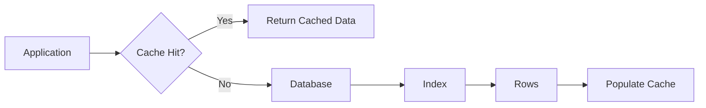

---

# 29. Cache in System Design

A common architecture:

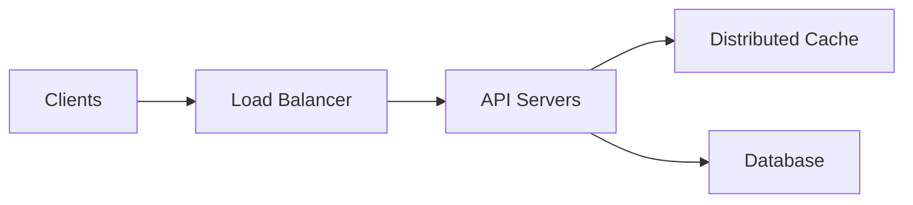

Request flow:

```text
Client
  ↓
Load Balancer
  ↓
API Server
  ↓
Cache
  ↓
 ┌──────────┐
 │          │
Hit        Miss
 │          │
 ▼          ▼
Return    Database
             ↓
           Cache
             ↓
           Return
```

---

# 30. Example: E-Commerce Product

Suppose:

```text
GET /products/123
```

is requested thousands of times.

Without cache:

```text
1000 Requests
      ↓
1000 Database Queries
```

With cache:

```text
1000 Requests
      ↓
Cache
      ↓
Most requests served from cache
      +
Only misses reach database
```

The actual hit rate depends on TTL, eviction, traffic patterns, and cache capacity.

---

# 31. Cache and Scaling

Suppose an application receives:

```text
10,000 requests/sec
```

and the cache hit ratio is:

```text
90%
```

Approximately:

```text
9,000 requests/sec → Cache
1,000 requests/sec → Database
```

This is simplified, but it shows the basic idea.

Caching can significantly reduce database pressure.

---

# 32. Hot Keys

A **hot key** is a cache key receiving an unusually large amount of traffic.

Example:

```text
10,000 requests
       ↓
product:123
       ↓
One extremely popular key
```

Potential approaches include:

```text
Replication
Local caching
Request coalescing
Load distribution techniques
```

---

# 33. Cache Warming

**Cache warming** means populating the cache before normal traffic needs the data.

```text
Application Starts
       ↓
Load Popular Data
       ↓
Populate Cache
       ↓
Traffic Arrives
       ↓
Cache Hits
```

Useful after:

```text
Deployment
Cache Restart
Large Cache Flush
Node Failure
```

---

# 34. Distributed Cache Challenges

Once a cache is distributed, additional challenges appear:

```text
Network failures
Consistency
Replication
Eviction
Hot keys
Partitioning
Failover
Cache stampede
```

Caching therefore becomes a system-design problem at scale.

---

# 35. Practical Backend Thinking

When an API is slow, ask:

```text
Is the database slow?
        ↓
Is the same data requested repeatedly?
        ↓
Can we cache it?
        ↓
How fresh must it be?
        ↓
What TTL should we use?
        ↓
How do we invalidate it?
        ↓
What happens if cache fails?
```

Caching is not simply:

```text
"Put Redis in front of the database."
```

It requires decisions about:

```text
Performance
Freshness
Consistency
Memory
Eviction
Failure handling
```

---

# 36. Interview Cheat Sheet

| Concept | Remember |
|---|---|
| Cache | Fast storage for frequently/recently needed data |
| Cache hit | Data found in cache |
| Cache miss | Data not found in cache |
| Hit ratio | Hits / total cache requests |
| TTL | Time To Live |
| Eviction | Removing entries to free space |
| LRU | Least Recently Used |
| LFU | Least Frequently Used |
| Cache-aside | Application handles cache miss/loading |
| Read-through | Cache handles loading on miss |
| Write-through | Writes propagate through cache to backing store |
| Write-back | Cache persists to backing store later |
| Invalidation | Removing/updating stale cached data |
| Stampede | Many requests regenerate expired data |
| Penetration | Repeated requests for nonexistent data |
| Avalanche | Many entries expire together |
| Hot key | Extremely popular cache key |
| Cache warming | Pre-populating cache |
| Distributed cache | Shared cache across application instances |

---

# 37. Final Mental Model

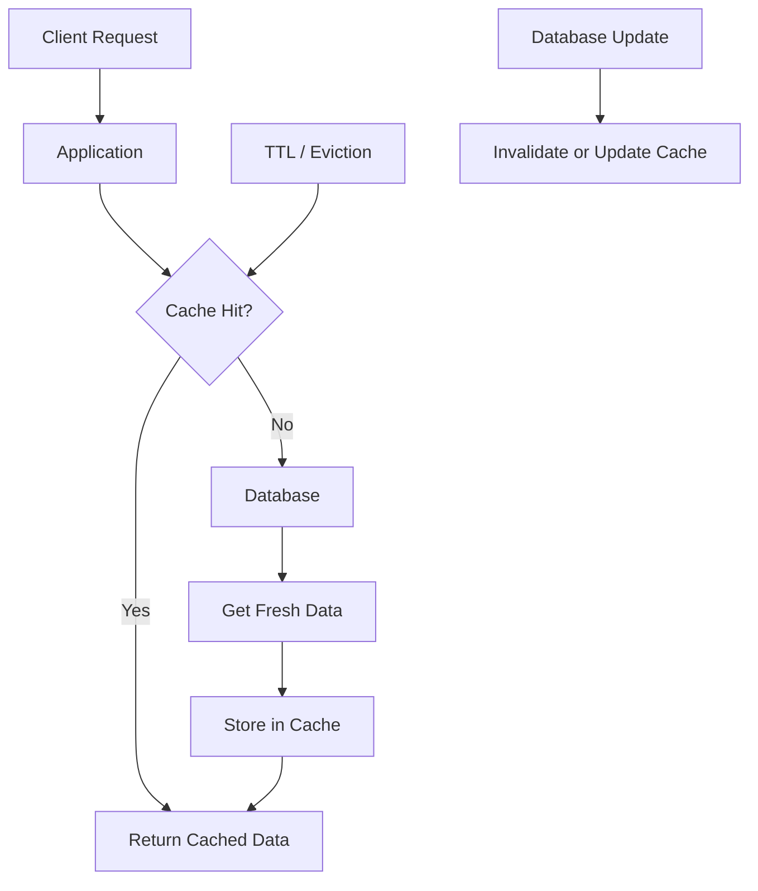

Remember:

```text
Cache = Fast copy of data

Cache Hit
    ↓
Fast response
    ↓
Less database load

Cache Miss
    ↓
Fetch from source
    ↓
Populate cache

But...

Cache
  ↓
Stale Data
  +
Invalidation
  +
Memory Cost
  +
Failure Handling
  +
Consistency Trade-offs
```

## One-line interview answer

> **A cache is a fast storage layer that keeps frequently accessed data closer to the application so requests can be served with lower latency while reducing load on the underlying data store.**
