# Explain TCP Model

> **Core idea:** The TCP/IP model explains how data moves across a network by dividing communication into layers. Each layer has a specific responsibility and works with the layers around it.

---

## 1. What Is the TCP/IP Model?

The **TCP/IP model** is a conceptual framework used to understand how devices communicate over networks.

It divides networking responsibilities into layers:

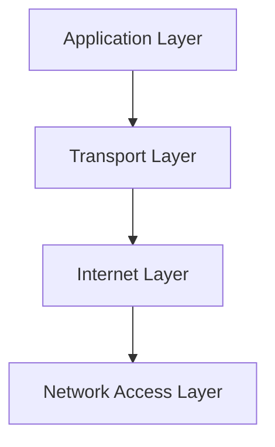

Each layer solves a different part of the communication problem.

### The 4-layer TCP/IP model

| Layer | Main responsibility | Examples |
|---|---|---|
| Application | Network services used by applications | HTTP, HTTPS, DNS, SSH |
| Transport | End-to-end communication | TCP, UDP |
| Internet | Addressing and routing | IP, ICMP |
| Network Access | Local network delivery | Ethernet, Wi-Fi |

---

# 2. Why Do We Need Layers?

Imagine sending data from your laptop to a server.

There are many separate problems:

```text
What does the application want to send?
        ↓
How should the data reach the correct process?
        ↓
How should it reach the correct machine?
        ↓
How should it travel across the local network?
```

Instead of solving everything in one giant protocol, networking divides the responsibilities.

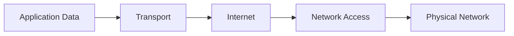

This separation makes networking easier to design, implement, troubleshoot, and evolve.

---

# 3. The Four Layers

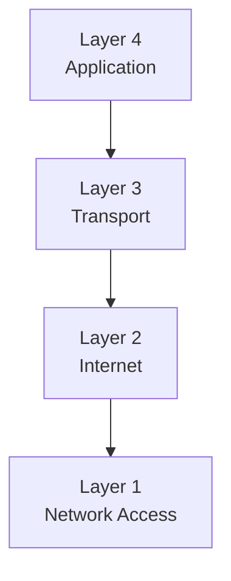

> Different references sometimes use slightly different TCP/IP layer terminology. The 4-layer model above is the common simplified model.

---

# 4. Layer 1: Network Access

The **Network Access layer** handles communication over the local network.

It deals with things such as:

- Frames
- MAC addresses
- Ethernet
- Wi-Fi
- Local network delivery

Examples:

```text
Ethernet
Wi-Fi
ARP
```

Conceptually:

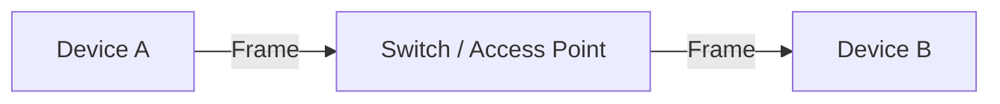

This layer is concerned mainly with:

> **How do I move data across the local network?**

---

# 5. Layer 2: Internet

The **Internet layer** handles logical addressing and routing between networks.

The main protocol is:

```text
IP
```

Other examples include:

```text
ICMP
```

The key concept is the **IP address**.

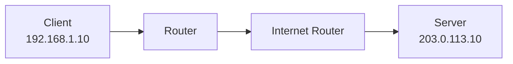

The Internet layer answers:

> **Which machine/network should this packet reach, and how should it be routed there?**

---

# 6. Layer 3: Transport

The **Transport layer** provides communication between applications running on hosts.

The two major transport protocols are:

```text
TCP
UDP
```

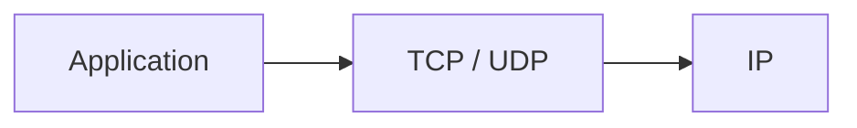

The Transport layer is responsible for concepts such as:

- Ports
- Segmentation
- End-to-end communication
- Reliability when TCP is used
- Flow control
- Congestion control when TCP is used

---

# 7. TCP

**TCP = Transmission Control Protocol**

TCP provides a reliable, ordered byte stream between applications.

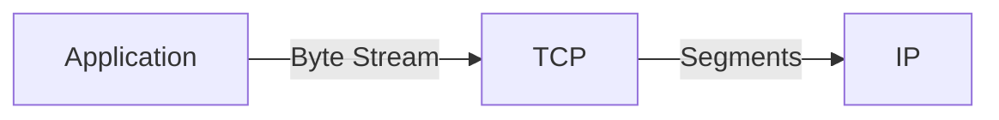

TCP provides mechanisms for:

```text
Connection establishment
Reliable delivery
Ordering
Acknowledgements
Retransmission
Flow control
Congestion control
```

---

# 8. UDP

**UDP = User Datagram Protocol**

UDP provides a lightweight datagram transport.

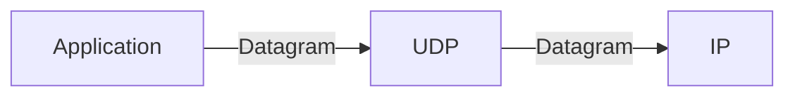

UDP does not provide TCP's built-in:

```text
Reliable delivery
Ordering
Retransmission
Connection establishment
```

Applications can choose UDP when low overhead or application-controlled delivery is useful.

Examples include:

```text
DNS
Real-time media
Online games
QUIC transport
```

---

# 9. Layer 4: Application

The Application layer contains protocols directly used by applications.

Examples:

```text
HTTP
HTTPS
DNS
SSH
SMTP
FTP
```

For example:

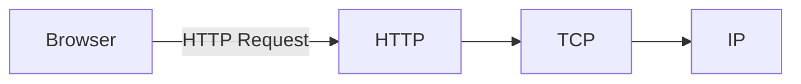

Important:

> The Application layer does not mean only the browser or frontend. It contains the network protocols applications use.

---

# 10. Complete TCP/IP Stack

A common view is:

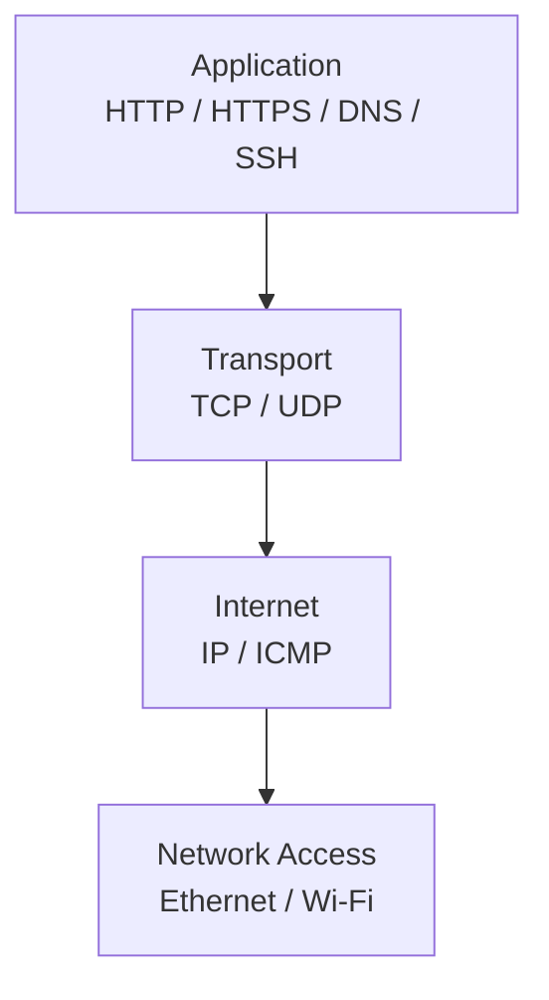

A real HTTPS request can therefore be viewed as:

```text
HTTP
 ↓
TCP
 ↓
IP
 ↓
Ethernet / Wi-Fi
```

With HTTPS:

```text
HTTP
 ↓
TLS
 ↓
TCP
 ↓
IP
 ↓
Ethernet / Wi-Fi
```

---

# 11. Encapsulation

One of the most important concepts is **encapsulation**.

As data moves down the stack, each layer adds its own information.

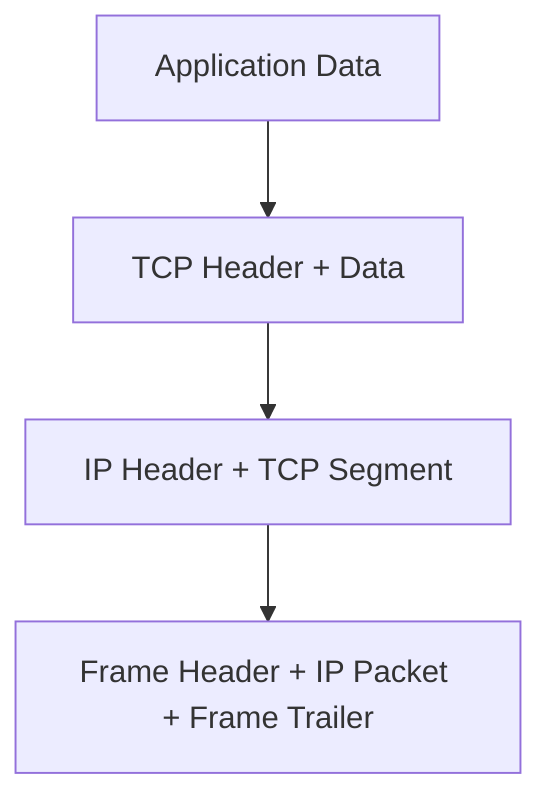

Think:

```text
Application
    ↓
[Application Data]

Transport
    ↓
[TCP Header + Application Data]

Internet
    ↓
[IP Header + TCP Segment]

Network Access
    ↓
[Frame Header + IP Packet + Frame Trailer]
```

---

# 12. Decapsulation

At the destination, the reverse happens.

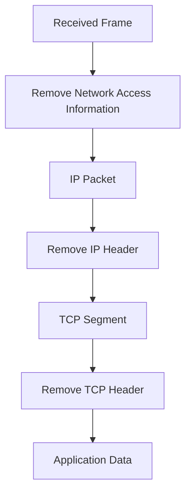

So:

```text
Sender:
Data → Encapsulation → Network

Receiver:
Network → Decapsulation → Data
```

---

# 13. What Is a TCP Segment?

When an application sends a large stream of data, TCP divides it into manageable pieces for transmission.

Conceptually:

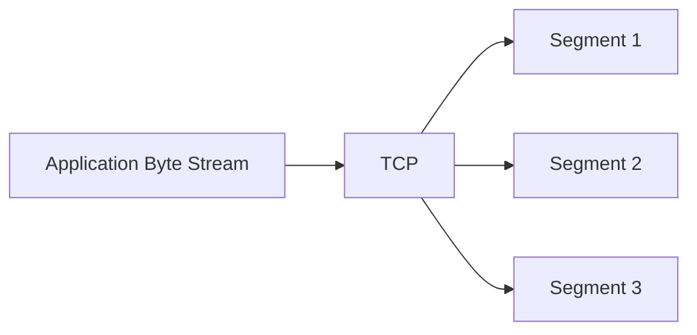

A TCP segment contains a TCP header and a portion of the application data.

Important TCP header concepts include:

```text
Source Port
Destination Port
Sequence Number
Acknowledgement Number
Flags
Window
Checksum
```

---

# 14. What Is an IP Packet?

TCP segments are carried inside IP packets.

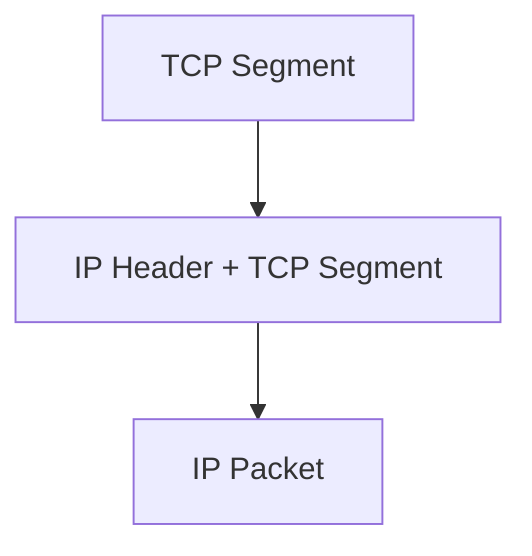

The IP layer primarily handles:

```text
Source IP
Destination IP
Routing
Packet forwarding
```

---

# 15. What Is a Network Frame?

At the Network Access layer, the IP packet is carried inside a local-network frame.

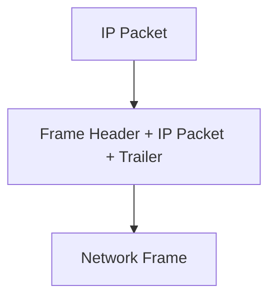

For Ethernet, important addressing includes:

```text
Source MAC
Destination MAC
```

The key distinction:

```text
IP address → Used for network-level routing

MAC address → Used for local network delivery
```

---

# 16. Ports

IP identifies a host.

A **port** identifies a network service/process endpoint on that host.

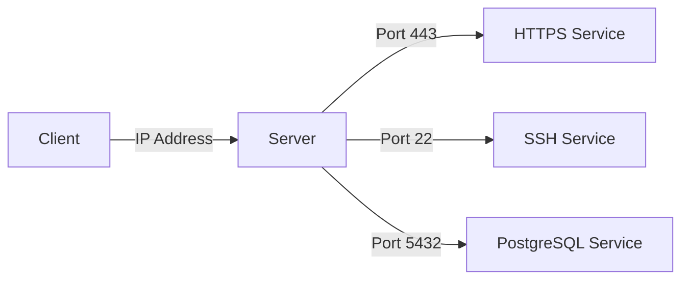

Example:

```text
203.0.113.10:443
```

means:

```text
IP   → 203.0.113.10
Port → 443
```

This is why the transport layer is closely associated with ports.

---

# 17. TCP Connection

TCP establishes a connection between two endpoints.

A simplified TCP connection:

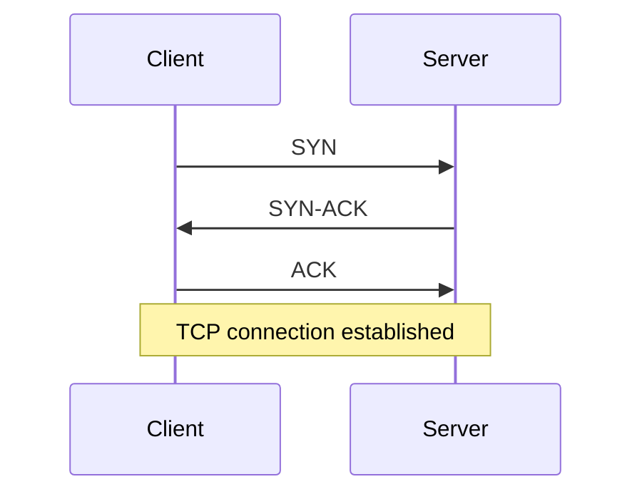

This is called the **TCP three-way handshake**.

The purpose is to establish the connection and synchronize sequence numbers.

---

# 18. TCP Reliable Delivery

TCP uses acknowledgements and sequence numbers to support reliable, ordered delivery.

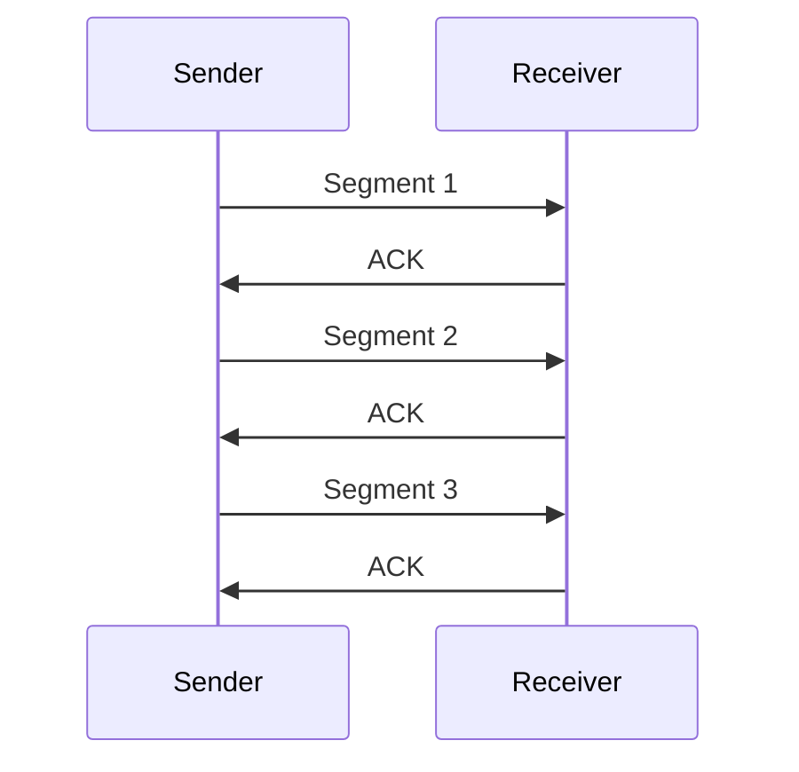

If data is lost, TCP can retransmit it.

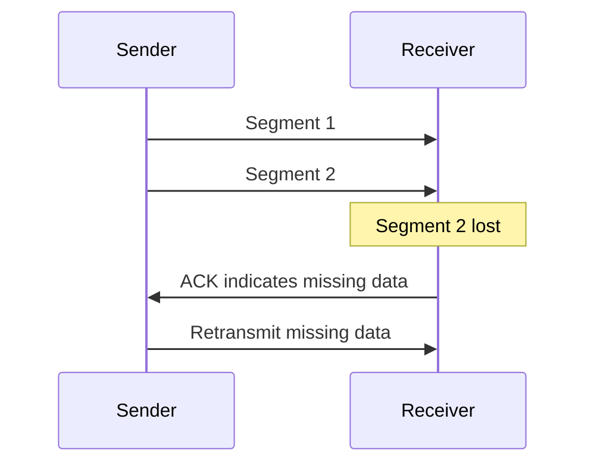

---

# 19. Flow Control

Flow control prevents a fast sender from overwhelming a slower receiver.

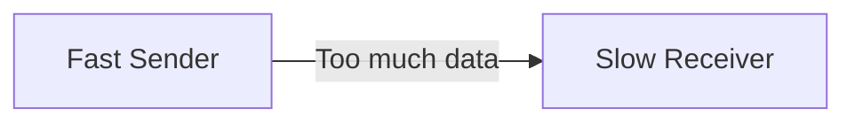

TCP uses a **receive window** to communicate how much data the receiver can currently accept.

```mermaid
flowchart LR
    R[Receiver] -->|Available receive capacity| S[Sender]
    S -->|Send within advertised window| R
```

---

# 20. Congestion Control

Flow control protects the receiver.

**Congestion control** helps protect the network from excessive traffic.

```mermaid
flowchart LR
    A[Sender] --> B[Network]
    B --> C[Receiver]

    D[Too much traffic] -.-> B
```

TCP adjusts its sending behavior based on network conditions.

```text
Flow control
→ Protect the receiver

Congestion control
→ React to network congestion
```

---

# 21. End-to-End Journey

Suppose a browser requests:

```text
https://example.com
```

A simplified journey:

```mermaid
sequenceDiagram
    participant B as Browser
    participant S as Server

    B->>S: HTTP request
    Note over B,S: HTTP is carried by transport
    B->>S: TCP segments
    Note over B,S: TCP segments are carried by IP
    B->>S: IP packets
    Note over B,S: IP packets are carried by local frames
    B->>S: Network frames
```

Conceptually:

```text
Browser
  ↓
HTTP
  ↓
TCP
  ↓
IP
  ↓
Ethernet / Wi-Fi
  ↓
Routers
  ↓
Server
```

---

# 22. What Happens at Each Layer?

```mermaid
flowchart TD
    A[Application<br/>What data does the app want to exchange?]
    B[Transport<br/>Which application/process? Reliable or lightweight transport?]
    C[Internet<br/>Which host/network? How should the packet be routed?]
    D[Network Access<br/>How does it move across the local network?]

    A --> B
    B --> C
    C --> D
```

### Application

```text
HTTP
DNS
SSH
SMTP
```

### Transport

```text
TCP
UDP
Ports
```

### Internet

```text
IP
Routing
Logical addressing
```

### Network Access

```text
Ethernet
Wi-Fi
Frames
MAC addresses
```

---

# 23. TCP/IP Model vs OSI Model

The **OSI model** has 7 layers, while the common TCP/IP model has 4.

```mermaid
flowchart LR
    subgraph OSI
        A1[Application]
        A2[Presentation]
        A3[Session]
        A4[Transport]
        A5[Network]
        A6[Data Link]
        A7[Physical]
    end

    subgraph TCPIP
        B1[Application]
        B2[Transport]
        B3[Internet]
        B4[Network Access]
    end

    A1 --> B1
    A2 --> B1
    A3 --> B1
    A4 --> B2
    A5 --> B3
    A6 --> B4
    A7 --> B4
```

A useful mapping:

| TCP/IP | OSI |
|---|---|
| Application | Application + Presentation + Session |
| Transport | Transport |
| Internet | Network |
| Network Access | Data Link + Physical |

> The OSI model is primarily a conceptual/reference model. The TCP/IP model is closely associated with the protocols used by the Internet.

---

# 24. Important Terms

### Protocol

Rules for communication.

### IP Address

Logical address used to identify a host/interface for network communication.

### MAC Address

Link-layer address used for local network delivery.

### Port

Identifies a transport-layer endpoint associated with a service/process.

### Packet

Commonly refers to an IP-layer unit.

### Segment

Commonly refers to a TCP transport-layer unit.

### Frame

Link-layer unit used to carry network-layer data.

---

# 25. Data Units by Layer

A useful simplified mapping:

```mermaid
flowchart TB
    A[Application Data]
    B[TCP Segment / UDP Datagram]
    C[IP Packet]
    D[Network Frame]

    A --> B
    B --> C
    C --> D
```

Remember:

```text
Application → Data
TCP         → Segment
UDP         → Datagram
IP          → Packet
Ethernet    → Frame
```

Terminology can vary by protocol and context, so treat these as common names rather than universal rules.

---

# 26. A Backend Developer's View

When you write:

```python
requests.get("https://example.com")
```

your application is working at the Application layer.

Underneath, the stack may involve:

```mermaid
flowchart TD
    A[Python Application] --> B[HTTPS / HTTP]
    B --> C[TLS]
    C --> D[TCP]
    D --> E[IP]
    E --> F[Wi-Fi / Ethernet]
```

You usually do not manually implement each layer.

The operating system, networking stack, libraries, and network devices handle most of the lower-level work.

---

# 27. Common Troubleshooting by Layer

The layered model is extremely useful for debugging.

```mermaid
flowchart TD
    A[Problem] --> B{Which layer?}

    B -->|Application| C[HTTP error / API bug / DNS issue]
    B -->|Transport| D[Connection / port / TCP issue]
    B -->|Internet| E[IP / routing issue]
    B -->|Network Access| F[Wi-Fi / Ethernet / local network issue]
```

Examples:

```text
404
→ Application / HTTP

Connection refused
→ Often service/port/listener related

No route to host
→ Often network/routing related

Wi-Fi disconnected
→ Network Access
```

The exact cause always depends on the environment.

---

# 28. The Most Important Mental Model

Think of the stack as a chain of responsibilities:

```mermaid
flowchart TB
    A[Application<br/>HTTP / DNS / SSH]
    B[Transport<br/>TCP / UDP]
    C[Internet<br/>IP / Routing]
    D[Network Access<br/>Ethernet / Wi-Fi]

    A -->|Application data| B
    B -->|Segments / datagrams| C
    C -->|Packets| D
    D -->|Frames| E[Network]
```

### One-line responsibility

```text
Application
→ What are we communicating?

Transport
→ Which application, and how should data be transported?

Internet
→ Which host/network, and how does the packet get there?

Network Access
→ How does it move across the local link?
```

---

# Interview Cheat Sheet

### What is the TCP/IP model?

A layered model used to understand how network communication works.

### How many layers does the common TCP/IP model have?

```text
4
```

```text
Application
Transport
Internet
Network Access
```

### Which layer does TCP belong to?

```text
Transport
```

### Which layer does IP belong to?

```text
Internet
```

### Which layer does HTTP belong to?

```text
Application
```

### What does TCP provide?

```text
Reliable, ordered byte-stream delivery
```

along with mechanisms for:

```text
Acknowledgements
Retransmission
Flow control
Congestion control
```

### What does IP do?

```text
Logical addressing
Routing
Packet delivery between networks
```

### What is a port?

A transport-layer endpoint used to identify a service/process endpoint on a host.

### What is encapsulation?

Each lower layer adds its own protocol information as data moves down the stack.

### What is decapsulation?

The receiver removes the protocol information layer by layer as data moves upward.

---

# Final Revision

```text
┌────────────────────────────────────┐
│ APPLICATION                         │
│ HTTP, HTTPS, DNS, SSH              │
│ "What are we communicating?"       │
├────────────────────────────────────┤
│ TRANSPORT                           │
│ TCP, UDP                            │
│ "Which process and how?"           │
├────────────────────────────────────┤
│ INTERNET                            │
│ IP, ICMP                            │
│ "Which host and where?"            │
├────────────────────────────────────┤
│ NETWORK ACCESS                      │
│ Ethernet, Wi-Fi                    │
│ "How across the local network?"    │
└────────────────────────────────────┘
```

The entire idea in one flow:

```mermaid
flowchart LR
    A[Application] --> B[Transport]
    B --> C[Internet]
    C --> D[Network Access]
    D --> E[Network]
    E --> D2[Network Access]
    D2 --> C2[Internet]
    C2 --> B2[Transport]
    B2 --> A2[Application]
```

> **Application creates the data → Transport moves it between application endpoints → Internet routes it between hosts/networks → Network Access moves it across the local link.**
