# HTTP and HTTPS Protocols

> **Core idea:** HTTP defines how clients and servers communicate. HTTPS is HTTP protected by TLS.

---

## 1. What Is a Protocol?

A **protocol** is a set of rules that systems follow to communicate.

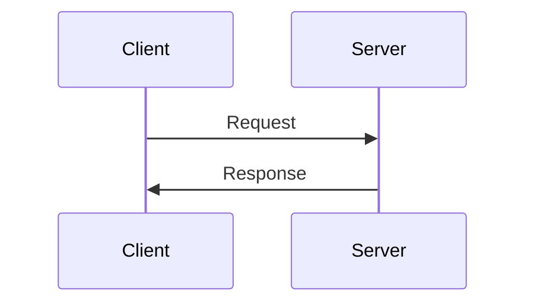

HTTP is an **application-layer protocol** used mainly for web communication.

---

# 2. What Is HTTP?

**HTTP = HyperText Transfer Protocol**

HTTP is used to transfer resources such as:

- HTML
- CSS
- JavaScript
- Images
- JSON
- Files
- API data

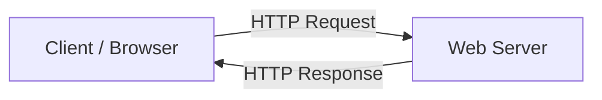

The basic model is:

```text
Request → Response
```

---

# 3. HTTP Request

An HTTP request can contain:

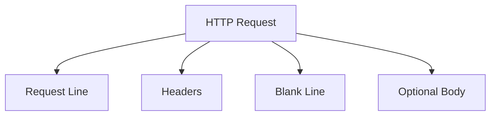

Example:

```http
POST /users HTTP/1.1
Host: example.com
Content-Type: application/json
Authorization: Bearer token

{
  "name": "Tapan"
}
```

### Request line

```text
POST /users HTTP/1.1
```

Contains:

```text
Method + Path + HTTP Version
```

### Headers

Headers provide metadata about the request.

```text
Host
Content-Type
Accept
Authorization
User-Agent
Content-Length
```

### Body

The body carries data sent to the server.

```json
{
  "name": "Tapan"
}
```

---

# 4. HTTP Response

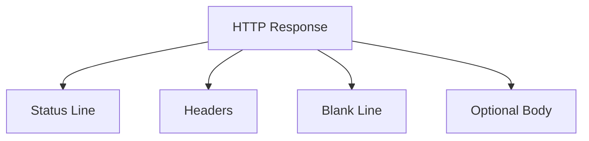

Example:

```http
HTTP/1.1 200 OK
Content-Type: application/json

{
  "id": 42,
  "name": "Tapan"
}
```

Response structure:

```text
Status Line
Headers
Blank Line
Body
```

---

# 5. HTTP Methods

HTTP methods describe what the client wants to do.

| Method | Purpose |
|---|---|
| `GET` | Read data |
| `POST` | Create/process data |
| `PUT` | Replace a resource |
| `PATCH` | Partially update a resource |
| `DELETE` | Delete a resource |
| `HEAD` | Get headers without the body |
| `OPTIONS` | Ask what operations are supported |

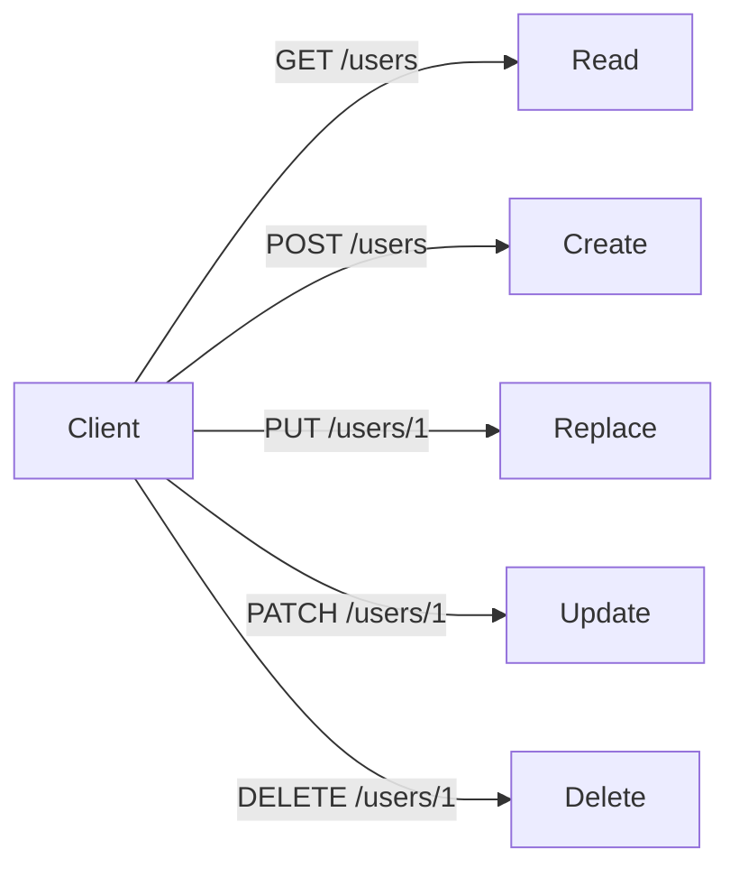

---

# 6. HTTP Status Codes

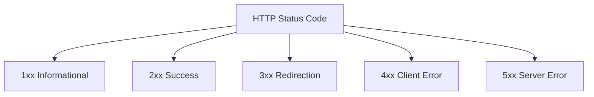

Common codes:

```text
200 OK
201 Created
204 No Content

301 Moved Permanently
302 Found
304 Not Modified

400 Bad Request
401 Unauthorized
403 Forbidden
404 Not Found
409 Conflict
429 Too Many Requests

500 Internal Server Error
502 Bad Gateway
503 Service Unavailable
504 Gateway Timeout
```

Easy memory:

```text
2xx → Success
3xx → Redirect / cache-related
4xx → Client problem
5xx → Server problem
```

---

# 7. HTTP Is Stateless

HTTP itself does not remember previous requests.

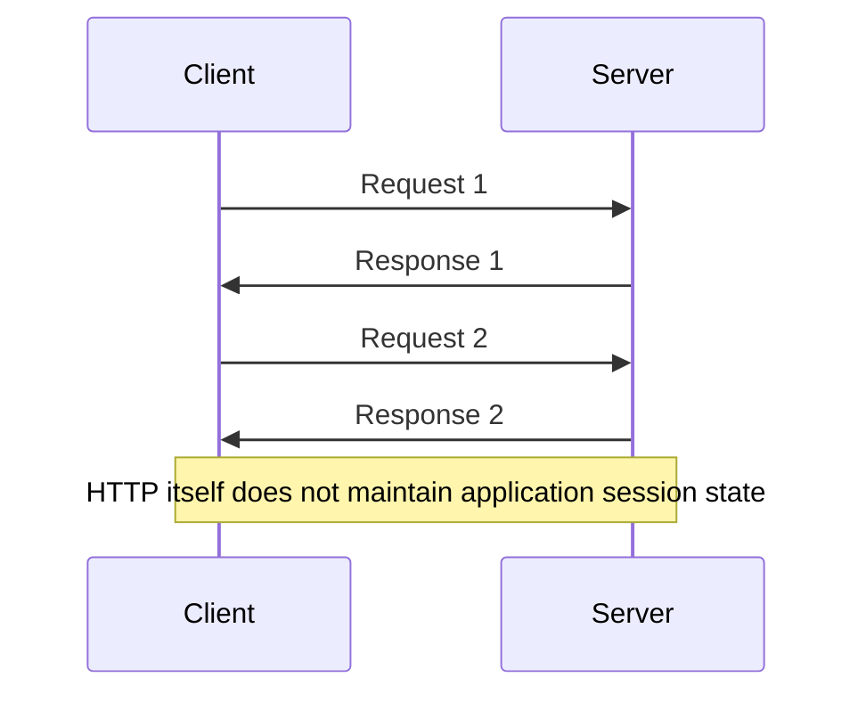

Applications add state using mechanisms such as:

- Cookies
- Sessions
- Tokens
- JWTs
- Server-side session stores

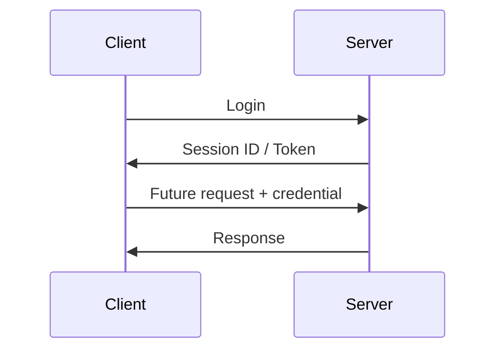

---

# 8. HTTP Network Stack

HTTP belongs to the **application layer**.

Traditional HTTP/1.1:

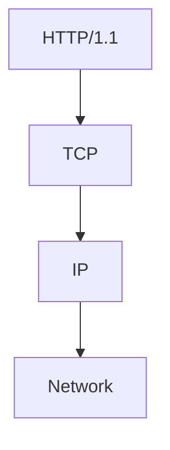

HTTP/2:

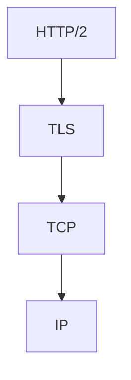

HTTP/3:

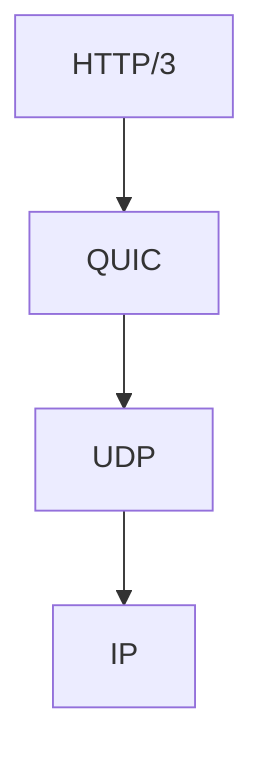

> **HTTP is not TCP.** HTTP defines application-level communication. TCP, UDP, and QUIC handle transport-level concerns.

---

# 9. What Is HTTPS?

**HTTPS = HTTP Secure**

Conceptually:

```text
HTTP + TLS = HTTPS
```

TLS means **Transport Layer Security**.

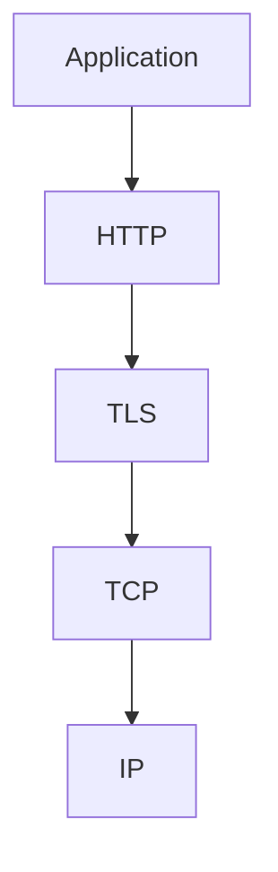

For HTTP/3:

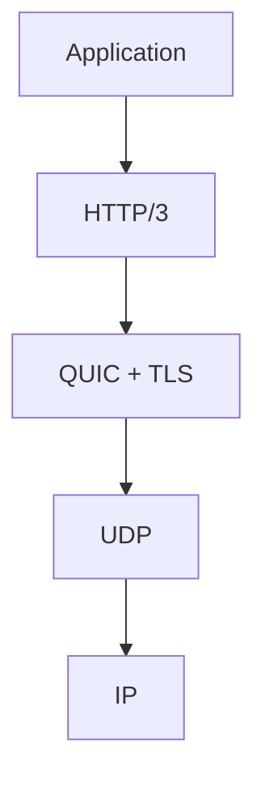

---

# 10. Why HTTPS?

Plain HTTP does not provide confidentiality or integrity protection.

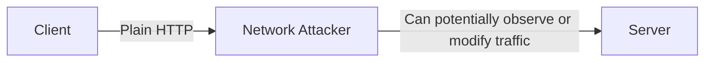

HTTPS protects application traffic with TLS.

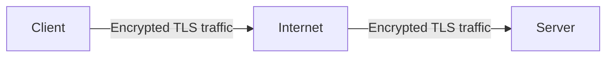

Simple analogy:

```text
HTTP  → Postcard 📮
HTTPS → Sealed envelope ✉️🔐
```

---

# 11. What TLS Provides

TLS provides three important security properties.

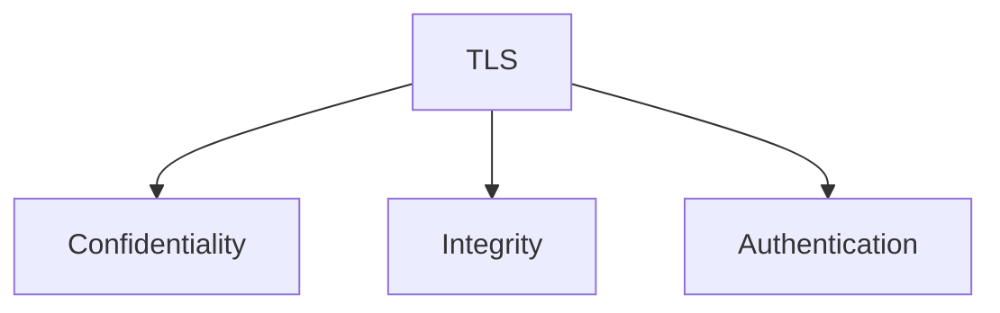

### Confidentiality

Others should not be able to read protected traffic.

```text
Original:
Transfer ₹5000

        ↓ TLS

Encrypted traffic:
8fA7$x...9Kp
```

### Integrity

Tampering with protected traffic should be detectable.

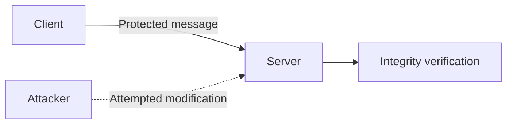

### Authentication

TLS certificates help the client verify the server's identity.

---

# 12. TLS Certificates

When visiting:

```text
https://example.com
```

the server presents a TLS certificate.

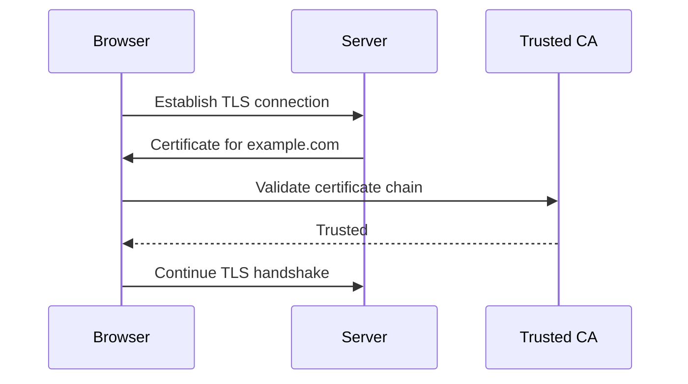

A certificate helps establish:

```text
"This server is authorized for this domain."
```

> A certificate is part of authentication and key establishment. It is not the encryption itself.

---

# 13. Simplified TLS Handshake

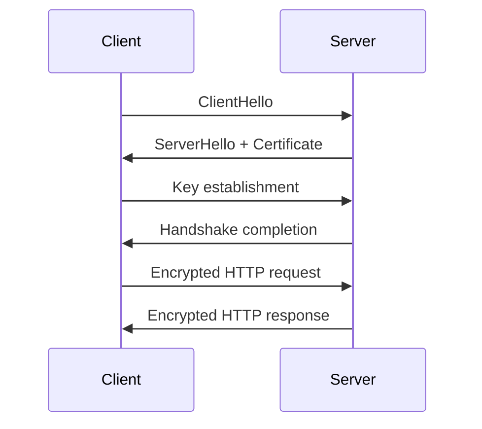

Mental model:

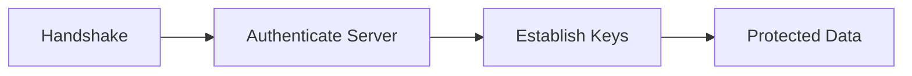

The exact handshake depends on the TLS version and configuration.

---

# 14. HTTP vs HTTPS

| Aspect | HTTP | HTTPS |
|---|---|---|
| Full form | HyperText Transfer Protocol | HyperText Transfer Protocol Secure |
| Default port | `80` | `443` |
| TLS protection | ❌ | ✅ |
| Confidentiality | ❌ | ✅ |
| Integrity protection | ❌ | ✅ |
| Server authentication | ❌ | ✅ Through TLS |
| URL | `http://` | `https://` |

```mermaid
flowchart LR
    A[HTTP] --> B[No TLS protection]
    C[HTTPS] --> D[HTTP + TLS]
```

---

# 15. What Happens When You Enter a URL?

Suppose you enter:

```text
https://example.com/users
```

A simplified journey:

```mermaid
sequenceDiagram
    participant B as Browser
    participant D as DNS
    participant S as Server

    B->>D: Resolve example.com
    D->>B: IP address
    B->>S: Establish connection
    B->>S: TLS handshake
    B->>S: HTTP GET /users
    S->>B: HTTP response
    B->>B: Render/process response
```

Mental model:

```text
URL
 ↓
DNS
 ↓
Connection
 ↓
TLS
 ↓
HTTP Request
 ↓
Server Processing
 ↓
HTTP Response
 ↓
Browser
```

---

# 16. Ports

A port identifies a service endpoint on a host.

```text
HTTP  → 80
HTTPS → 443
```

```mermaid
flowchart LR
    A[Browser] -->|example.com:80| B[HTTP Server]
    C[Browser] -->|example.com:443| D[HTTPS Server]
```

For local development:

```text
http://localhost:3000
```

means:

```text
Host → localhost
Port → 3000
```

---

# 17. Cookies

Cookies allow applications to maintain state across requests.

```mermaid
sequenceDiagram
    participant B as Browser
    participant S as Server

    B->>S: Login
    S->>B: Set-Cookie: sessionId=abc
    B->>B: Store cookie
    B->>S: Request + Cookie
    S->>B: Response
```

Common security-related attributes:

```text
Secure
HttpOnly
SameSite
```

---

# 18. HTTP Caching

Caching allows clients and intermediaries to reuse responses.

```mermaid
sequenceDiagram
    participant B as Browser
    participant S as Server

    B->>S: Request resource
    S->>B: Response + Cache headers
    B->>B: Store cached response
    B->>B: Request same resource
    B->>B: Use cache when valid
```

Important headers:

```text
Cache-Control
ETag
Last-Modified
If-None-Match
If-Modified-Since
```

Caching can reduce:

- Network traffic
- Server load
- Latency

---

# 19. HTTP Redirects

A server can tell the client to request another URL.

```mermaid
sequenceDiagram
    participant B as Browser
    participant S as Server

    B->>S: GET http://example.com
    S->>B: 301 + Location: https://example.com
    B->>S: GET https://example.com
    S->>B: Response
```

Common redirect codes:

```text
301
302
303
307
308
```

---

# 20. HTTP and APIs

HTTP is heavily used for backend APIs.

```mermaid
sequenceDiagram
    participant F as Frontend
    participant A as Backend API
    participant D as Database

    F->>A: GET /api/products
    A->>D: Query products
    D->>A: Product data
    A->>F: 200 OK + JSON
```

Example:

```http
GET /api/products
Accept: application/json
```

Response:

```json
[
  {
    "id": 1,
    "name": "Laptop"
  },
  {
    "id": 2,
    "name": "Phone"
  }
]
```

---

# 21. Typical Backend Architecture

```mermaid
flowchart LR
    C[Client] --> L[Load Balancer / Reverse Proxy]
    L --> A[Backend Application]
    A --> D[(Database)]
    A --> R[(Redis / Cache)]
    A --> E[External Service]
```

A request might travel like:

```text
Client
 ↓
HTTPS
 ↓
Load Balancer
 ↓
Backend
 ↓
Database / Cache / External APIs
 ↓
Backend
 ↓
HTTPS
 ↓
Client
```

---

# 22. HTTP Versions

HTTP has evolved over time.

```mermaid
flowchart TD
    A[HTTP] --> B[HTTP/1.1]
    A --> C[HTTP/2]
    A --> D[HTTP/3]

    B --> E[TCP]
    C --> F[TCP + TLS]
    D --> G[QUIC + UDP + TLS]
```

### HTTP/1.1

- Text-based messages
- Persistent connections
- Traditional request/response model

### HTTP/2

Important improvements include:

- Binary framing
- Multiplexed streams
- Header compression

### HTTP/3

Uses:

```text
HTTP/3
 ↓
QUIC
 ↓
UDP
```

QUIC provides transport features including stream multiplexing and encrypted connections.

---

# 23. Do Not Confuse These Concepts

```mermaid
flowchart TD
    A[Web Communication] --> B[HTTP]
    A --> C[TLS]
    A --> D[Transport]

    B --> E[HTTP/1.1]
    B --> F[HTTP/2]
    B --> G[HTTP/3]

    C --> H[Security]

    D --> I[TCP]
    D --> J[QUIC / UDP]
```

Remember:

```text
HTTP     → Application protocol
HTTPS    → HTTP protected by TLS
HTTP/2   → HTTP version with protocol improvements
HTTP/3   → HTTP version using QUIC
TLS      → Security protocol
TCP      → Transport protocol
UDP      → Transport protocol
QUIC     → Modern transport protocol built over UDP
```

---

# 24. HTTPS Does Not Make the Whole Application Secure

HTTPS protects the communication channel.

It does **not** automatically prevent:

- SQL injection
- XSS
- Broken authorization
- Authentication bugs
- Vulnerable server code
- Insecure business logic

```mermaid
flowchart TD
    A[Application Security] --> B[HTTPS / TLS]
    A --> C[Authentication]
    A --> D[Authorization]
    A --> E[Input Validation]
    A --> F[Secure Code]
    A --> G[Infrastructure Security]
```

HTTPS is one layer of security, not the entire security model.

---

# 25. HTTP vs HTTPS vs HTTP/2 vs HTTP/3

| Concept | Main job |
|---|---|
| HTTP | Application communication |
| HTTPS | HTTP + TLS protection |
| HTTP/1.1 | HTTP version |
| HTTP/2 | More efficient HTTP communication |
| HTTP/3 | HTTP over QUIC |
| TLS | Secure communication |
| TCP | Reliable transport |
| UDP | Lightweight transport |
| QUIC | Modern transport protocol over UDP |

---

# 26. Interview Cheat Sheet

### What is HTTP?

HTTP is an application-layer protocol used for communication between clients and servers.

### What is HTTPS?

HTTPS is HTTP protected using TLS.

### Default ports?

```text
HTTP  → 80
HTTPS → 443
```

### Why is HTTPS secure?

TLS provides confidentiality, integrity protection, and server authentication.

### What does a TLS certificate do?

It helps authenticate the server's identity and participates in the TLS key-establishment process.

### Is HTTP stateless?

Yes. HTTP itself does not maintain application session state between requests.

### Is HTTPS a completely different application protocol?

No. HTTPS uses HTTP with TLS protection.

### Does HTTPS make an application completely secure?

No. It secures communication, not the entire application.

### HTTP/2 vs HTTPS?

```text
HTTP/2 → HTTP protocol improvements
HTTPS  → TLS-based security
```

---

# 27. Final Mental Model

```mermaid
flowchart TD
    A[Client] --> B[HTTP Request]
    B --> C[TLS Protection]
    C --> D[Network]
    D --> E[Server]
    E --> F[Application Logic]
    F --> G[HTTP Response]
    G --> C
    C --> A
```

The simplest way to remember everything:

```text
HTTP
  ↓
How client and server communicate

HTTPS
  ↓
HTTP + TLS
  ↓
Secure communication

TLS
  ↓
Confidentiality + Integrity + Authentication

HTTP/1.1 / HTTP/2 / HTTP/3
  ↓
Different generations of HTTP

TCP / QUIC
  ↓
Transport underneath HTTP
```

> **HTTP defines the conversation. TLS protects the conversation. The transport carries the conversation.**
