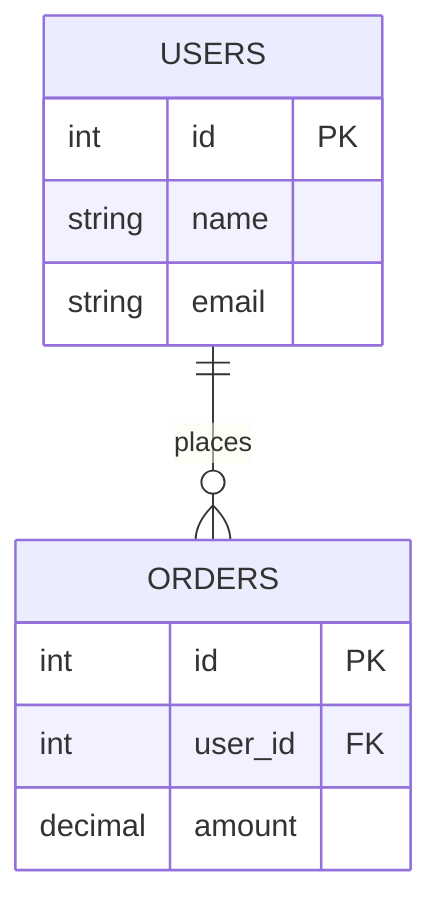
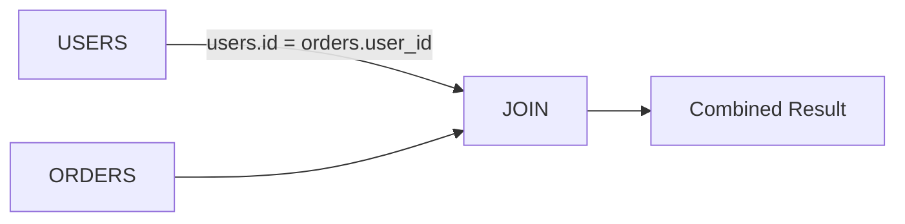
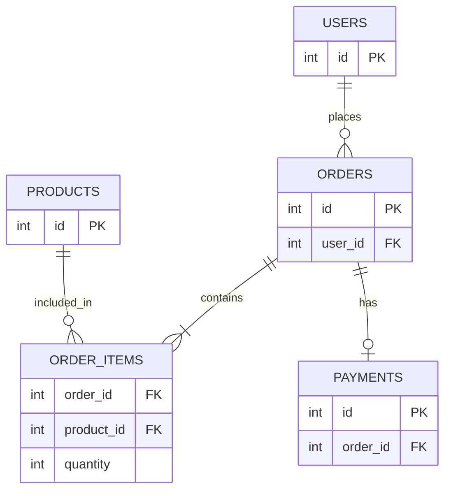

# Relational Model in DBMS

## 1. What is the Relational Model?

The **relational model** represents data as a collection of **tables**.

Each table contains:

- **Rows** → individual records
- **Columns** → attributes/properties
- **Relationships** → connections between tables

Example:

```text
USERS
+----+----------+-------------------+
| id | name     | email             |
+----+----------+-------------------+
| 1  | Tapan    | tapan@example.com |
| 2  | Rahul    | rahul@example.com |
+----+----------+-------------------+

ORDERS
+-----+---------+--------+
| id  | user_id | amount |
+-----+---------+--------+
| 101 | 1       | 500    |
| 102 | 1       | 900    |
| 103 | 2       | 300    |
+-----+---------+--------+
```

---

# 2. Key Terminologies

| Term | Meaning |
|---|---|
| **Relation** | A table |
| **Tuple** | A row/record |
| **Attribute** | A column/property |
| **Domain** | Set of allowed values for an attribute |
| **Schema** | Structure/definition of the database |
| **Instance** | Actual data at a particular point in time |
| **Primary Key** | Uniquely identifies each row |
| **Candidate Key** | A possible unique identifier |
| **Alternate Key** | Candidate key not selected as the primary key |
| **Composite Key** | Key made from multiple columns |
| **Foreign Key** | References a key in another table |
| **Constraint** | Rule that keeps data valid and consistent |
| **Selection** | Filtering rows |
| **Projection** | Selecting columns |
| **Join** | Combining related rows from multiple tables |

---

# 3. Relation

A **relation** is essentially a table.

```text
USERS
+----+--------+
| id | name   |
+----+--------+
| 1  | Tapan  |
| 2  | Rahul  |
+----+--------+
```

---

# 4. Tuple

A **tuple** is a single row in a relation.

```text
(1, "Tapan")
```

is one tuple.

---

# 5. Attribute

An **attribute** is a column.

```text
id
name
email
```

are attributes.

---

# 6. Domain

A **domain** defines the valid values an attribute can contain.

```text
age    → integer
email  → string
price  → decimal
```

```text
age = 25        ✅
age = "hello"   ❌
```

---

# 7. Schema vs Instance

### Schema

The structure or blueprint of the database.

```text
USERS(
    id INT,
    name VARCHAR,
    email VARCHAR
)
```

### Instance

The actual data present at a particular point in time.

```text
1 | Tapan | tapan@example.com
2 | Rahul | rahul@example.com
```

```text
Schema   = Blueprint
Instance = Current data
```

---

# 8. Keys

## Primary Key

Uniquely identifies every row.

A primary key must be:

- Unique
- Not `NULL`

```text
USERS

id   name
---------
1    Tapan
2    Rahul
3    Amit
```

---

## Candidate Key

A column or combination of columns that **could uniquely identify a row**.

```text
id     → Candidate Key
email  → Candidate Key
```

One candidate key is selected as the primary key.

---

## Alternate Key

A candidate key that was **not selected** as the primary key.

```text
Candidate Keys:
    id
    email

Primary Key:
    id

Alternate Key:
    email
```

---

## Composite Key

A key consisting of multiple columns.

```text
ORDER_ITEMS

order_id | product_id | quantity
---------|------------|---------
101      | 10         | 2
101      | 20         | 1
102      | 10         | 3
```

Together:

```text
(order_id, product_id)
```

can uniquely identify a row.

---

# 9. Foreign Key

A **foreign key** creates a relationship between tables.

```text
USERS.id
   ↑
   │
ORDERS.user_id
```

`orders.user_id` references `users.id`.



---

# 10. Relationships

## One-to-One

```text
USER ─────── PROFILE
  1             1
```

## One-to-Many

```text
USER ───────< ORDER
  1            many
```

One user can have many orders.

## Many-to-Many

A bridge/junction table is used.

```text
STUDENT
---------
id

COURSE
---------
id

ENROLLMENT
----------------
student_id
course_id
```

Often:

```text
(student_id, course_id)
```

is the composite primary key.

---

# 11. Integrity Constraints

**Integrity constraints** are rules that maintain the **accuracy, validity, and consistency** of data.

```text
Data
 ↓
Constraints
 ↓
Valid + Consistent Database
```

## Entity Integrity

A primary key must uniquely identify a row and **cannot be `NULL`**.

```text
id = NULL   ❌
id = 1      ✅
```

## Referential Integrity

A foreign key should refer to an existing row in the referenced table, unless the relationship is intentionally nullable.

```text
USERS
id
--
1
2
3

ORDERS
user_id
-------
1       ✅
2       ✅
999     ❌
```

If user `999` does not exist, the reference is invalid.


## Domain Integrity

Values should conform to the allowed type/domain.

```text
age = 25        ✅
age = "hello"   ❌

price = 99.50   ✅
```

## Key Constraints

Keys must satisfy their uniqueness requirements.

```text
id
--
1
2
1   ❌
```

---

# 12. Relational Operations

## Selection

Filters rows.

```sql
SELECT *
FROM users
WHERE age > 25;
```

## Projection

Selects specific columns.

```sql
SELECT name, email
FROM users;
```

## Join

Combines related tables.

```sql
SELECT users.name, orders.amount
FROM users
JOIN orders
    ON users.id = orders.user_id;
```



---

# 13. Relational Model in System Design

Imagine an Amazon-like order system.

```text
users
orders
order_items
products
payments
```

The relational model helps define:

```text
User → Orders
Order → OrderItems
OrderItem → Product
Order → Payment
```



---

# 14. Why It Matters in System Design

```text
Relational Model
       ↓
Keys & Relationships
       ↓
Normalization
       ↓
Indexes
       ↓
Transactions
       ↓
ACID
       ↓
Isolation & Concurrency
       ↓
Replication
       ↓
Partitioning / Sharding
       ↓
Distributed Databases
```

---

# Interview Cheat Sheet

| Concept | Remember |
|---|---|
| Relation | Table |
| Tuple | Row |
| Attribute | Column |
| Domain | Allowed values/type |
| Schema | Database blueprint |
| Instance | Current data |
| Primary Key | Unique row identifier |
| Candidate Key | Possible unique identifier |
| Alternate Key | Candidate key not chosen as PK |
| Composite Key | Multiple columns forming a key |
| Foreign Key | References another table |
| Entity Integrity | Primary key cannot be `NULL` |
| Referential Integrity | Foreign key must reference valid data |
| Domain Integrity | Values follow the allowed domain |
| Key Constraint | Keys satisfy uniqueness requirements |
| Selection | Filter rows |
| Projection | Select columns |
| Join | Combine related data |

## Final Mental Model

```text
                 RELATIONAL MODEL
                        │
          ┌─────────────┴─────────────┐
          ▼                           ▼
       Tables                       Keys
          │                           │
     ┌────┴────┐                ┌─────┴─────┐
     ▼         ▼                ▼           ▼
   Rows     Columns         Primary       Foreign
 (Tuples) (Attributes)        Key           Key
                                  │           │
                                  └─────┬─────┘
                                        ▼
                                  Relationships
                                        │
                                        ▼
                                   Constraints
                                        │
                                        ▼
                               Valid + Consistent
                                     Data
```
