# What Happens When You Enter `google.com`?

> **Core idea:** A browser request is a chain of networking steps: URL parsing → DNS → TCP → TLS → HTTP → server processing → response → browser rendering.

---

## 1. The Big Picture

When you type:

```text
https://google.com
```

and press Enter, many things happen before the page appears.

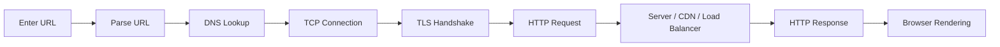

A simplified mental model:

```text
URL
 ↓
DNS
 ↓
IP address
 ↓
TCP connection
 ↓
TLS encryption
 ↓
HTTP request
 ↓
Server
 ↓
HTTP response
 ↓
Browser renders page
```

---

# 2. Step 1: URL Parsing

The browser first interprets the URL.

For:

```text
https://google.com/search?q=backend
```

we can identify:

```text
Scheme       → https
Host         → google.com
Path         → /search
Query        → ?q=backend
```

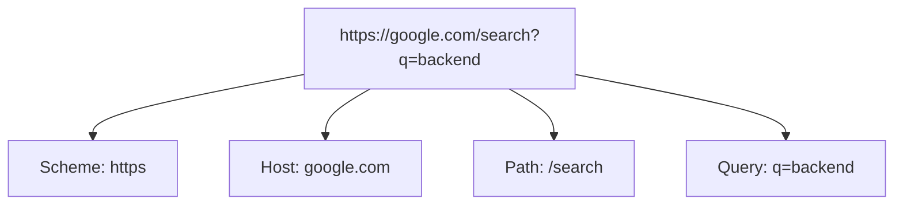

The browser now knows which protocol to use and which hostname it needs to contact.

---

# 3. Step 2: Check Local Caches

Before asking a DNS server, the browser and operating system may already know the IP address.

Possible places include:

```text
Browser DNS cache
        ↓
OS DNS cache
        ↓
Hosts file
        ↓
DNS resolver
```

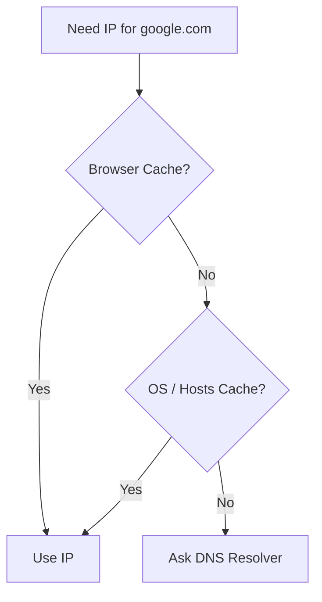

If the address is cached and still valid, the DNS lookup can be skipped.

---

# 4. Step 3: DNS Resolution

The browser needs an IP address for:

```text
google.com
```

DNS translates domain names into IP addresses.

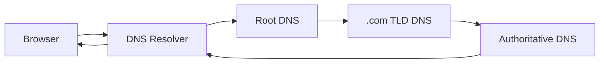

Conceptually:

```text
google.com
    ↓
DNS
    ↓
IP address
```

For example, DNS may return an IPv4 address or an IPv6 address.

> The exact Google IP returned can vary because large services use distributed infrastructure, routing, load balancing, and geographic considerations.

---

# 5. DNS Hierarchy

DNS is hierarchical.

For:

```text
google.com
```

the hierarchy is roughly:

```text
.
└── com
    └── google.com
```

The lookup can involve:

```text
Root
 ↓
.com TLD
 ↓
Authoritative nameserver
 ↓
google.com IP
```

A recursive resolver performs much of this work on behalf of the client.

---

# 6. Step 4: Choose a Network Path

Once the browser has an IP address, the operating system needs to send packets toward it.

Your computer may first determine:

```text
Which network interface?
Which gateway/router?
Which local-link destination?
```

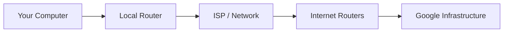

Routers forward IP packets toward the destination network.

The exact route can change dynamically.

---

# 7. Step 5: TCP Connection

For traditional HTTPS over TCP, the browser establishes a TCP connection to the destination.

HTTPS commonly uses:

```text
TCP port 443
```

The TCP handshake is:

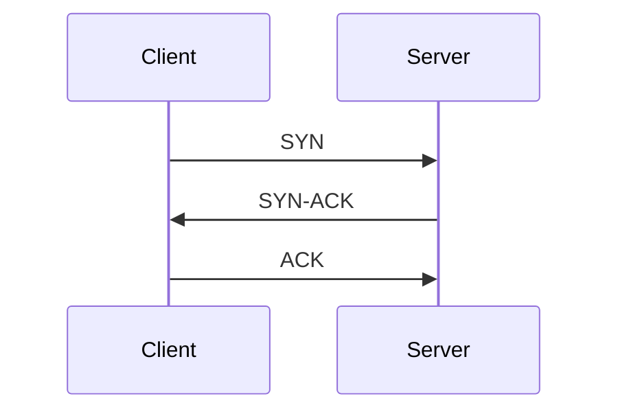

After this:

```text
TCP connection established
```

TCP provides mechanisms for:

```text
Reliable delivery
Ordering
Acknowledgements
Retransmission
Flow control
Congestion control
```

---

# 8. TCP Is Not the Same as HTTP

This distinction is important.

```text
HTTP
→ Application-layer protocol

TCP
→ Transport-layer protocol
```

The relationship is roughly:

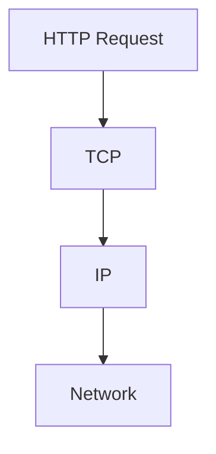

HTTP data is transported over the underlying connection.

---

# 9. Step 6: TLS Handshake

Because we are using:

```text
https://
```

the connection needs TLS.

TLS provides important security properties such as:

```text
Encryption
Authentication
Integrity
```

A simplified handshake:

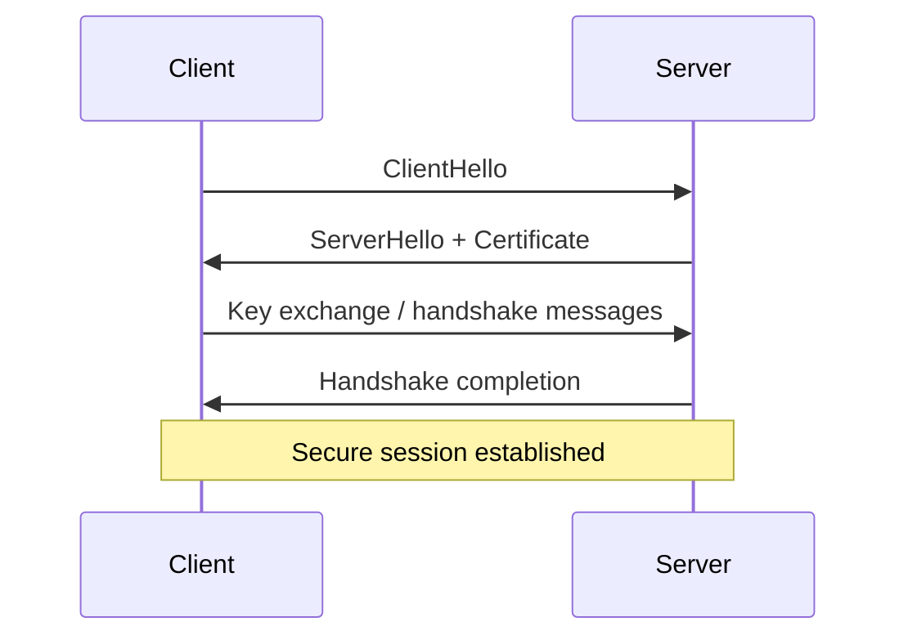

The exact TLS 1.3 handshake contains additional details, but the key idea is:

> The client and server establish cryptographic parameters and authenticate the server before protected application data is exchanged.

---

# 10. Why the Certificate Matters

The server presents a certificate containing information about its identity.

The browser verifies the certificate chain using trusted certificate authorities.

Conceptually:

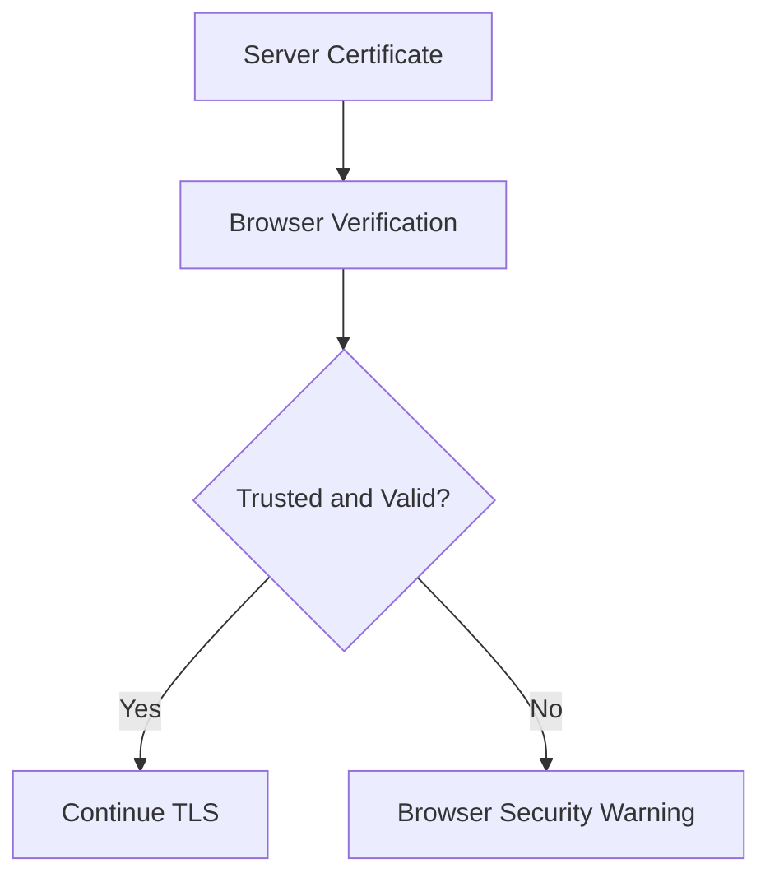

The certificate helps the browser verify that it is communicating with the intended domain rather than an impostor.

---

# 11. Step 7: HTTP Request

Now the browser can send the HTTP request through the secure connection.

A simplified request:

```http
GET / HTTP/1.1
Host: google.com
```

Modern browsers commonly use HTTP/2 or HTTP/3 rather than HTTP/1.1, depending on what the server and browser negotiate.

Conceptually:

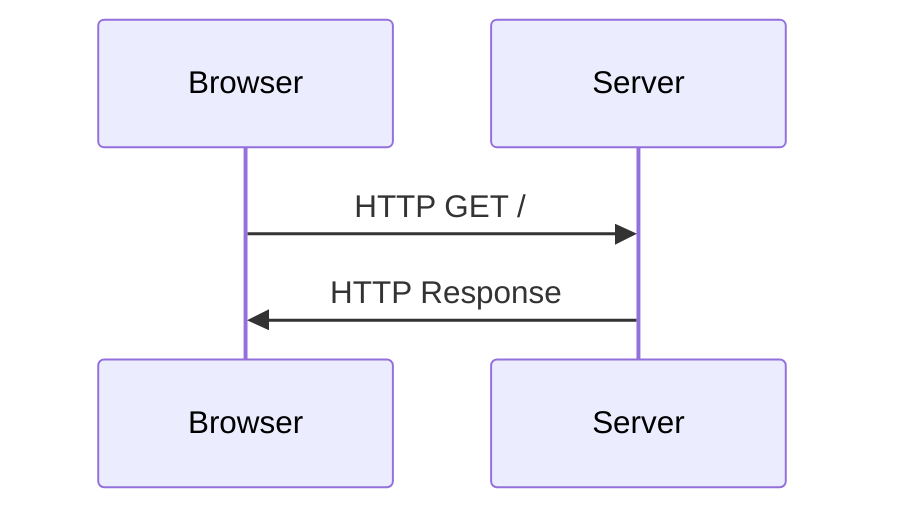

---

# 12. What Does the Server Receive?

The request contains information such as:

```text
Method
Path
Headers
Cookies
Other request metadata
```

For example:

```http
GET /
Host: google.com
Accept: text/html
Accept-Language: en
```

The actual request sent by a modern browser is more complex.

---

# 13. Step 8: Server Infrastructure

A large website is usually not just:

```text
Browser → One Server
```

There can be several components.

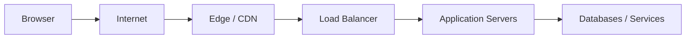

Depending on the request, infrastructure may include:

```text
CDN
Edge servers
Load balancers
Application servers
Caches
Databases
Internal services
```

The exact architecture is service-specific.

---

# 14. CDN and Edge

A CDN can serve content from infrastructure closer to the user.

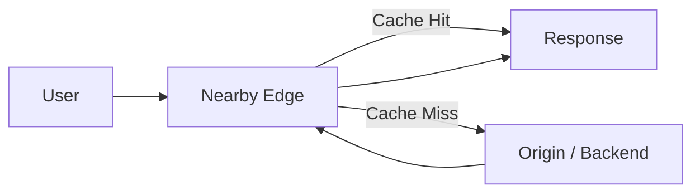

For cacheable content:

```text
User
 ↓
Edge
 ↓
Cached response
```

For content not available at the edge:

```text
User
 ↓
Edge
 ↓
Origin / Backend
 ↓
Response
```

---

# 15. Step 9: Server Generates a Response

The server processes the request and returns an HTTP response.

A simplified response:

```http
HTTP/1.1 200 OK
Content-Type: text/html
```

followed by response data.

Common status codes:

```text
200 → Success
301 → Permanent redirect
302 → Temporary redirect
304 → Not modified
400 → Bad request
401 → Unauthorized
403 → Forbidden
404 → Not found
500 → Server error
```

---

# 16. Redirects Can Add More Requests

The first response may tell the browser to visit another URL.

Example:

```text
google.com
   ↓
redirect
   ↓
www.google.com
```

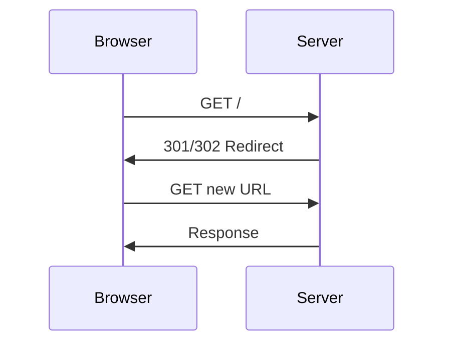

This means a single URL entered by the user can result in multiple network requests.

---

# 17. Step 10: Browser Receives the Response

The browser receives the response body.

For an HTML page, it begins processing the document.

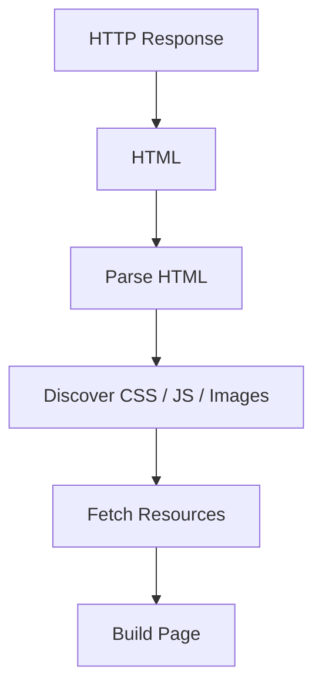

The browser does not simply download HTML and stop.

It parses the document and discovers additional resources.

---

# 18. HTML Creates More Requests

Suppose the HTML contains:

```html
<link rel="stylesheet" href="/style.css">
<script src="/app.js"></script>

```

The browser may request:

```text
/style.css
/app.js
/logo.png
```

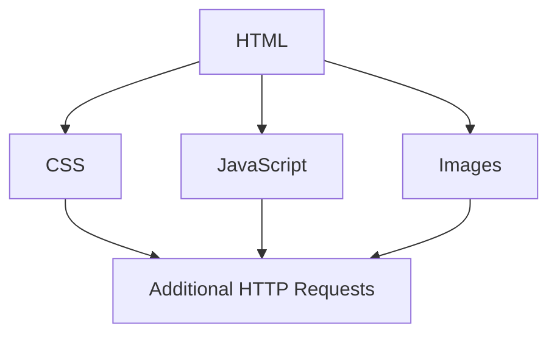

This is why loading a web page can involve many network requests.

---

# 19. Browser Rendering

The browser parses HTML and constructs the page structures needed for rendering.

A simplified rendering pipeline:

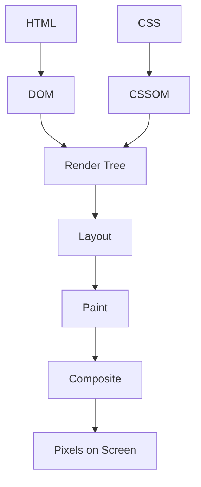

### DOM

Represents the HTML document as a tree.

### CSSOM

Represents parsed CSS information.

### Render Tree

Combines relevant DOM and styling information.

### Layout

Determines sizes and positions.

### Paint

Draws visual elements.

### Composite

Combines rendered layers for display.

---

# 20. JavaScript Can Change Everything

JavaScript can:

```text
Modify the DOM
Change styles
Fetch APIs
Create more requests
Handle user interaction
Update page content
```

For example:

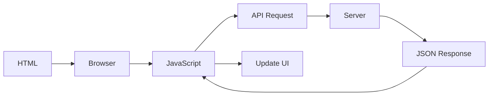

So the page can continue communicating with servers even after the initial HTML arrives.

---

# 21. Connection Reuse

The browser does not necessarily create a brand-new TCP connection for every resource.

Modern protocols support efficient connection reuse.

For HTTP/2:

```text
One TCP connection
        ↓
Multiple concurrent HTTP streams
```

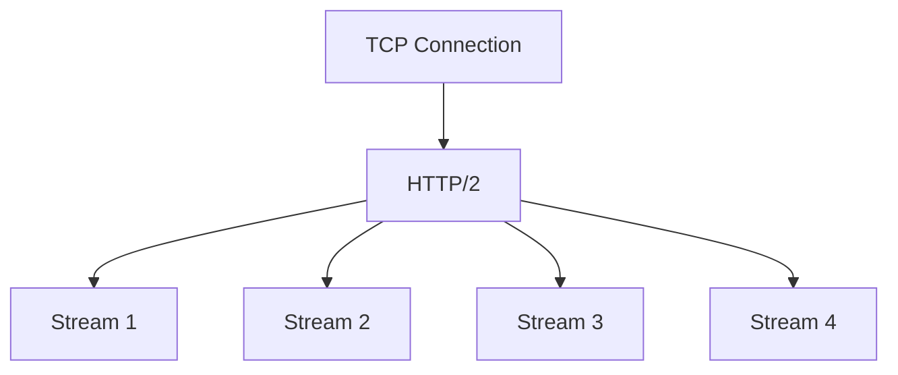

HTTP/3 differs significantly because it uses QUIC over UDP rather than TCP.

```text
HTTP/1.1 → commonly TCP
HTTP/2   → TCP
HTTP/3   → QUIC over UDP
```

---

# 22. The Complete Journey

Put everything together:

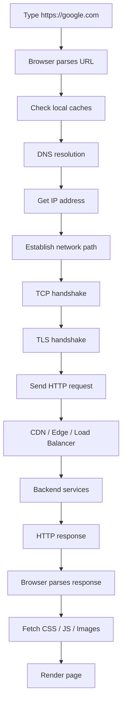

---

# 23. A More Realistic Mental Model

The simplified version is:

```text
DNS
 ↓
TCP
 ↓
TLS
 ↓
HTTP
```

But modern web traffic can be more complicated.

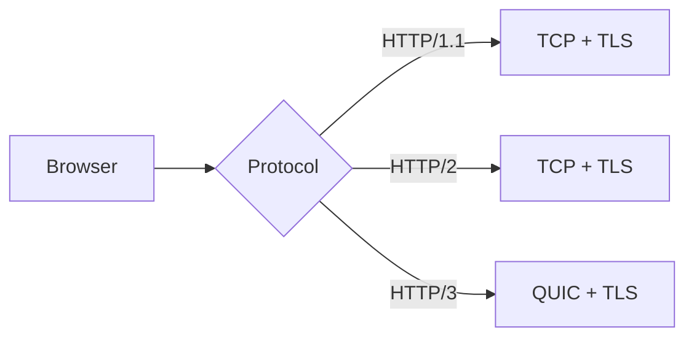

So don't memorize:

```text
Every website = DNS → TCP → TLS → HTTP
```

as an absolute rule.

Instead remember:

> **The browser resolves the destination, establishes an appropriate secure transport, sends an application-layer request, receives data, and renders it.**

---

# 24. Where Each Protocol Fits

```mermaid
flowchart TB
    A[HTTP / HTTPS<br/>Application]
    B[TCP / QUIC<br/>Transport]
    C[IP<br/>Internet]
    D[Ethernet / Wi-Fi<br/>Network Access]

    A --> B
    B --> C
    C --> D
```

Common concepts:

| Concept | Main responsibility |
|---|---|
| DNS | Domain → IP resolution |
| IP | Addressing and routing |
| TCP | Reliable transport |
| TLS | Secure communication |
| HTTP | Application request/response |
| Browser | Parse, execute, render |

---

# 25. What If DNS Fails?

```mermaid
flowchart TD
    A[Enter google.com] --> B[DNS Lookup]
    B --> C{Success?}
    C -->|No| D[Cannot resolve hostname]
    C -->|Yes| E[Continue]
```

Possible symptom:

```text
DNS_PROBE_FINISHED_NXDOMAIN
```

or another DNS-related browser error.

Without a destination IP, the browser cannot proceed normally.

---

# 26. What If TCP Fails?

The host may be reachable, but the connection may fail.

Possible causes:

```text
Server unavailable
Port not listening
Firewall
Routing issue
Network failure
```

Conceptually:

```mermaid
flowchart LR
    A[Client] --> B[TCP Connection]
    B --> C{Success?}
    C -->|No| D[Connection Error]
    C -->|Yes| E[TLS]
```

---

# 27. What If TLS Fails?

Possible causes include:

```text
Invalid certificate
Expired certificate
Untrusted certificate
Hostname mismatch
TLS incompatibility
```

```mermaid
flowchart TD
    A[TCP Connected] --> B[TLS Handshake]
    B --> C{Valid?}
    C -->|No| D[Browser Security Error]
    C -->|Yes| E[HTTP]
```

---

# 28. What If HTTP Fails?

The connection can succeed but the application can still return an error.

For example:

```text
404
500
503
```

```mermaid
flowchart LR
    A[TCP] --> B[TLS] --> C[HTTP]
    C --> D{Application Result}
    D -->|Success| E[200]
    D -->|Error| F[4xx / 5xx]
```

This is why:

> **Network connectivity does not guarantee application success.**

---

# 29. Backend Developer Perspective

When debugging an API, think in layers:

```text
Can DNS resolve the host?
        ↓
Can I reach the IP?
        ↓
Can I establish the connection?
        ↓
Does TLS succeed?
        ↓
Did the HTTP request reach the service?
        ↓
What HTTP status came back?
        ↓
Did the application/database fail?
```

```mermaid
flowchart TD
    A[Request Failed] --> B[DNS?]
    B --> C[Network / IP?]
    C --> D[TCP / QUIC?]
    D --> E[TLS?]
    E --> F[HTTP?]
    F --> G[Application?]
    G --> H[Database / Dependency?]
```

This layered debugging approach is extremely useful in backend engineering.

---

# 30. Important Distinctions

### DNS

```text
google.com → IP address
```

### IP

```text
Moves packets toward a destination host/network
```

### TCP

```text
Provides reliable ordered byte-stream transport
```

### TLS

```text
Provides encryption, authentication, and integrity
```

### HTTP

```text
Defines application-level requests and responses
```

### Browser

```text
Parses, executes, fetches resources, and renders
```

---

# 31. Interview Answer

If an interviewer asks:

> **"What happens when you enter google.com in the browser?"**

A strong concise answer:

```text
1. The browser parses the URL.
2. It checks relevant caches and resolves google.com through DNS.
3. It obtains an IP address.
4. It establishes the appropriate network connection.
5. For HTTPS over TCP, it performs the TCP three-way handshake.
6. It performs the TLS handshake and validates the certificate.
7. It sends an HTTP request.
8. The request reaches Google's edge/server infrastructure.
9. The server returns an HTTP response.
10. The browser parses HTML and discovers additional resources.
11. It fetches required CSS, JavaScript, images, and other resources.
12. The browser builds the page and renders pixels on the screen.
```

---

# 32. One-Minute Revision

```text
                    google.com
                         │
                         ▼
                  Parse the URL
                         │
                         ▼
                    DNS Lookup
                         │
                         ▼
                     IP Address
                         │
                         ▼
                  Network Routing
                         │
                         ▼
                  TCP / QUIC
                         │
                         ▼
                       TLS
                         │
                         ▼
                       HTTP
                         │
                         ▼
              CDN / Edge / Backend
                         │
                         ▼
                   HTTP Response
                         │
                         ▼
                  Browser Parsing
                         │
                         ▼
             CSS / JS / Images
                         │
                         ▼
                      Render
                         │
                         ▼
                    Web Page
```

---

# Final Mental Model

Don't try to memorize every packet.

Remember the story:

```mermaid
flowchart LR
    A[Name] -->|DNS| B[Address]
    B -->|Network| C[Destination]
    C -->|Secure Transport| D[Connection]
    D -->|HTTP| E[Request]
    E --> F[Server]
    F --> G[Response]
    G --> H[Browser]
    H --> I[Rendered Page]
```

> **You type a name. DNS finds an address. The network reaches the destination. A secure transport is established. HTTP carries the request. Servers process it and return data. The browser turns that data into the page you see.**
