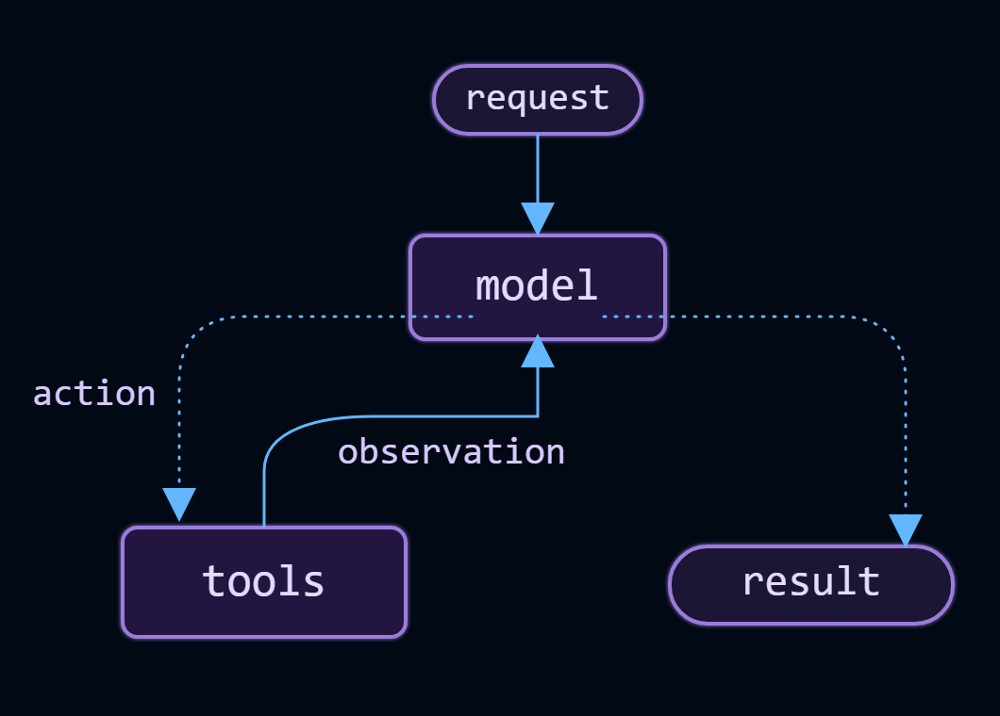
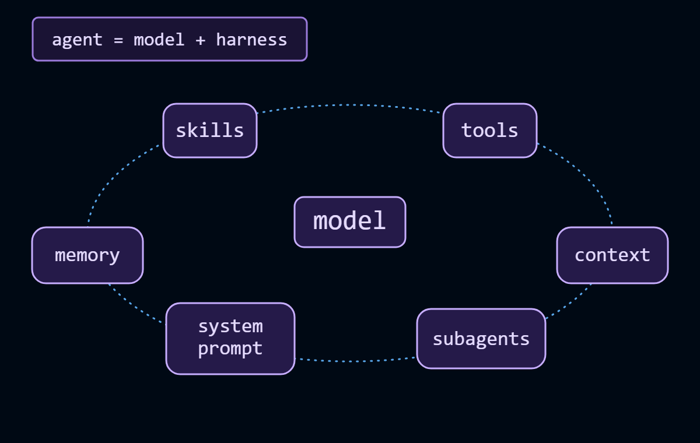
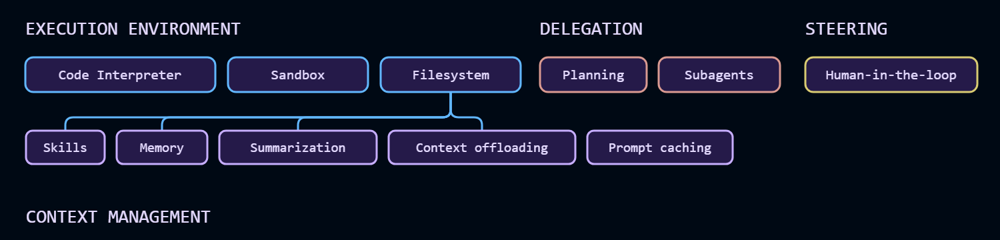

# Agents


An agent is a model calling tools in a loop until a given task is complete.


# Core components



# Model

# Tools

# System prompt


# Structured output

# Agent state


# Invocation

# Streaming

# Configure the harness




# Execution environment

Agents are especially useful when they can take action rather than just generate text. The execution environment gives the agent a workspace: tools it can call, a filesystem for reading and writing files across turns, and code execution for running scripts or shell commands.


# Context management


# Planning and delegation

# Name your agent

# Fault tolerance


```
middleware=[
        ModelRetryMiddleware(max_retries=3),
        ToolRetryMiddleware(max_retries=2),
    ],

```

# Guardrails

```
from langchain.agents.middleware import PIIMiddleware
 middleware=[PIIMiddleware("email")]
 ```


 # Steering

 Full autonomy isn’t always appropriate. Steering lets you place humans at specific decision points—before destructive writes, expensive API calls, or anything requiring judgment—without restructuring your agent. The agent pauses and waits; a human approves, edits, or rejects; execution continues.

```
  middleware=[HumanInTheLoopMiddleware(interrupt_on={"write_file": True})],
  ```


