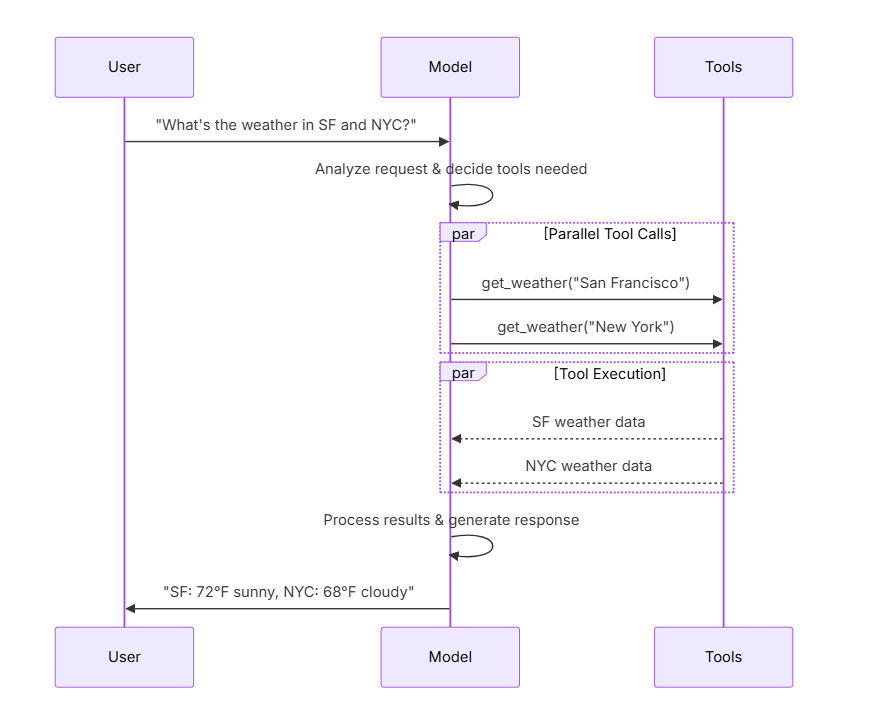

# Models

# Parameters

# Connection resilience


# Invocation

# Stream

# Batch

# Tool calling




# Structured output

# Reasoning

# Prompt caching

# Server-side tool use

# Model exceptions

# Rate limiting

# Base URL and proxy settings

# Token usage

# Invocation config

```
response = model.invoke(
    "Tell me a joke",
    config={
        "run_name": "joke_generation",      # Custom name for this run
        "tags": ["humor", "demo"],          # Tags for categorization
        "metadata": {"user_id": "123"},     # Custom metadata
        "callbacks": [my_callback_handler], # Callback handlers
    }
)

```


# Configurable models

# Dynamic model selection

basic_model = ChatOpenAI(model="gpt-5.4-mini")
advanced_model = ChatOpenAI(model="gpt-5.5")


