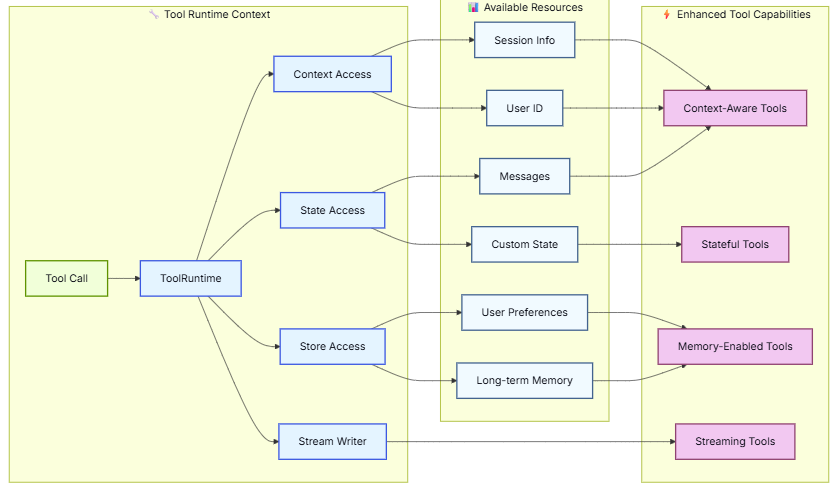

# Basic tool definition

# Custom tool name

@tool("web_search")  # Custom name

@tool("calculator", description="Performs arithmetic calculations. Use this for any math problems.")

# Advanced schema definition
```
weather_schema = {
    "type": "object",
    "properties": {
        "location": {"type": "string"},
        "units": {"type": "string"},
        "include_forecast": {"type": "boolean"}
    },
    "required": ["location", "units", "include_forecast"]
}

@tool(args_schema=weather_schema)
```

# Access context


# Context
Context provides immutable configuration data that is passed at invocation time. Use it for user IDs, session details, or application-specific settings that shouldn’t change during a conversation.