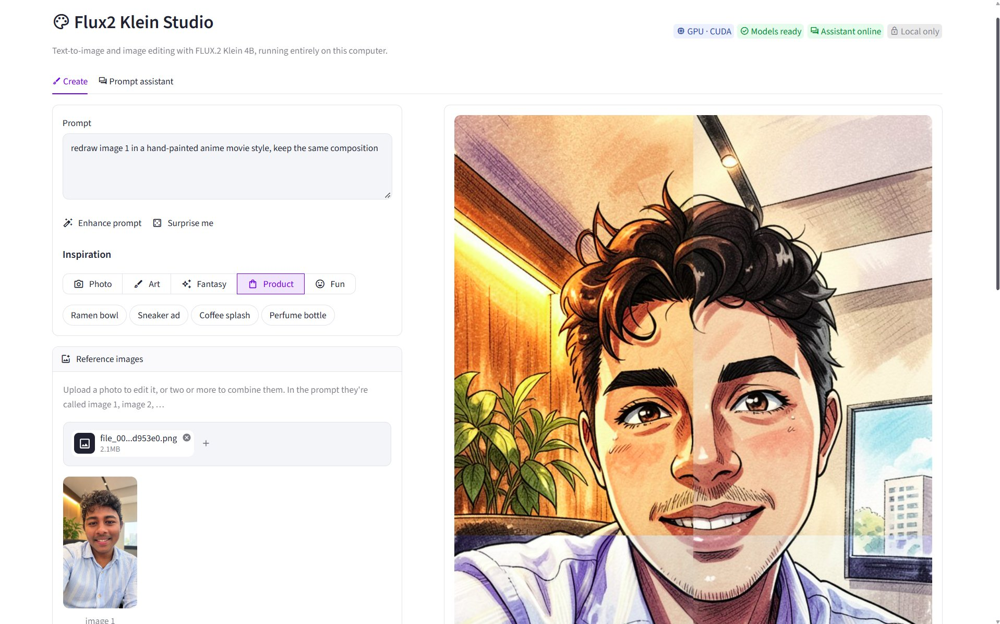
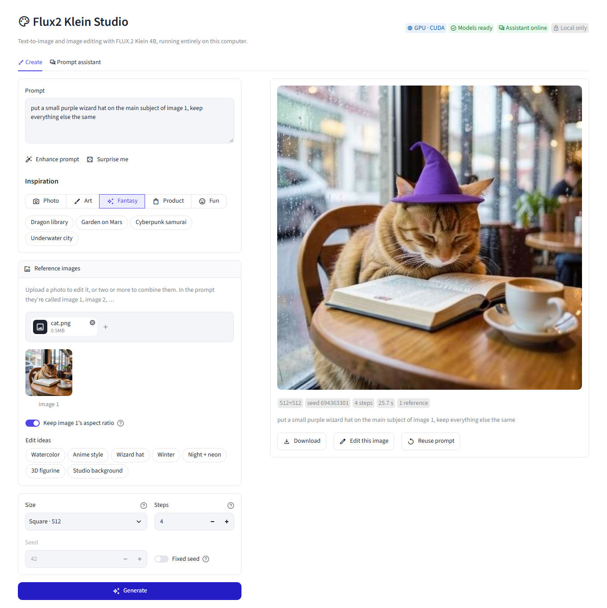

# 🎨 Local Text-to-Image with FLUX.2 Klein

Generating images from text **entirely on my laptop** (NVIDIA RTX PRO 500, 6 GB VRAM, 31.5 GB RAM) with FLUX.2 Klein 4B. **It can also edit my own images** using them as references. A Streamlit app ("Flux2 Klein Studio") wraps it all with clickable prompt and edit ideas, an AI prompt enhancer and a gallery.


*My first image. Prompt: "a lovely cat reading a book in a rainy cafe". 512×512, about 12 seconds.*

---

## 🚀 Quick start

Works on Windows. An NVIDIA GPU is recommended; other GPUs work more slowly.

1. **Install [Python 3.10+](https://www.python.org/downloads/)** and tick "Add python.exe to PATH". Optional: install **[Ollama](https://ollama.com)** for the Prompt assistant and Enhance prompt.
2. **Set up** (one time), from this folder:
   ```powershell
   python setup.py
   ```
   It does everything and is safe to run again. Finished steps are skipped, and an interrupted download resumes where it stopped.
   - creates a Python environment in `.venv` (or uses the one that's already active) and installs the packages
   - downloads the three model files (~5.3 GB) into `models/` and checks each one's SHA-256
   - downloads stable-diffusion.cpp: the CUDA build for NVIDIA GPUs, Vulkan otherwise
   - imports the text encoder into Ollama, if Ollama is installed
3. **Start the app:**
   ```powershell
   python run.py
   ```
   It opens at `http://localhost:8501`.

---

## 📑 Contents

1. [The big idea: text-to-image is three models](#1-the-big-idea-text-to-image-is-three-models)
2. [What we did, step by step](#2-what-we-did-step-by-step)
3. [Using the app](#3-using-the-app)
4. [How the app works](#4-how-the-app-works)
5. [Speed on this laptop](#5-speed-on-this-laptop)
6. [Folder layout](#6-folder-layout)
7. [Troubleshooting](#7-troubleshooting)
8. [Licenses and notes](#8-licenses-and-notes)
9. [Links](#9-links)

---

## 1. The big idea: text-to-image is three models

The most important lesson from this project: **a "text-to-image model" is really three models working together.** Downloading one file with the model's name on it doesn't mean you have all three.

```
your prompt: "a cat reading a book"
   │
   ▼
[1] Text encoder (Qwen3-4B)
   │   reads the prompt and turns it into numbers (embeddings)
   ▼
[2] Diffusion transformer (FLUX.2 Klein 4B)
   │   starts from random noise and "denoises" it into a picture, guided by those numbers
   │   (Klein is distilled, so it only needs 4 of these steps)
   ▼
[3] VAE decoder
   │   turns the compressed result (a "latent") into real pixels
   ▼
🖼️ image
```

| Part | File (in `models/`) | Size | From |
| --- | --- | --- | --- |
| 1. Text encoder | `flux2-klein-4b-uncensored-q4_k_m.gguf` | 2.5 GB | [ponpoke/flux2-klein-4b-uncensored-text-encoder](https://huggingface.co/ponpoke/flux2-klein-4b-uncensored-text-encoder) |
| 2. Diffusion model | `flux-2-klein-4b-Q4_0.gguf` | 2.46 GB | [leejet/FLUX.2-klein-4B-GGUF](https://huggingface.co/leejet/FLUX.2-klein-4B-GGUF) |
| 3. VAE | `flux2-vae.safetensors` | 0.34 GB | [Comfy-Org/flux2-dev](https://huggingface.co/Comfy-Org/flux2-dev/tree/main/split_files/vae) |
| Runner | `sd/sd-cli.exe` | ~900 MB with CUDA | [stable-diffusion.cpp releases](https://github.com/leejet/stable-diffusion.cpp/releases) |

**stable-diffusion.cpp** (`sd-cli.exe`) is the program that loads all three and runs them on the GPU. It's to image models what llama.cpp and Ollama are to chat models.

---

## 2. What we did, step by step

### Step 1 – Downloaded a GGUF from Hugging Face

I searched Hugging Face for `flux2-klein`, found `ponpoke/flux2-klein-4b-uncensored-text-encoder` (tagged **Text-to-Image**, 227 likes) and downloaded `flux2-klein-4b-uncensored-q4_k_m.gguf` (2.5 GB). I thought this was the image model.

### Step 2 – `ollama create` failed with "invalid model name"

I wrote a `Modelfile` and tried to import it into Ollama:

```powershell
ollama create flux2-klein -f ./Modelfile
# gathering model components
# Error: 400 Bad Request: invalid model name
```

**Cause:** the `FROM` line pointed to a file that didn't exist:

```
FROM ./flux2-klein-4b-uncensored-text-encoder-Q4_K_M.gguf   ❌ what the Modelfile said
     ./flux2-klein-4b-uncensored-q4_k_m.gguf                ✅ the file on disk
```

When Ollama can't find the file after `FROM`, it treats the text as the **name of a model to download** from its library. `./something.gguf` isn't a valid name, so the error says "invalid model name" instead of "file not found". A misleading message!

**Fix:** make the `FROM` path match the real filename. After that it imported fine:

```
copying file sha256:97dac4e9… 100%
parsing GGUF
writing manifest
success
```

> 💡 **Lesson:** `ollama create` **copies** the GGUF into Ollama's own storage. After that, the Ollama model doesn't depend on the original file. That's why moving the file into `models/` later didn't break anything.

### Step 3 – It imported… but it only chats

`ollama run flux2-klein` replied with **text**, not images. Two checks showed why.

**`ollama show flux2-klein`:**

```
architecture   qwen3        ← a language model, not an image model
parameters     4.0B
Capabilities:  completion, thinking, tools    ← no image generation
```

**Reading the GGUF file's own metadata** (the header at the start of the file):

```
general.architecture = qwen3
general.name         = Flux2 Klein 4b Uncensored Text Encoder   ← says it right there
qwen3.block_count    = 36, embedding_length = 2560               ← exactly Qwen3-4B
```

<details>
<summary>Python snippet to read a GGUF header</summary>

```python
import struct

def read_gguf_header(path):
    f = open(path, "rb")
    assert f.read(4) == b"GGUF"
    f.read(4)                                   # version
    _tensors, kv_count = struct.unpack("<QQ", f.read(16))
    read_str = lambda: f.read(struct.unpack("<Q", f.read(8))[0]).decode("utf-8", "replace")
    fmt = {0: "<B", 1: "<b", 2: "<H", 3: "<h", 4: "<I", 5: "<i", 6: "<f", 7: "<?", 10: "<Q", 11: "<q", 12: "<d"}

    def read_value(t):
        if t == 8:
            return read_str()
        if t == 9:                              # array
            et, n = struct.unpack("<I", f.read(4))[0], struct.unpack("<Q", f.read(8))[0]
            return [read_value(et) for _ in range(n)]
        return struct.unpack(fmt[t], f.read(struct.calcsize(fmt[t])))[0]

    for _ in range(kv_count):
        key = read_str()
        value = read_value(struct.unpack("<I", f.read(4))[0])
        if key.startswith("general.") or key.endswith(("block_count", "embedding_length")):
            print(key, "=", value)

read_gguf_header("models/flux2-klein-4b-uncensored-q4_k_m.gguf")
```

</details>

**So what was it?** Part 1 of the pipeline: the **text encoder**. FLUX.2 Klein 4B uses Qwen3-4B to read prompts, and this repo is a Qwen3-4B modified to remove its refusals ("abliterated"). Because a text encoder is an ordinary language model, Ollama happily ran it as a chatbot. The Hugging Face repo is tagged "Text-to-Image" only because it's *used inside* a text-to-image setup. Its own model card says it's a replacement text encoder that you pair with the official FLUX.2 Klein model.

> 💡 **Lesson:** a Hugging Face **tag** describes the pipeline a file belongs to, not what the file does on its own. Check the repo name, the model card, and `general.architecture` in the GGUF header.

### Step 4 – First Streamlit app: a prompt-writer chat

Since the model was already imported, I built a small Streamlit chat around it using the `ollama` Python package:

```python
import ollama

r = ollama.chat(
    model="flux2-klein",
    messages=[{"role": "user", "content": "Turn this into a detailed image prompt: a cat in a rainy cafe"}],
    think=False,   # Qwen3 "thinks" out loud first unless you turn it off
)
print(r.message.content)
```

It's good at turning a short idea into a rich, detailed image prompt. It's **bad at facts**: asked "what is FLUX.2?", it confidently said "a conceptual art project". Small models make things up.

### Step 5 – Picking the missing parts

I needed part 2 (diffusion model) and part 3 (VAE). Searching `flux2-klein` on Hugging Face gives ~46 results. Here's how I chose:

| Candidate | Verdict | Why |
| --- | --- | --- |
| **`leejet/FLUX.2-klein-4B-GGUF` → `Q4_0`** | ✅ **chosen** | leejet wrote stable-diffusion.cpp, and its FLUX.2 docs link to this repo. Distilled = 4 steps. Apache-2.0. |
| `leejet/FLUX.2-klein-4B-GGUF` → `Q8_0` (4.3 GB) | ❌ | Better quality, but too heavy next to the text encoder on a 6 GB GPU |
| `…FLUX.2-klein-base-4B…` | ❌ | Non-distilled base model: needs ~20–50 steps instead of 4, so much slower |
| Anything `9B` | ❌ | Too big for 6 GB VRAM |
| `SDNQ`, `bnb-4bit`, `int8`, `MLX` versions | ❌ | Formats for Python diffusers or Apple Silicon, not GGUF / stable-diffusion.cpp |
| VAE from `black-forest-labs/FLUX.2-dev` | ❌ | Gated (needs login + accepting the license) |
| **VAE from `Comfy-Org/flux2-dev`** | ✅ **chosen** | Same `flux2-vae` file, no login needed |

The text encoder from Step 1 wasn't wasted: it's exactly part 1 of this setup.

### Step 6 – Download the missing parts

> Today `python setup.py` does all of this automatically ([Step 12](#step-12--smooth-setup-for-someone-new)). These are the manual steps it replaced.

Run in PowerShell from this folder. **Use `curl.exe`, not `curl`**: in Windows PowerShell, `curl` is an alias for the much slower `Invoke-WebRequest`. `-C -` resumes a download if it gets cut off.

```powershell
cd C:\work-learn\p2\ai\text_to_image
New-Item -ItemType Directory -Force models, sd | Out-Null

# Part 2: diffusion model (2.46 GB)
curl.exe -L -C - -o models\flux-2-klein-4b-Q4_0.gguf "https://huggingface.co/leejet/FLUX.2-klein-4B-GGUF/resolve/main/flux-2-klein-4b-Q4_0.gguf"

# Part 3: VAE (0.34 GB)
curl.exe -L -C - -o models\flux2-vae.safetensors "https://huggingface.co/Comfy-Org/flux2-dev/resolve/main/split_files/vae/flux2-vae.safetensors"

# Runner: stable-diffusion.cpp, CUDA build + CUDA runtime DLLs
curl.exe -L -o sd\sd-cuda.zip "https://github.com/leejet/stable-diffusion.cpp/releases/download/master-908-88411ef/sd-master-88411ef-bin-win-cuda12-x64.zip"
curl.exe -L -o sd\cudart.zip "https://github.com/leejet/stable-diffusion.cpp/releases/download/master-908-88411ef/cudart-sd-bin-win-cu12-x64.zip"
Expand-Archive sd\sd-cuda.zip -DestinationPath sd -Force
Expand-Archive sd\cudart.zip -DestinationPath sd -Force

# Part 1 (already downloaded in Step 1), kept next to the others
Move-Item flux2-klein-4b-uncensored-q4_k_m.gguf models\
```

The CUDA build worked on my Blackwell laptop GPU (compute capability 12.0). If it doesn't on yours, the Vulkan build (32 MB) works on any GPU:

```powershell
curl.exe -L -o sd-vulkan.zip "https://github.com/leejet/stable-diffusion.cpp/releases/download/master-908-88411ef/sd-master-88411ef-bin-win-vulkan-x64.zip"
Expand-Archive sd-vulkan.zip -DestinationPath sd-vulkan -Force
```

The app automatically uses `sd-vulkan\sd-cli.exe` if `sd\sd-cli.exe` isn't there.

### Step 7 – First image from the command line

```powershell
.\sd\sd-cli.exe --diffusion-model models\flux-2-klein-4b-Q4_0.gguf `
  --vae models\flux2-vae.safetensors `
  --llm models\flux2-klein-4b-uncensored-q4_k_m.gguf `
  -p "a lovely cat reading a book in a rainy cafe" `
  --cfg-scale 1.0 --steps 4 --offload-to-cpu --diffusion-fa -o cat.png
```

| Flag | Meaning |
| --- | --- |
| `--diffusion-model` | Part 2, the model that draws |
| `--vae` | Part 3, turns the latent into pixels |
| `--llm` | Part 1, the text encoder (it's a language model, hence "llm") |
| `-p` | The prompt |
| `--steps 4` | Denoising steps. Klein is distilled for 4; the default of 20 would just be slower. |
| `--cfg-scale 1.0` | Prompt guidance. Distilled models have guidance built in, so use 1.0; the default of 7.0 is for older models. |
| `-W` / `-H` | Width / height in pixels (default 512). Multiples of 16. |
| `-s` | Seed. Same prompt + same seed = same image. Negative = random. |
| `--offload-to-cpu` | Keeps weights in regular RAM and moves each part to the GPU only when needed. This is what makes 4.9 GB of weights work on a 6 GB GPU. |
| `--diffusion-fa` | Flash attention: faster and uses less memory |
| `-o` | Output file |

Result: `cat.png` at the top of this page. 🎉

### Step 8 – Flux2 Klein Studio (the Streamlit app)

Upgraded [app.py](app.py) into a two-tab app: image generation plus the prompt chat from Step 4. See [Using the app](#3-using-the-app).

### Step 9 – Tidy-up

- Moved the text encoder into `models/` so all three parts live together, and updated `Modelfile` to match.
- Added `models/`, `sd/` and `outputs/` to the repo's `.gitignore`. GitHub rejects files over 100 MB, and the models alone are ~5.3 GB. Only the small files (`app.py`, `.streamlit/config.toml`, `Modelfile`, `README.md`, `cat.png`, `cat_wizard.png`, `ui.png`, `selfie_anime.jpg`) get committed.

### Step 10 – Editing my own images (reference images)

FLUX.2 isn't only text-to-image. **You can give it images as references** and describe a change. stable-diffusion.cpp's `-r` flag passes a reference image, and you can use it several times. The prompt refers to them as **image 1**, **image 2**, … in the order given.

**Edit one image:**

```powershell
.\sd\sd-cli.exe --diffusion-model models\flux-2-klein-4b-Q4_0.gguf --vae models\flux2-vae.safetensors `
  --llm models\flux2-klein-4b-uncensored-q4_k_m.gguf --cfg-scale 1.0 --steps 4 --offload-to-cpu --diffusion-fa `
  -r cat.png -p "put a small purple wizard hat on the cat, keep everything else the same" -o cat_wizard.png
```

| Before (`cat.png`) | After (`cat_wizard.png`), 13 s |
| :---: | :---: |
|  |  |

Only the hat changed: the café, book, coffee cup and rain are the same. Adding *"keep everything else the same"* to the prompt helps a lot.

**Combine two images:** `-r cat.png -r library.png -p "the ginger cat from image 1 sleeping on the stack of books in the tree library from image 2"`. The cat replaced the dragon in the library scene, matching its illustration style (768×768, 36 s).

**Changing the whole scene works too:** "make image 1 a snowy winter scene, keep everything else the same" turned the tree library into a snowy version with the same layout.

**Editing a real photo:** I uploaded a selfie and clicked the **Anime style** edit idea ("redraw image 1 in a hand-painted anime movie style, keep the same composition"). The app kept the photo's portrait shape: 672×1184, 6 steps, 41 s.



### Step 11 – A clean, professional UI

The first version worked but looked like a demo: emojis on every button, Streamlit's default red, a "Deploy" button, a category bar that got cut off, and chat settings cluttering the image page. The redesign:

- **Two clear tabs:** **Create** (controls on the left, result on the right, gallery below) and **Prompt assistant**, with its settings moved into its own tab
- **Consistent visuals:** a custom light and dark theme with one indigo accent, Material icons instead of emojis, and panels with borders
- **Status badges** in the header: GPU backend, models, assistant, local only
- **Cleaner controls:** ideas as compact pills, and a square-thumbnail gallery with icon buttons
- **Local only for real:** Streamlit's Deploy button and usage statistics turned off in `.streamlit/config.toml`

Tested end to end in a real browser (Playwright): idea pills, Surprise me, generating, uploading a reference photo, an edit idea, the prompt assistant and Send to Create.

### Step 12 – Smooth setup for someone new

Before this, a new person had to follow Step 6 by hand: make folders, run five `curl.exe` commands, unzip, move files, create a Python environment and install packages. Now it's `python setup.py`, then `python run.py`.

- **[setup.py](setup.py)** uses only Python's standard library, so any Python 3.10+ can run it before anything is installed.
  1. If it isn't running in a virtual environment, it creates `.venv` and re-runs itself with that Python.
  2. It installs [requirements.txt](requirements.txt) (streamlit, ollama, pillow).
  3. It downloads the models and the runner.
  4. It imports the text encoder into Ollama if Ollama is installed.
- **Pinned and verified downloads:** every URL points at an exact version (a Hugging Face commit, a stable-diffusion.cpp release tag), and every file is checked against its official size and SHA-256. A corrupted file is deleted instead of silently breaking the app.
- **Resume:** downloads go to a `.part` file and continue with an HTTP `Range` request. Tested by cutting a download off at 325 MB of 336 MB: the next run printed "resuming at 0.33 GB", finished, and the checksum matched.
- **Picks the right runner:** CUDA if `nvidia-smi` works, Vulkan otherwise. Force one with `python setup.py --backend vulkan`.
- **Checks disk space** before downloading.
- **[run.py](run.py)** finds the right Python (the active environment or `.venv`), checks setup was done, and starts Streamlit *from this folder*, so the theme in `.streamlit/config.toml` always applies.
- **Tested in a fresh folder** with no environment: `setup.py` created `.venv`, installed the packages and skipped the models that were already there, and `run.py` started the app ("GPU · Vulkan", "Models ready").
- **Python only, no `.bat` files:** I first added `setup.bat` / `run.bat` as double-click shortcuts, then removed them. Two commands in a terminal are just as easy, and one language is simpler to maintain.

**Also added: deleting images.** A **Delete** button under the current image and a trash icon on each gallery thumbnail. Both ask for confirmation, then remove the image and its `.json` file. As a safety check, the app only ever deletes `.png` files directly inside `outputs/`.

---

## 3. Using the app



The header shows the app's status at a glance: **GPU backend** (CUDA or Vulkan), **Models ready**, **Assistant online** (Ollama running with the `flux2-klein` model) and **Local only**. The app follows your computer's light/dark setting.

### Create tab

The left panel has the controls. The right panel shows the current image.

- **Prompt:** describe the image you want.
  - **Enhance prompt:** the local assistant rewrites a short idea ("a lighthouse in a storm") into a detailed prompt. Edit it if you like, then generate.
  - **Surprise me:** fills in a random idea.
- **Inspiration:** pick a category (Photo, Art, Fantasy, Product, Fun) and click one of its ideas to fill the prompt.
- **Reference images:** see [Editing your own images](#editing-your-own-images) below.
- **Settings:**

  | Setting | What it does |
  | --- | --- |
  | Size | Square 512 (fastest) up to Square 1024 (sharpest), plus portrait, landscape and wide |
  | Steps | 4 is right for Klein. More steps rarely help. |
  | Fixed seed | Turn on and set a seed to reproduce or tweak an image exactly (same prompt + same seed = same image) |

- **Generate:** a progress bar shows each stage (loading models → reading the prompt → step 1–4 → finishing). Then the image appears with its size, seed, steps, time and prompt, plus **Download**, **Edit this image**, **Reuse prompt** and **Delete** (asks to confirm first).
- **Recent:** your last 12 images as an even grid of square thumbnails. Under each: **view** (show it in the big panel), **reuse prompt** (hover to see the prompt), **add as reference** and **delete**. Images are saved to `outputs/` with a matching `.json` file (prompt, seed, size, steps, time, references), so the gallery survives restarts.

### Editing your own images

1. Open **Reference images** and upload 1–4 images (PNG, JPG or WebP). They're labelled **image 1**, **image 2**, … in upload order.
2. Click an **edit idea** (Watercolor, Anime style, Wizard hat, Winter, Night + neon, 3D figurine, Studio background, and Combine 1 + 2 once you have two images), or write your own ("put the dog from image 1 on the beach from image 2").
3. Press **Generate**.

- **Keep editing a result:** press **Edit this image** under the current image. It becomes image 1, so you can make changes step by step (add a hat → make it night → watercolor).
- **Combine gallery images:** press the **add as reference** icon under any recent image.
- **Keep image 1's aspect ratio** (on by default): a landscape photo gives a landscape result. The Size setting still controls how detailed it is.
- Phone photos are fine: they're rotated upright and shrunk to at most 1024 px before use.

### Prompt assistant tab

- **Prompt writer** mode: describe an idea and get a detailed prompt back, in a box with a copy button and a **Send to Create** button that puts it in the Create tab's prompt box.
- **Chat** mode: a normal assistant. Remember it's a small 4B model that makes up facts.
- **Starter ideas:** clickable suggestions while the chat is empty.
- **Settings** (popover): **Show thinking** displays Qwen3's reasoning before its answer, and **Creativity** is the temperature.
- **Clear:** starts a new conversation.

### ✍️ Tips for good prompts

FLUX.2 Klein understands natural sentences, so describe the image the way you'd describe a photo to a friend:

- **Subject:** who or what, doing what ("a corgi cooking pancakes")
- **Setting:** where and when ("in a tiny kitchen, morning")
- **Light and mood:** "warm amber light", "neon reflections", "misty"
- **Style or camera:** "watercolor", "35mm photo", "3D render", "top-down angle"
- **Text in images works:** "a red neon sign that says OPEN" came out spelled correctly

---

## 4. How the app works

A short tour of [app.py](app.py) for future me.

- **Image generation = running `sd-cli.exe` as a subprocess.** `generate_image()` builds the same command as Step 7 and runs it with `subprocess.Popen`, with no shell and arguments passed as a list, so quotes in prompts can't break anything.
- **Live progress bar:** sd-cli redraws its progress bar with `\r`. The app reads its output in chunks, splits on `\r` and `\n`, and matches lines like `|=====>   | 2/4 - 1.20it/s` with a regex:
  ```python
  STEP_RE = re.compile(r"\|\s*(\d+)/(\d+) - [\d.]+(?:s/it|it/s)")
  ```
  Model-loading bars end in `MB/s` / `GB/s`, so they don't match.
- **Freeing the GPU:** Ollama normally keeps a model in VRAM for 5 minutes. Before each generation, `free_gpu()` unloads the chat model (`keep_alive=0`), so sd-cli gets all 6 GB. Enhance also uses `keep_alive=0`. It's slightly slower (the model reloads each time) but avoids out-of-memory errors.
- **Absolute paths:** `HERE = Path(__file__).resolve().parent`. sd-cli runs from inside `sd/`, so relative model paths would point to the wrong folder. This caused a real bug during testing.
- **Streamlit session-state tricks:**
  - Idea and edit-idea **pills** act like buttons: their `on_change` callback (`pick_idea`) copies the full prompt into `st.session_state.img_prompt`, then un-selects the pill. Callbacks run *before* the page redraws, so the text box shows the new value.
  - Enhance prompt can't write into a text box that's already drawn, so it parks the result in `pending_prompt` and calls `st.rerun()`. The next run copies it in before drawing the box.
  - Chat starter pills put their text into `queued_msg`, which is handled exactly like typed chat input.
- **If you close the page mid-generation**, a `finally:` block kills sd-cli so it doesn't keep running in the background.
- **Reference images:**
  - `save_reference()` fixes phone rotation (`ImageOps.exif_transpose`), shrinks the image to at most 1024 px, and saves it as `outputs/refs/<content-hash>.png`. The hash means uploading the same photo twice doesn't create a second copy.
  - Each reference becomes an `-r <path>` argument to sd-cli.
  - `fit_to_reference()` picks an output size with image 1's shape and about the same number of pixels as the chosen Size, rounded to multiples of 16. For example, a 1024×683 photo at "Square 768" gives 944×624.
  - Gallery images picked with "Edit this image" or "add as reference" are kept in `st.session_state.picked_refs`, because a file uploader can't be filled in from code.
- **Look and feel** (Step 11):
  - The theme lives in [.streamlit/config.toml](.streamlit/config.toml): one indigo accent color, rounded corners, and separate `[theme.light]` / `[theme.dark]` palettes so it follows the computer's setting.
  - Material icons (`icon=":material/auto_awesome:"`) replace emojis. Panels are `st.container(border=True)`.
  - Gallery thumbnails are square crops made with `ImageOps.fit` and cached with `@st.cache_data`. The file's modified time is part of the cache key.
  - `toolbarMode = "minimal"` hides Streamlit's Deploy button, and `gatherUsageStats = false` stops Streamlit's default usage statistics, so the "Local only" badge is true.

---

## 5. Speed on this laptop

Measured on an NVIDIA RTX PRO 500 Blackwell laptop GPU (6 GB) with 31.5 GB RAM, CUDA build, 4 steps:

| Task | Time |
| --- | --- |
| 512×512 image | ~12 s (≈ 3 s loading models, 6.5 s drawing, 1.4 s decoding) |
| 1024×1024 image | ~27 s |
| Edit with 1 reference, 512×512 | ~13 s |
| Edit with 1 reference, 944×624 | ~27 s |
| Combine 2 references, 768×768 | ~36 s |
| 512×512 with the **Vulkan** runner instead of CUDA | ~55 s (Vulkan picked the Intel integrated GPU, device 0) |
| Enhance prompt | ~18–23 s (includes loading the chat model onto the GPU) |
| Chat reply | ~17 s |

Model weights total ~4.9 GB (text encoder 2.4 GB + diffusion 2.3 GB + VAE 0.16 GB). With `--offload-to-cpu` they live in RAM and move to the GPU only while in use.

---

## 6. Folder layout

```
ai/text_to_image/
├── app.py              ← Streamlit app (Flux2 Klein Studio)
├── setup.py            ← one-time setup: .venv, packages, models, runner, Ollama
├── run.py              ← starts the app with the right Python
├── requirements.txt    ← streamlit, ollama, pillow
├── .streamlit/
│   └── config.toml     ← theme (light + dark), hides Deploy button, no usage stats
├── ui.png              ← screenshot of the app
├── .venv/              ← (gitignored) Python environment made by setup.py
├── Modelfile           ← imports the text encoder into Ollama as "flux2-klein"
├── README.md           ← this file
├── cat.png             ← first image
├── cat_wizard.png      ← cat.png edited with a reference ("add a wizard hat")
├── selfie_anime.jpg    ← screenshot: a selfie redrawn in anime style
├── models/             ← (gitignored) the three model parts
│   ├── flux2-klein-4b-uncensored-q4_k_m.gguf   1. text encoder
│   ├── flux-2-klein-4b-Q4_0.gguf               2. diffusion model
│   └── flux2-vae.safetensors                   3. VAE
├── sd/                 ← (gitignored) stable-diffusion.cpp CUDA build: sd-cli.exe + DLLs
├── sd-vulkan/          ← (gitignored) Vulkan build, only if setup picked or was told to use it
└── outputs/            ← (gitignored) generated images + .json details
    └── refs/           ← shrunk copies of uploaded reference images
```

If you ever re-create the Ollama model: `ollama create flux2-klein -f ./Modelfile` (the Modelfile already points into `models/`).

---

## 7. Troubleshooting

| Problem | Cause → fix |
| --- | --- |
| `ollama create` → `400 Bad Request: invalid model name` | The `FROM` path in `Modelfile` doesn't match a real file → fix the filename ([Step 2](#step-2--ollama-create-failed-with-invalid-model-name)) |
| Ollama model only replies with text | Expected: it's only the text encoder ([Step 3](#step-3--it-imported-but-it-only-chats)). Images come from sd-cli. |
| App shows "missing files" | Run `python setup.py`. It downloads only what's missing. |
| "Image generation failed" | Open the "sd-cli output" box under the error. For GPU/CUDA errors, try the Vulkan build. For out-of-memory errors, pick a smaller size. |
| Prompt assistant / Enhance prompt: "Can't reach Ollama" | Start the Ollama app (or `ollama serve`). Image generation still works without Ollama. |
| `curl` download is very slow or behaves oddly | Use `curl.exe`. Plain `curl` is PowerShell's `Invoke-WebRequest`. |
| `git push` rejected: file larger than 100 MB | The model files must stay gitignored (see [Step 9](#step-9--tidy-up)) |
| Printing 🎨 in a Python script crashes with `UnicodeEncodeError` | Windows console encoding. Run `$env:PYTHONIOENCODING="utf-8"` first. |

---

## 8. Licenses and notes

- **FLUX.2 Klein 4B** (diffusion model, via leejet's GGUF): Apache-2.0.
- **Text encoder** (`ponpoke/flux2-klein-4b-uncensored-text-encoder`): listed under the **flux-non-commercial-v2.1** license, so personal/learning use only.
- **VAE** (`Comfy-Org/flux2-dev`): repo license is listed as "other" (FLUX.2-dev terms). Check it before any commercial use.
- **"Uncensored / abliterated":** the text encoder had its refusal behaviour removed by editing its weights. It only affects how prompts are interpreted. What you generate is your responsibility.
- Everything runs locally. No prompt or image leaves the machine.

---

## 9. Links

- stable-diffusion.cpp: https://github.com/leejet/stable-diffusion.cpp
- stable-diffusion.cpp FLUX.2 guide: https://github.com/leejet/stable-diffusion.cpp/blob/master/docs/flux2.md
- Diffusion model: https://huggingface.co/leejet/FLUX.2-klein-4B-GGUF
- Text encoder: https://huggingface.co/ponpoke/flux2-klein-4b-uncensored-text-encoder
- VAE: https://huggingface.co/Comfy-Org/flux2-dev/tree/main/split_files/vae
- Official model: https://huggingface.co/black-forest-labs/FLUX.2-klein-4B
- Ollama Modelfile reference: https://docs.ollama.com/modelfile
- Streamlit docs: https://docs.streamlit.io
