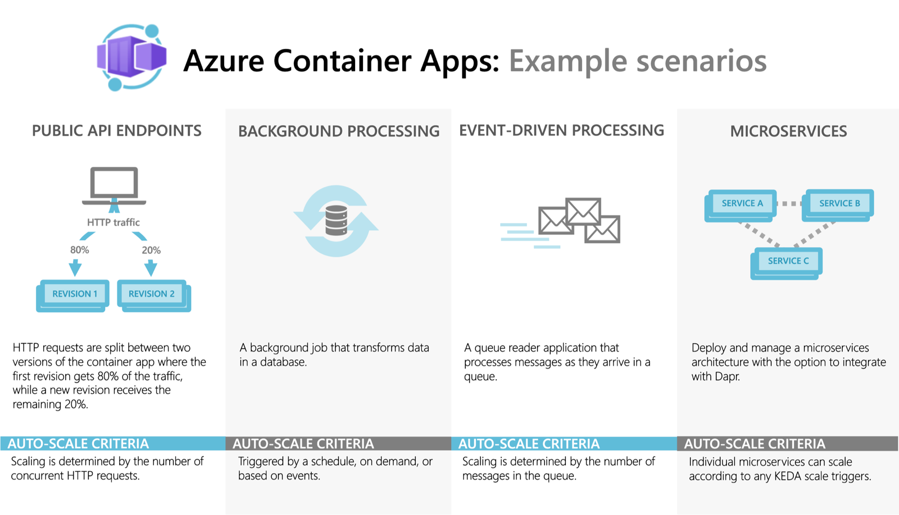

# Azure Container Apps Overview

Azure Container Apps is a serverless platform for running containerized applications without managing the underlying infrastructure.

## Common uses of Azure Container Apps include:

- Deploying API endpoints
- Hosting background processing jobs
- Handling event-driven processing
- Running microservices

## Applications built on Azure Container Apps can dynamically scale based on:

- HTTP traffic
- Event-driven processing
- CPU or memory load
- Any KEDA-supported scaler

## What is KEDA?

KEDA stands for Kubernetes Event-Driven Autoscaling.

It is an open-source project that helps applications scale automatically based on real-world event signals, not just CPU or memory usage. In Azure Container Apps, KEDA is the main technology behind event-driven scaling.

### Simple idea

Imagine you have an app that reads messages from Azure Service Bus or Kafka. When the queue is empty, the app can scale down to zero or a minimum number of replicas. When messages start piling up, KEDA detects that load and starts more replicas to process them quickly.

### How KEDA works

KEDA monitors a trigger source such as:

- Azure Queue Storage
- Azure Service Bus
- Kafka
- RabbitMQ
- HTTP concurrency
- CPU/memory metrics

When the target metric crosses a threshold, KEDA updates the number of running replicas automatically.

### Why it matters in Azure Container Apps

Azure Container Apps supports both built-in scale rules and KEDA-based scalers. This is useful when an app needs to scale based on:

- queue length
- event volume
- number of messages waiting to be processed
- custom metrics from external systems

This makes it ideal for event-driven microservices, background workers, and asynchronous processing.

### Example

A payment processing app listens to a Service Bus topic. When many messages arrive, KEDA detects the increasing queue depth and scales the app out to handle the load. When traffic drops, KEDA scales it back down to save cost.

### Benefits of KEDA

- Scales based on real business events
- Supports scale-to-zero for idle workloads
- Reduces infrastructure cost
- Handles burst traffic efficiently
- Works well with APIs, workers, and background jobs

In short, KEDA gives Azure Container Apps the ability to scale smartly and automatically for event-driven workloads, beyond simple request-based scaling.

