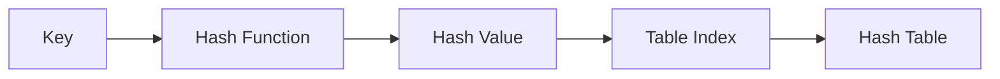
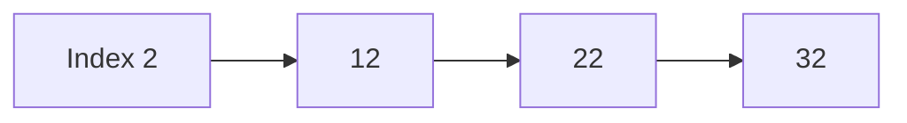
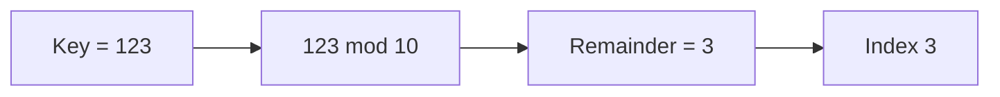
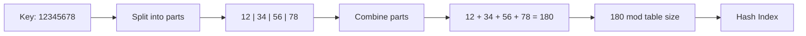
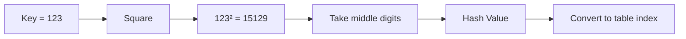
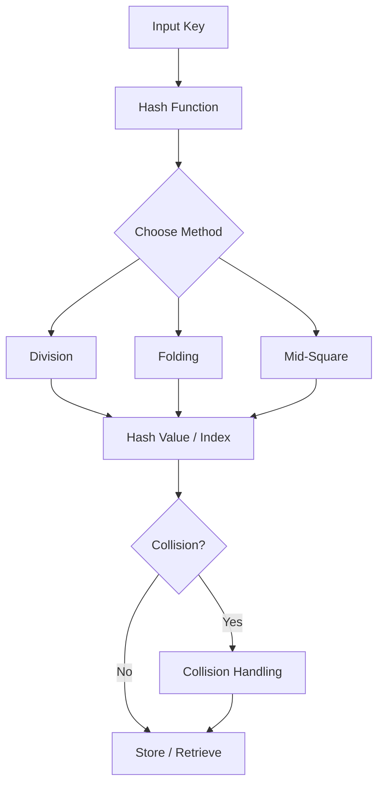

# Basic Hashing

## 1. What is Hashing?

**Hashing** is a technique used to map a key to a specific location in a data structure called a **hash table**.

```text
Key
 ↓
Hash Function
 ↓
Index
 ↓
Hash Table
```

Example:

```text
key = 42
table size = 10

42 % 10 = 2
```

So key `42` can be stored at index `2`.

---

## 2. Why Do We Need Hashing?

Hashing is mainly used for **fast lookup, insertion, and deletion**.

Without hashing, searching for a value in an unsorted array may require checking elements one by one:

```text
[10, 25, 42, 17, 89, 31]
             ↑
          Search
```

With hashing:

```text
42
 ↓
Hash Function
 ↓
Index 2
 ↓
Direct access
```

Common uses:

- Dictionaries / maps
- Sets
- Caches
- Symbol tables
- Fast key-value lookup
- Database operations

---

## 3. Hash Table

A **hash table** stores data using a hash function to determine where each key should be placed.

```text
Index     Value
  0         -
  1         -
  2        42
  3         -
  4        24
  5         -
  6        16
  7         -
  8         -
  9        39
```

---

## 4. Hash Function

A **hash function** converts a key into a hash value or table index.

```text
h(key) → index
```

Example:

```text
h(42) = 42 % 10
      = 2
```

A good hash function should:

- Be deterministic
- Be fast
- Distribute keys reasonably evenly
- Produce valid table indexes



---

## 5. Collision

A **collision** happens when two different keys produce the same index.

Example:

```text
12 % 10 = 2
22 % 10 = 2
```

Therefore:

```text
12 ──┐
     ├──► Index 2
22 ──┘
```

Collisions are normal in hash tables and must be handled.

---

## 6. Collision Handling

Two major approaches are:

```text
Collision Handling
       │
       ├── Separate Chaining
       │
       └── Open Addressing
              ├── Linear Probing
              ├── Quadratic Probing
              └── Double Hashing
```

### Separate Chaining

Multiple entries can be stored in a bucket.

```text
Index 2 → 12 → 22 → 32
```



### Open Addressing

If the calculated position is occupied, another position is searched.

```text
12 → index 2
22 → index 2 → occupied
22 → another index
```

---

# 7. Advantages of Hashing

## 1. Fast Lookup

Hash tables provide **O(1) average-case lookup** under suitable conditions.

## 2. Fast Insertion

Insertion is commonly **O(1) average-case**.

## 3. Fast Deletion

Deletion is commonly **O(1) average-case**.

## 4. Natural Key-Value Storage

Hashing is ideal for:

```text
Key → Value
```

Example:

```text
"user123" → User Object
"product42" → Product Object
```

## 5. Useful for Sets

Hash-based sets can efficiently answer:

```text
Does this value exist?
```

---

# 8. Disadvantages of Hashing

## 1. Collisions

Different keys can map to the same location.

## 2. Worst-Case Performance

Although average operations can be O(1), heavy collisions can make operations much slower.

## 3. Extra Memory

Hash tables usually require additional space for buckets, empty slots, metadata, and collision handling.

## 4. No Natural Sorted Order

Hash tables are designed for lookup, not maintaining sorted order.

## 5. Resizing Cost

When a table becomes too full, it may need to grow and existing entries may need to be rehashed.

---

# 9. Load Factor

The **load factor** tells us how full a hash table is.

```text
Load Factor = Number of Elements / Table Size
```

Example:

```text
Elements = 7
Table size = 10

Load Factor = 7 / 10
            = 0.7
```

A high load factor can increase collisions and reduce performance.

---

# 10. Internal Hashing Methods

Three basic hashing methods are:

```text
Internal Hashing Methods
        │
        ├── Division Method
        ├── Folding Method
        └── Mid-Square Method
```

---

# 11. Division Method

The **division method** uses the remainder after dividing the key by the table size.

### Formula

```text
h(k) = k mod m
```

Where:

- `k` = key
- `m` = table size

### Example

```text
Key = 123
Table size = 10

123 % 10 = 3
```

Therefore:

```text
123 → index 3
```



### Advantages

- Very simple
- Very fast
- Easy to implement
- Requires only a modulo operation

### Disadvantages

- Poor table-size choices can cause poor distribution
- Similar key patterns can cause clustering
- Collisions are still possible

---

# 12. Folding Method

The **folding method** divides a large key into smaller parts and combines those parts.

Example:

```text
Key = 12345678

12 | 34 | 56 | 78
```

Add the parts:

```text
12 + 34 + 56 + 78 = 180
```

If table size is `10`:

```text
180 % 10 = 0
```

Therefore:

```text
12345678 → index 0
```



### Advantages

- Useful for large numeric keys
- Simple to understand
- Can use multiple portions of the key
- Easy to implement

### Disadvantages

- Collisions are still possible
- Distribution depends on how the key is divided
- Poor grouping can lead to collisions
- More work than a simple modulo operation

---

# 13. Mid-Square Method

The **mid-square method** works by:

1. Squaring the key
2. Taking the middle digits
3. Using them as the hash value/index

```text
Key
 ↓
Square
 ↓
Take middle digits
 ↓
Hash value
```

### Example

```text
Key = 123

123² = 15129
```

Selected middle digits can be used as the hash value.

The number of digits selected depends on the required table index range.



### Advantages

- Uses information from several digits of the key
- Can provide good distribution for suitable key sets
- Small changes in a key can affect the squared result

### Disadvantages

- Requires a square/multiplication operation
- More work than a simple modulo operation
- Choosing the middle digits matters
- Collisions are still possible

---

# 14. Division vs Folding vs Mid-Square

| Feature | Division | Folding | Mid-Square |
|---|---|---|---|
| Basic idea | Use remainder | Split and combine | Square and take middle digits |
| Main operation | Modulo | Addition/combination | Squaring |
| Simplicity | Very simple | Simple | Moderate |
| Numeric keys | Yes | Yes | Yes |
| Speed | Very fast | Fast | Generally more work |
| Collisions | Possible | Possible | Possible |
| Main concern | Table size | Key grouping | Middle-digit selection |

---

# 15. Complete Hashing Flow



---

# 16. Hashing Complexity

For a well-designed hash table:

| Operation | Average | Worst Case |
|---|---:|---:|
| Search | O(1) | Can degrade due to collisions |
| Insert | O(1) | Can degrade due to collisions |
| Delete | O(1) | Can degrade due to collisions |

The important word is **average**.

Hashing does not guarantee O(1) for every possible workload.

---

# 17. Hashing vs Array

| Feature | Array | Hash Table |
|---|---|---|
| Access by index | O(1) | O(1) average by key |
| Search by arbitrary value | Usually O(n) | O(1) average by key |
| Key-value storage | Not natural | Natural |
| Sorted order | Can be maintained | Not naturally maintained |
| Extra memory | Usually lower | Usually higher |
| Collision handling | Not required | Required |

---

# 18. Real-World Applications

Hashing is commonly used in:

### Dictionaries / Maps

```text
username → user object
```

### Sets

```text
unique values
```

### Caches

```text
cache_key → cached_data
```

### Compilers

```text
variable name → variable information
```

### Database Systems

Hash-based structures can be useful for certain lookup and join operations.

### Distributed Systems

Hashing is also used in techniques such as consistent hashing to distribute keys across servers.

---

# 19. Backend Developer Perspective

Suppose an API receives:

```text
GET /users/123
```

A hash-based structure could conceptually provide:

```text
123
 ↓
Hash Function
 ↓
Bucket / Index
 ↓
User Object
```

A cache can similarly use:

```text
"user:123"
     ↓
  Hash Key
     ↓
Cached Value
```

This is why hashing is important beyond DSA.

---

# 20. Common Mistakes

### Mistake 1: Thinking collisions mean hashing failed

Collisions are expected. A hash table needs a collision-handling strategy.

### Mistake 2: Assuming hashing always gives O(1)

The usual complexity is **O(1) average-case**, not guaranteed O(1).

### Mistake 3: Ignoring load factor

As the table becomes crowded, collisions can increase.

### Mistake 4: Thinking a hash table maintains sorted order

Hashing is primarily designed for efficient lookup, not ordering.

### Mistake 5: Confusing hash value with table index

Conceptually:

```text
Key
 ↓
Hash Value
 ↓
Table Index
```

The hash value may need to be transformed into a valid table index.

---

# 21. Interview Cheat Sheet

### What is hashing?

Hashing maps a key to a hash value or table index using a hash function to enable efficient average-case lookup, insertion, and deletion.

### What is a hash table?

A hash table is a data structure that stores key-based data using hash values to determine storage locations.

### What is a collision?

A collision occurs when two different keys map to the same table index.

### What is the division method?

```text
h(k) = k mod m
```

It uses the remainder of the key divided by the table size.

### What is the folding method?

It splits a key into parts and combines those parts to produce a hash value.

### What is the mid-square method?

It squares the key and uses selected middle digits of the result as the hash value.

### What is load factor?

```text
Load Factor = Number of Elements / Table Size
```

### Average complexity?

```text
Search   → O(1) average
Insert   → O(1) average
Delete   → O(1) average
```

---

# 22. Final Mental Model

```text
                    KEY
                     │
                     ▼
               HASH FUNCTION
                     │
          ┌──────────┼──────────┐
          ▼          ▼          ▼
      Division    Folding   Mid-Square
          │          │          │
          └──────────┼──────────┘
                     ▼
                 HASH VALUE
                     │
                     ▼
                 TABLE INDEX
                     │
                     ▼
                 HASH TABLE
                     │
                ┌────┴────┐
                ▼         ▼
          No Collision  Collision
                │         │
                ▼         ▼
             Store     Handle it
                      using chaining
                    or open addressing
```

## One-Line Interview Answer

**Hashing maps a key to a location using a hash function so data can usually be searched, inserted, and deleted in O(1) average time, while collisions are handled using techniques such as chaining or open addressing.**
