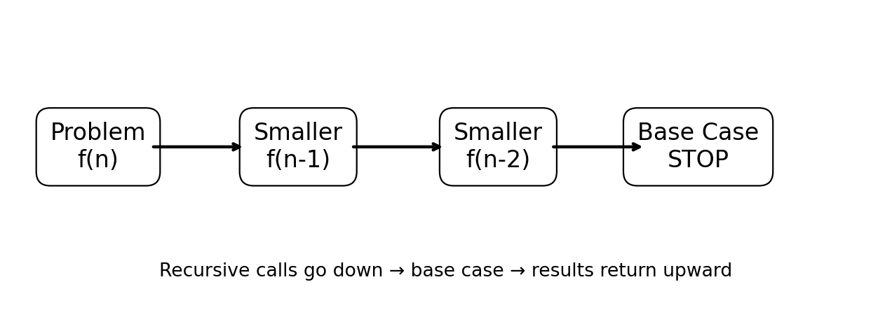
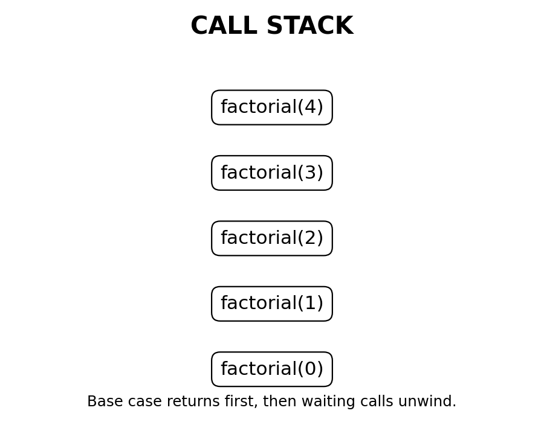

# Introduction to Recursion

> **Recursion is a technique where a function solves a problem by calling itself on a smaller or simpler version of the same problem.**



## 1. Basic Concept

A recursive function has two essential parts:

| Part | Purpose |
|---|---|
| **Base Case** | Stops recursion |
| **Recursive Case** | Calls the function again with a smaller/simpler problem |

```python
def countdown(n):
    if n == 0:          # Base case
        return
    print(n)
    countdown(n - 1)    # Recursive case
```

For `countdown(3)`:

```text
3 → 2 → 1 → 0 → STOP
```

A recursive call should make progress toward the base case.

---

## 2. Base Case

The base case is the smallest case that can be solved directly.

```python
def factorial(n):
    if n == 0:
        return 1
```

Ask:

> **When should the recursion stop?**

If the base case is missing or unreachable, recursion can continue until the runtime's recursion/call-stack limit is reached.

---

## 3. Recursive Case

The recursive case reduces the problem and calls the same function again.

```python
def factorial(n):
    if n == 0:
        return 1

    return n * factorial(n - 1)
```

Here:

```text
Base case:      n == 0
Recursive case: n * factorial(n - 1)
```

---

## 4. Recursion Template

```python
def solve(problem):

    if smallest_problem:
        return direct_answer

    smaller_problem = make_smaller(problem)
    smaller_answer = solve(smaller_problem)

    return combine(smaller_answer)
```

Think in three questions:

1. What is the smallest problem?
2. How do I make the problem smaller?
3. How do I use the smaller answer?

---

## 5. Call Stack

Recursion uses the **call stack**. Each function call creates a stack frame.



For `factorial(4)`:

```text
factorial(4)
    ↓
factorial(3)
    ↓
factorial(2)
    ↓
factorial(1)
    ↓
factorial(0)
```

After `factorial(0)` returns, the waiting calls continue.

---

## 6. Going Down and Unwinding

### Going down

```text
4 → 3 → 2 → 1 → 0
```

### Coming back up

```text
factorial(0) → 1
factorial(1) → 1
factorial(2) → 2
factorial(3) → 6
factorial(4) → 24
```

The return phase is called **unwinding**.

---

## 7. Example: Factorial

Mathematical definition:

```text
n! = n × (n-1)!
0! = 1
```

Implementation:

```python
def factorial(n):
    if n == 0:
        return 1
    return n * factorial(n - 1)
```

For `factorial(4)`:

```text
4 × factorial(3)
4 × 3 × factorial(2)
4 × 3 × 2 × factorial(1)
4 × 3 × 2 × 1 × factorial(0)
4 × 3 × 2 × 1 × 1
= 24
```

---

## 8. Trust the Recursive Call

A powerful way to solve recursion:

> **Assume the recursive call correctly solves the smaller problem.**

For:

```python
return n * factorial(n - 1)
```

Think:

```text
factorial(n - 1)
       ↓
smaller problem is solved
       ↓
multiply by n
       ↓
current answer
```

Do not try to mentally execute every recursive call at once.

---

# Advantages of Recursion

## 9. Natural for Recursive Structures

Trees and hierarchical data contain smaller versions of themselves.

```text
Tree
├── Left Subtree
└── Right Subtree
```

Recursive code often maps directly to this structure.

## 10. Good for Divide-and-Conquer

Useful for:

- Merge Sort
- Quick Sort
- Binary Search
- Other divide-and-conquer algorithms

```text
Problem
├── Smaller problem
└── Smaller problem
```

## 11. Good for Backtracking

Useful for:

- N-Queens
- Sudoku
- Permutations
- Combinations
- Maze solving

Typical structure:

```text
Choose
  ↓
Explore recursively
  ↓
Undo choice
  ↓
Try next choice
```

## 12. Can Make Some Code Cleaner

For naturally recursive problems, recursion can be shorter and easier to understand than manually managing a stack.

## 13. Matches Mathematical Definitions

Examples:

```text
Factorial
Fibonacci
GCD
```

The code can closely follow the mathematical definition.

---

# Disadvantages of Recursion

## 14. Extra Stack Memory

Every active recursive call needs stack space.

For recursion depth `n`:

```text
Space ≈ O(n)
```

## 15. Recursion/Stack Limits

Very deep recursion can exceed the runtime's recursion limit or available call-stack capacity.

## 16. Function-Call Overhead

Recursive calls have overhead. For simple repetition, a loop is often more efficient.

## 17. Can Be Harder to Debug

Many nested calls make it harder to track:

```text
Which call am I in?
What is this call waiting for?
What value will return?
```

## 18. Can Be Very Slow if Work Repeats

Naive Fibonacci repeatedly calculates the same subproblems:

```python
def fib(n):
    if n <= 1:
        return n
    return fib(n - 1) + fib(n - 2)
```

This creates a large recursion tree.

---

# Recursion Types

## 19. Direct Recursion

A function directly calls itself.

```python
def fun(n):
    if n == 0:
        return
    fun(n - 1)
```

## 20. Indirect Recursion

One function eventually calls another function that calls the first.

```python
def A(n):
    if n > 0:
        B(n - 1)

def B(n):
    if n > 0:
        A(n - 1)
```

```text
A → B → A → B
```

## 21. Single Recursive Call

```text
f(n)
 ↓
f(n-1)
 ↓
f(n-2)
```

This creates a recursive chain.

## 22. Multiple Recursive Calls

```text
       f(n)
      /     f(n-1)   f(n-2)
```

This creates a recursion tree and can increase time complexity significantly.

---

# Complexity

## 23. Factorial

```text
T(n) = T(n-1) + O(1)
```

Therefore:

```text
Time  = O(n)
Space = O(n)
```

The space comes from the call stack.

## 24. Naive Fibonacci

```text
T(n) = T(n-1) + T(n-2) + O(1)
```

Typical complexity:

```text
Time  ≈ O(2^n)
Space = O(n)
```

---

# Tail Recursion

## 25. What Is Tail Recursion?

A recursive call is **tail recursive** when it is the final operation performed by the function.

```python
def countdown(n):
    if n == 0:
        return
    print(n)
    countdown(n - 1)
```

Some languages can optimize tail calls.

**Python does not generally perform tail-call optimization**, so tail recursion should not be assumed to remove Python's stack cost.

---

# Practical Uses

## 26. Trees

```python
def preorder(node):
    if node is None:
        return

    print(node.value)
    preorder(node.left)
    preorder(node.right)
```

Common recursive traversals:

```text
Preorder
Inorder
Postorder
```

## 27. Graphs

DFS is commonly implemented recursively.

```python
def dfs(node):
    if node in visited:
        return

    visited.add(node)

    for neighbour in graph[node]:
        dfs(neighbour)
```

For graphs with cycles, maintain a `visited` set.

## 28. Backtracking

```python
def backtrack(state):
    if solution_found:
        return

    for choice in choices:
        make_choice(choice)
        backtrack(new_state)
        undo_choice(choice)
```

## 29. Divide-and-Conquer

```text
Divide
  ↓
Solve smaller problems
  ↓
Combine
```

---

# Optimization

## 30. Memoization

If recursive calls repeatedly solve the same subproblem, cache the answer.

```python
memo = {}

def fib(n):
    if n <= 1:
        return n

    if n in memo:
        return memo[n]

    memo[n] = fib(n - 1) + fib(n - 2)
    return memo[n]
```

This avoids repeated work.

---

# Recursion vs Iteration

## 31. Comparison

| Recursion | Iteration |
|---|---|
| Function calls itself | Uses loops |
| Uses call stack | Usually avoids recursive stack growth |
| Natural for trees/backtracking | Natural for simple repetition |
| Can be very expressive | Often has less overhead |
| Can hit recursion limits | No recursive-depth problem |
| Can be harder to debug | Usually easier to trace for simple loops |

### Rule of thumb

Use recursion when the **problem structure itself is recursive**. Use iteration when a loop expresses the problem more simply.

---

# Recursion vs Explicit Stack

A recursive DFS:

```python
dfs(node)
```

uses the program's call stack.

An iterative DFS commonly uses:

```python
stack = [node]
```

Both can represent pending work. The difference is whether the runtime call stack or your own explicit stack stores that state.

---

# How to Identify a Recursive Problem

Ask:

> **Can I express the problem as a smaller version of the same problem?**

Examples:

```text
factorial(n)
    ↓
factorial(n-1)

tree(node)
    ↓
tree(left), tree(right)

binary search
    ↓
search one half
```

If yes, recursion may be a good fit.

---

# How to Write a Recursive Solution

### Step 1: Define what the function returns

```text
factorial(n) → n!
```

### Step 2: Find the smallest case

```text
factorial(0) = 1
```

### Step 3: Write the base case

```python
if n == 0:
    return 1
```

### Step 4: Reduce the problem

```text
n → n - 1
```

### Step 5: Trust the smaller call

```python
factorial(n - 1)
```

### Step 6: Combine

```python
return n * factorial(n - 1)
```

### Step 7: Check termination

Every recursive path must move toward the base case.

---

# Common Mistakes

| Mistake | Result |
|---|---|
| No base case | Infinite recursion |
| Unreachable base case | Infinite recursion |
| Input never changes | Infinite recursion |
| Wrong base-case value | Incorrect answer |
| Forgetting `return` | Recursive result may be lost |
| Too many branches | High time complexity |
| Very deep recursion | Recursion/stack failure |
| Repeated subproblems | Wasted computation |

---

# Debugging Recursive Code

Use a trace table.

For `factorial(3)`:

| Call | Waiting for |
|---|---|
| `factorial(3)` | `factorial(2)` |
| `factorial(2)` | `factorial(1)` |
| `factorial(1)` | `factorial(0)` |
| `factorial(0)` | returns `1` |

Then unwind:

```text
factorial(1) = 1 × 1 = 1
factorial(2) = 2 × 1 = 2
factorial(3) = 3 × 2 = 6
```

---

# Advantages vs Disadvantages

| Advantages | Disadvantages |
|---|---|
| Natural for trees | Extra stack memory |
| Useful for DFS | Recursion-depth limits |
| Excellent for backtracking | Function-call overhead |
| Useful for divide-and-conquer | Can be harder to debug |
| Matches recursive mathematics | Can be very slow if work repeats |
| Can make hierarchical code cleaner | Not ideal for every problem |

---

# Interview Cheat Sheet

### What is recursion?

A technique where a function solves a problem by calling itself on a smaller/simpler version of the problem.

### Two essential parts?

```text
Base Case
Recursive Case
```

### What supports recursion?

The **call stack**.

### What happens after the base case?

The calls **unwind** and return their results to previous calls.

### Main advantages?

- Natural for recursive structures
- Useful for trees and graphs
- Excellent for backtracking
- Useful for divide-and-conquer
- Can simplify naturally recursive problems

### Main disadvantages?

- Stack memory
- Recursion-depth limits
- Function-call overhead
- Debugging complexity
- Possible repeated computation

### What is memoization?

Caching results of already-solved subproblems.

### What is tail recursion?

A recursive call that is the final operation of the function.

### What is indirect recursion?

A function calls another function that eventually calls the first function.

---

# Final Mental Model

```text
        CURRENT PROBLEM
               │
               ▼
       Is there a smaller
          same problem?
               │
               ▼
        Recursive Call
               │
               ▼
          Base Case?
          /               No         Yes
        │           │
        ▼           ▼
   Keep reducing  Return
                    │
                    ▼
                Unwind
                    │
                    ▼
              Final Answer
```

## The formula to remember

```text
RECURSION
=
BASE CASE
+
SMALLER PROBLEM
+
RECURSIVE CALL
+
COMBINE RESULT
```

## Final rule

> **Do not memorize recursive code. Learn to identify the base case, reduce the problem, trust the recursive call, and understand how the call stack unwinds.**
