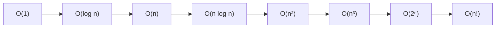
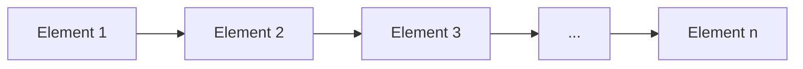
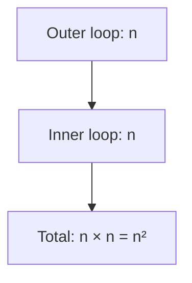
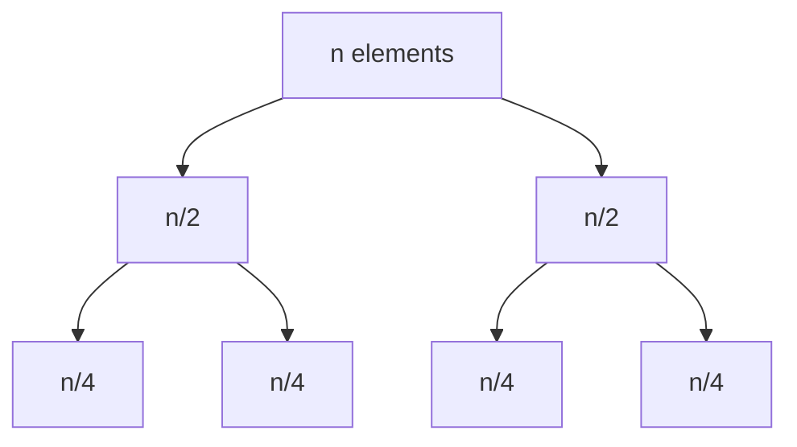
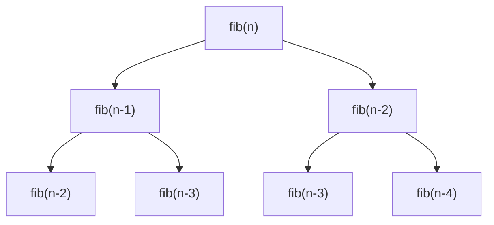
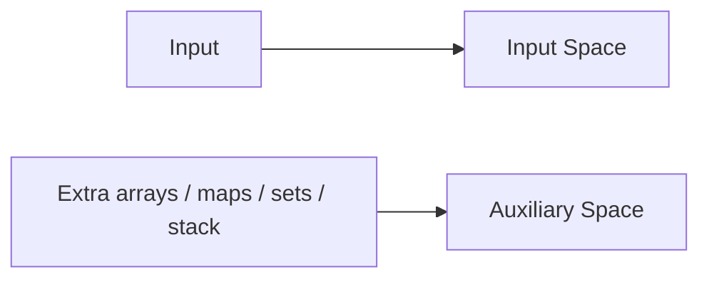
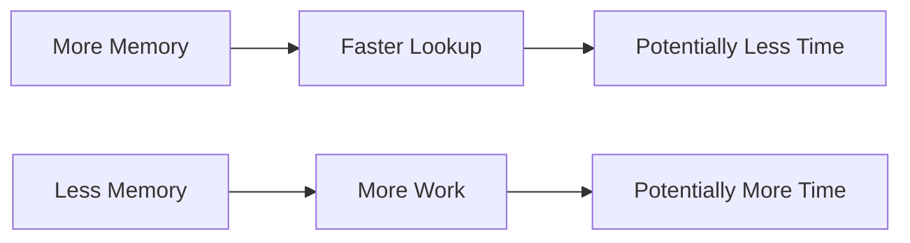
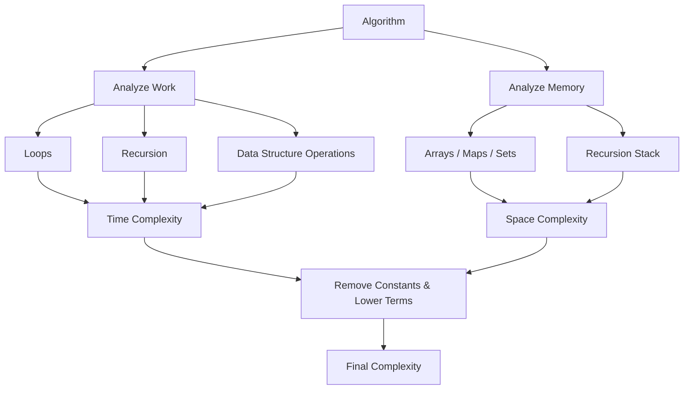

# Time and Space Complexity

> A practical guide to understanding how an algorithm scales as the input size grows.

---

## 1. What Is Time Complexity?

**Time Complexity** describes how the amount of work performed by an algorithm grows with the input size `n`.

It is usually expressed using **Big-O notation**.

It does not mean the exact number of seconds. Instead, it describes the **growth rate**.

| Complexity | Name | Common Example |
|---|---|---|
| `O(1)` | Constant | Array access |
| `O(log n)` | Logarithmic | Binary Search |
| `O(n)` | Linear | Single loop |
| `O(n log n)` | Linearithmic | Merge Sort |
| `O(n²)` | Quadratic | Two nested loops |
| `O(n³)` | Cubic | Three nested loops |
| `O(2ⁿ)` | Exponential | Naive recursive Fibonacci |
| `O(n!)` | Factorial | Generating permutations |

### Growth hierarchy



---

# 2. Big-O Notation

Suppose we have:

```python
for x in arr:
    print(x)
```

If `arr` contains `n` elements, the loop runs `n` times.

Therefore:

```text
Time Complexity = O(n)
```

We normally ignore constants and lower-order terms.

For example:

```text
3n + 10  → O(n)

n² + n + 100 → O(n²)

5n³ + 2n² + n → O(n³)
```

The idea is to keep the **dominant growth term**.

---

# 3. O(1) - Constant Time

`O(1)` means the amount of work does not grow with `n`.

```python
def get_first(arr):
    return arr[0]
```

Whether the array contains 10 elements or 10 million elements, we access one position.

```text
Time Complexity = O(1)
```

> `O(1)` does not necessarily mean exactly one CPU instruction. It means the work is bounded by a constant.

---

# 4. O(n) - Linear Time

A single pass through `n` elements is usually `O(n)`.

```python
def print_array(arr):
    for x in arr:
        print(x)
```

The loop executes `n` times.

```text
Time Complexity = O(n)
```



If `n` doubles, the work roughly doubles.

---

# 5. O(n²) - Quadratic Time

Two nested loops often produce `O(n²)`.

```python
def pairs(arr):
    n = len(arr)

    for i in range(n):
        for j in range(n):
            print(arr[i], arr[j])
```

The outer loop runs `n` times.

The inner loop runs `n` times for each outer iteration.

```text
n × n = n²
```

Therefore:

```text
Time Complexity = O(n²)
```



---

# 6. O(n³) - Cubic Time

Three nested loops commonly produce `O(n³)`.

```python
for i in range(n):
    for j in range(n):
        for k in range(n):
            print(i, j, k)
```

Total work:

```text
n × n × n = n³
```

Therefore:

```text
Time Complexity = O(n³)
```

---

# 7. O(log n) - Logarithmic Time

`O(log n)` commonly occurs when the problem size is repeatedly divided by a constant factor.

For example:

```text
16 → 8 → 4 → 2 → 1
```

This is the idea behind **Binary Search**.

```python
def binary_search(arr, target):
    left = 0
    right = len(arr) - 1

    while left <= right:
        mid = (left + right) // 2

        if arr[mid] == target:
            return mid
        elif arr[mid] < target:
            left = mid + 1
        else:
            right = mid - 1

    return -1
```

Each iteration eliminates roughly half the remaining search space.

```text
Time Complexity = O(log n)
```

### Recognition pattern

These often indicate logarithmic behavior:

```python
i *= 2
```

```python
i //= 2
```

```text
n → n/2 → n/4 → n/8 → ...
```

---

# 8. O(n log n)

`O(n log n)` often appears in efficient sorting algorithms such as Merge Sort.

The intuition is:

```text
n work per level
×
log n levels
=
n log n
```

Merge Sort repeatedly divides the array and processes elements at each level.



Typical Merge Sort complexity:

```text
Time = O(n log n)
Space = O(n)
```

---

# 9. O(2ⁿ) - Exponential Time

Exponential algorithms grow extremely quickly.

A classic example is naive recursive Fibonacci:

```python
def fib(n):
    if n <= 1:
        return n

    return fib(n - 1) + fib(n - 2)
```

Each call creates two more calls.



The naive implementation has exponential time:

```text
Time ≈ O(2ⁿ)
```

---

# 10. O(n!) - Factorial Time

Factorial complexity grows even faster.

A classic example is generating all permutations of `n` elements.

For:

```text
n = 3
```

there are:

```text
3! = 6
```

permutations.

For:

```text
n = 10
```

there are:

```text
10! = 3,628,800
```

So factorial-time algorithms become impractical very quickly.

---

# 11. Sequential vs Nested Loops

This is one of the most important rules.

## Sequential loops

```python
for i in range(n):
    ...

for j in range(n):
    ...
```

The work is:

```text
n + n
= 2n
= O(n)
```

### Sequential loops are added.

---

## Nested loops

```python
for i in range(n):
    for j in range(n):
        ...
```

The work is:

```text
n × n
= n²
= O(n²)
```

### Nested loops are multiplied.

Remember:

```text
Sequential → Add
Nested     → Multiply
```

---

# 12. Different Input Sizes

Consider:

```python
for i in range(n):
    for j in range(m):
        print(i, j)
```

The complexity is:

```text
O(n × m)
```

Do not automatically call it `O(n²)` unless `m` and `n` represent the same input size.

---

# 13. Triangular Loops

Consider:

```python
for i in range(n):
    for j in range(i):
        print(i, j)
```

The number of operations is approximately:

```text
0 + 1 + 2 + 3 + ... + (n - 1)
```

This equals:

```text
n(n - 1) / 2
```

After removing constants and lower-order terms:

```text
O(n²)
```

---

# 14. Loop That Doubles

Consider:

```python
i = 1

while i < n:
    i *= 2
```

Values look like:

```text
1
2
4
8
16
32
...
```

The number of iterations is approximately:

```text
log₂(n)
```

Therefore:

```text
Time Complexity = O(log n)
```

---

# 15. Nested Logarithmic Loops

```python
i = 1

while i < n:
    j = 1

    while j < n:
        j *= 2

    i *= 2
```

Outer loop:

```text
O(log n)
```

Inner loop:

```text
O(log n)
```

Because they are nested:

```text
O(log n × log n)
= O(log² n)
```

---

# 16. Recursion and Time Complexity

When analyzing recursion, ask:

1. How many recursive calls are made?
2. How much work happens in each call?
3. How deep is the recursion?

Example:

```python
def countdown(n):
    if n == 0:
        return

    print(n)
    countdown(n - 1)
```

There is one recursive call per level:

```text
n → n-1 → n-2 → ... → 0
```

Therefore:

```text
Time Complexity = O(n)
```

---

# 17. What Is Space Complexity?

**Space Complexity** describes how the memory requirements of an algorithm grow with the input size.

For example:

```python
def find_max(arr):
    maximum = arr[0]

    for x in arr:
        if x > maximum:
            maximum = x

    return maximum
```

Only a few variables are used.

```text
Auxiliary Space = O(1)
```

---

# 18. Input Space vs Auxiliary Space

It is useful to distinguish:

### Input Space

Memory already occupied by the input.

### Auxiliary Space

Extra memory used by the algorithm.

Example:

```python
def copy_array(arr):
    result = []

    for x in arr:
        result.append(x)

    return result
```

`result` contains `n` elements.

Therefore:

```text
Auxiliary Space = O(n)
```

A useful mental model:



---

# 19. O(1) Auxiliary Space

```python
def find_max(arr):
    maximum = arr[0]

    for x in arr:
        if x > maximum:
            maximum = x

    return maximum
```

The number of extra variables remains constant.

```text
Time  = O(n)
Space = O(1)
```

---

# 20. O(n) Auxiliary Space

```python
def double_array(arr):
    result = []

    for x in arr:
        result.append(x * 2)

    return result
```

`result` grows with `n`.

```text
Time  = O(n)
Space = O(n)
```

---

# 21. Recursion and Space

Recursive calls consume **call-stack memory**.

```python
def countdown(n):
    if n == 0:
        return

    countdown(n - 1)
```

There can be approximately `n` active calls.

Therefore:

```text
Time  = O(n)
Space = O(n)
```

Even though there is no explicit array, recursion itself uses memory.

---

# 22. Best, Average, and Worst Case

An algorithm can behave differently depending on the input.

Example: Linear Search

```python
def search(arr, target):
    for i in range(len(arr)):
        if arr[i] == target:
            return i

    return -1
```

### Best Case

The target is the first element:

```text
O(1)
```

### Worst Case

The target is the last element or does not exist:

```text
O(n)
```

### Average Case

Typically:

```text
O(n)
```

When answering complexity questions, be clear about which case you mean.

---

# 23. Drop Constants

Suppose an algorithm performs:

```text
5n
```

operations.

We write:

```text
O(n)
```

not:

```text
O(5n)
```

Similarly:

```text
100n + 50 → O(n)
```

Big-O focuses on growth rate.

---

# 24. Drop Lower-Order Terms

Suppose:

```text
n² + n + 10
```

The dominant term is `n²`.

Therefore:

```text
O(n²)
```

Likewise:

```text
n³ + n² + n + 100
→ O(n³)
```

---

# 25. Practical Example

```python
def example(arr):
    n = len(arr)

    for i in range(n):
        print(arr[i])

    for i in range(n):
        for j in range(n):
            print(arr[i], arr[j])
```

First section:

```text
O(n)
```

Second section:

```text
O(n²)
```

Total:

```text
O(n) + O(n²)
```

Dominant term:

```text
O(n²)
```

Therefore:

```text
Time Complexity = O(n²)
```

---

# 26. Another Example

```python
def example(arr):
    n = len(arr)

    i = 1
    while i < n:
        i *= 2

    for j in range(n):
        print(j)
```

First loop:

```text
O(log n)
```

Second loop:

```text
O(n)
```

Total:

```text
O(log n + n)
```

Dominant term:

```text
O(n)
```

Therefore:

```text
Time Complexity = O(n)
```

---

# 27. Common Interview Trap

```python
for i in range(n):
    for j in range(10):
        print(i, j)
```

This is:

```text
O(n × 10)
```

But `10` is a constant.

Therefore:

```text
O(n)
```

Not `O(n²)`.

---

# 28. Time-Space Tradeoff

Sometimes we use additional memory to make an algorithm faster.

Example:

```python
def has_duplicate(arr):
    seen = set()

    for x in arr:
        if x in seen:
            return True

        seen.add(x)

    return False
```

The set allows fast membership checks.

Typical complexity:

```text
Time  = O(n) average
Space = O(n)
```

This is a **time-space tradeoff**.



---

# 29. Complexity Analysis Checklist

When you see an algorithm, ask:

### Step 1: What is the input size?

Usually:

```python
n = len(arr)
```

For two inputs:

```text
n = size of first input
m = size of second input
```

### Step 2: How many times does each loop execute?

Look for:

```text
n iterations
n² iterations
halving
doubling
```

### Step 3: Are loops sequential or nested?

```text
Sequential → Add
Nested → Multiply
```

### Step 4: Is there recursion?

Determine:

```text
Number of calls
Recursion depth
Work per call
```

### Step 5: What extra memory is used?

Look for:

```text
Arrays
Hash maps
Sets
Strings
Temporary structures
Recursion stack
```

### Step 6: Simplify

Remove:

```text
Constants
Lower-order terms
```

Keep the dominant term.

---

# 30. Common Complexity Patterns

| Code Pattern | Complexity |
|---|---:|
| `arr[0]` | `O(1)` |
| `for i in range(n)` | `O(n)` |
| Two nested `n` loops | `O(n²)` |
| Three nested `n` loops | `O(n³)` |
| `i *= 2` loop | `O(log n)` |
| `i //= 2` loop | `O(log n)` |
| Merge Sort | `O(n log n)` |
| Naive recursive Fibonacci | `O(2ⁿ)` |
| Generate all permutations | `O(n!)` |

---

# 31. Common Data Structure Operations

Typical complexities:

| Operation | Array/List | Hash Table | Balanced BST |
|---|---:|---:|---:|
| Access | `O(1)` | N/A | `O(log n)` |
| Search | `O(n)` | `O(1)` average | `O(log n)` |
| Insert | Depends | `O(1)` average | `O(log n)` |
| Delete | Depends | `O(1)` average | `O(log n)` |

> Exact complexity depends on the data structure implementation and the specific operation.

---

# 32. Output Space

Sometimes the output itself can be large.

For example, generating all permutations requires up to:

```text
n!
```

outputs.

Distinguish:

```text
Auxiliary Space
```

from:

```text
Output Space
```

When appropriate, state both.

---

# 33. Interview Answer Template

If asked:

> What is the time and space complexity?

A strong answer is:

> "The algorithm traverses the array once, so the time complexity is `O(n)`. It uses only a constant number of extra variables, so the auxiliary space is `O(1)`."

For nested loops:

> "The outer loop runs `n` times and the inner loop runs `n` times, so the total work is `n × n`, giving `O(n²)` time."

For binary search:

> "The search space is halved on every iteration, so the time complexity is `O(log n)`. The iterative implementation uses `O(1)` auxiliary space."

---

# 34. Final Cheat Sheet

```text
O(1)
    Constant

O(log n)
    Divide the problem repeatedly

O(n)
    One pass through input

O(n log n)
    n work across log n levels

O(n²)
    Two nested loops

O(n³)
    Three nested loops

O(2ⁿ)
    Exponential branching recursion

O(n!)
    Generate permutations / factorial growth
```

### Space

```text
Few variables
    → O(1)

Extra array of n elements
    → O(n)

HashMap / Set storing n elements
    → O(n)

Recursion depth n
    → O(n) stack
```

---

# 35. The Mental Model

Don't try to memorize every complexity.

Ask these questions:

```text
1. What is the input size?

2. How many times does the loop run?

3. Are loops sequential or nested?

4. Does the input get divided or doubled?

5. How many recursive calls are created?

6. How much extra memory is stored?

7. What is the dominant term?
```

Then simplify.



> **The goal of complexity analysis is to understand how an algorithm scales when the input grows, not to predict the exact runtime in seconds.**
