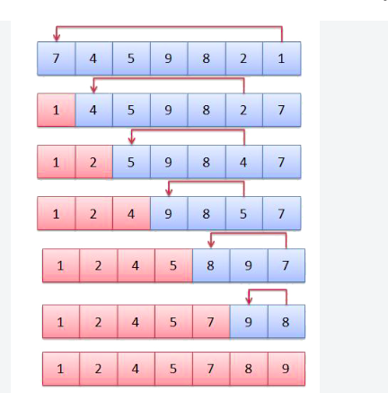

# Selection Sort


## Problem Statement

Given an array of integers `nums`, sort the array in non-decreasing order using the **selection sort** algorithm and return the sorted array.

A sorted array in non-decreasing order is an array where each element is greater than or equal to all previous elements in the array.

## Example 1

**Input:**
```text
nums = [7, 4, 1, 5, 3]
```

**Output:**
```text
[1, 3, 4, 5, 7]
```

**Explanation:** `1 <= 3 <= 4 <= 5 <= 7`.

Thus the array is sorted in non-decreasing order.

## Example 2

**Input:**
```text
nums = [5, 4, 4, 1, 1]
```

**Output:**
```text
[1, 1, 4, 4, 5]
```

**Explanation:** `1 <= 1 <= 4 <= 4 <= 5`.

Thus the array is sorted in non-decreasing order.

## Example 3

**Input:**
```text
nums = [3, 2, 3, 4, 5]
```

**Output:**
```text
[2, 3, 3, 4, 5]
```

## Constraints

- `1 <= nums.length <= 1000`
- `-10^4 <= nums[i] <= 10^4`
- `nums[i]` may contain duplicate values.



